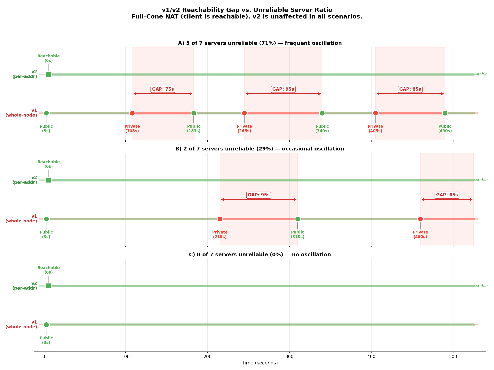
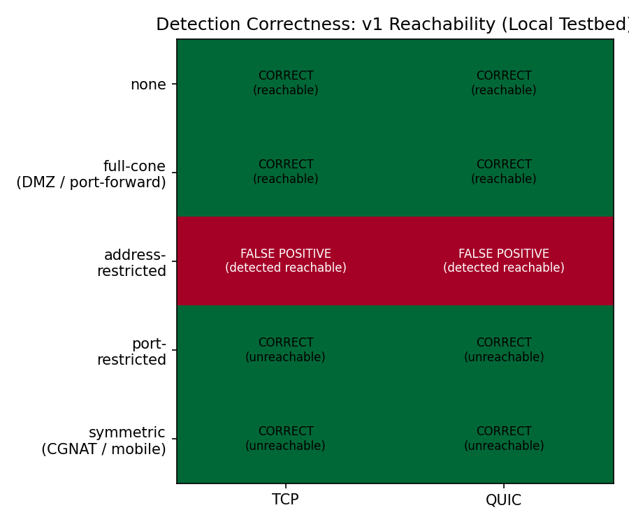
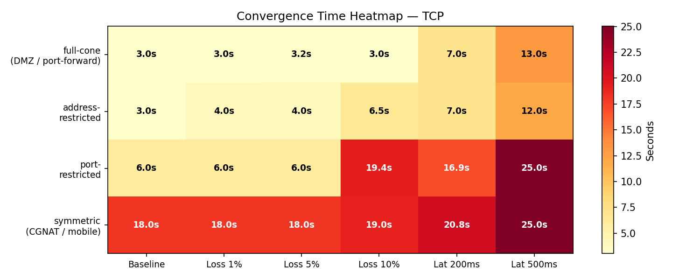
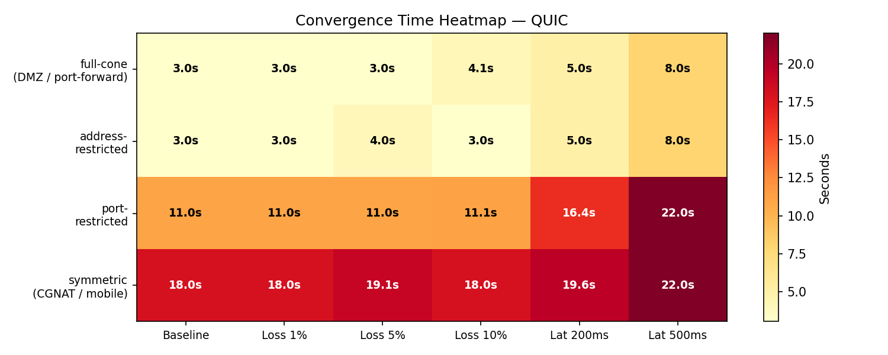

# AutoNAT v2: Performance Analysis and Cross-Implementation Study

**Date:** 2026-03-19
**Protocol:** AutoNAT v2 (`/libp2p/autonat/2/dial-request`, `/libp2p/autonat/2/dial-back`)
**Spec:** https://github.com/libp2p/specs/blob/master/autonat/autonat-v2.md
**Implementations tested:** go-libp2p v0.47.0, rust-libp2p v0.54, js-libp2p v3.1
**Testbed:** Docker-based lab with configurable NAT types (iptables)
**Repository:** https://github.com/probe-lab/autonat-project

---

## Table of Contents

1. [Executive Summary](#executive-summary)
2. [Background](#background)
3. [Testbed](#testbed)
4. [Findings](#findings)
5. [Key Metrics](#key-metrics)
6. [Cross-Implementation Comparison](#cross-implementation-comparison)
7. [Recommendations](#recommendations)
8. [Future Work](#future-work)
9. [What v2 Got Right](#what-v2-got-right)
10. [References](#references)
11. [Glossary](#glossary)

---

## Executive Summary

### Motivation

Peer-to-peer networks built on libp2p require nodes to determine whether
their addresses are reachable from the internet. Most residential and
mobile devices sit behind Network Address Translation (NAT) — a router
technique that maps private IP addresses to a shared public IP. While
NAT allows outbound connections, it blocks most inbound traffic. A node
that doesn't know it's behind NAT may advertise unreachable addresses,
participate as a DHT server when it can't serve queries, or fail to
reserve relay connections it needs.

libp2p's **AutoNAT** protocol solves this by having peers test whether a
node's addresses are actually dialable from outside. AutoNAT v1 uses a
simple majority vote; AutoNAT v2 (specified 2023, deployed 2024)
improves on this with per-address testing and nonce-based verification.

However, multiple libp2p-based projects have reported that reachability
detection **does not work reliably in production**:

- **Obol Network** ([Charon](https://github.com/ObolNetwork/charon),
  go-libp2p v0.47.0): Distributed validator nodes running behind home
  or corporate NAT experience oscillating reachability status. Their
  Prometheus metric `p2p_reachability_status` flips between public and
  private, triggering unnecessary relay activation and DHT client mode
  — degrading validator coordination through higher-latency relay paths.

- **Avail Network** ([avail-light](https://github.com/availproject/avail-light),
  rust-libp2p v0.55.0): Light clients reported persistent
  "autonat-over-quic libp2p errors" starting from v1.7.4. The team
  ultimately **disabled AutoNAT entirely** in v1.13.2 (September 2025),
  forcing operators to manually set `--external-address` for DHT server
  mode — defeating the purpose of automatic reachability detection.

These are not isolated incidents. They reflect fundamental issues in how
AutoNAT determines and communicates reachability across the libp2p
ecosystem. This project investigates AutoNAT v2 and evaluates whether it succeeds.

See [obol.md](obol.md) and [avail.md](avail.md) for detailed impact
analysis on each project.

### Findings

AutoNAT v2 is a significant improvement over v1 in per-address
reachability detection. In controlled testbed conditions, it produces
**0% false negative rate and 0% false positive rate** across all
non-edge-case NAT types, converges in ~6 seconds, and is resilient to
high latency and packet loss (QUIC adds only +1% convergence time at 10%
packet loss vs TCP's +147%).

However, we identified **7 findings** that affect its real-world
effectiveness — ranging from protocol-level design issues to
implementation gaps and cross-implementation inconsistencies.

The most impactful finding is that **v2's results are not consumed by the
systems that matter most** (DHT, AutoRelay) in go-libp2p, the only
implementation where v2 is deployed in production. v1 still controls the
global reachability flag, and v1 oscillates under real-world conditions
(3 out of 5 testbed runs with unreliable servers show v1 flipping between
Public and Private while v2 remains stable). This directly explains the
oscillation observed by Obol.

Cross-implementation analysis reveals that **only go-libp2p has a
functional AutoNAT v2 deployment**. rust-libp2p has a critical address
selection bug (probes ephemeral ports, 100% false negative) — which,
combined with the QUIC dial-back issue, explains the errors that led
Avail to disable AutoNAT. js-libp2p emits no reachability events.
Neither has a production consumer (Substrate skips autonat entirely;
Helia uses v1 only).

### Findings at a Glance

| # | Finding | Category | Severity |
|---|---------|----------|----------|
| 1 | [v1/v2 reachability gap](#finding-1-v1v2-reachability-gap) | go-libp2p | High |
| 2 | [v1 oscillation → DHT oscillation](#finding-2-v1-oscillation--dht-oscillation) | go-libp2p | High |
| 3 | [ADF false positive (100% FPR)](#finding-3-address-restricted-nat-false-positive) | Protocol | Medium |
| 4 | [Symmetric NAT silent failure](#finding-4-symmetric-nat-silent-failure) | Protocol | Medium |
| 5 | [UDP black hole blocks QUIC dial-back](#finding-5-udp-black-hole-blocks-quic-dial-back) | go-libp2p | Medium |
| 6 | [Rust: TCP port reuse safety net](#finding-6-rust-libp2p-tcp-port-reuse-and-address-translation) | Cross-impl | Low |
| 7 | [v2 adoption gap](#finding-7-v2-adoption-gap) | Cross-impl | Info |

---

## Background

### NAT Types

NAT behavior is defined by two independent properties: **mapping**
(how the router assigns external ports) and **filtering** (which
inbound packets are allowed through).

| NAT Type | Mapping | Filtering | Inbound from strangers | Prevalence |
|----------|---------|-----------|----------------------|------------|
| **No NAT** | — | — | Always works | Servers, cloud |
| **Full-cone** | EIM | EIF | Always works | Rare (intentional DMZ/forward) |
| **Address-restricted** | EIM | ADF | Only from previously contacted IPs | Rare in modern routers |
| **Port-restricted** | EIM | APDF | Only from exact previously contacted IP:port | Most common home router default |
| **Symmetric** | ADPM | APDF | Never (different port per destination) | CGNAT, mobile carriers |

For the full mapping/filtering taxonomy (RFC 4787), see
[autonat-v2.md](autonat-v2.md).

### Related Protocols in libp2p

AutoNAT does not operate in isolation. It is part of a protocol stack
where each component handles a different aspect of connectivity:

**Identify** (`/ipfs/id/1.0.0`) — When two peers connect, they exchange
metadata including the `ObservedAddr` — the address each peer sees the
other connecting from. This is how a node discovers its external address
(the NAT-mapped public IP:port). Identify is the **input** to AutoNAT:
the observed addresses become candidates for reachability testing.

**AutoNAT v1** (`/libp2p/autonat/1.0.0`) — The original reachability
protocol. A node asks a random connected peer to dial it back. The peer
reports success or failure. v1 produces a **global** verdict
(Public/Private/Unknown) based on a majority vote across recent probes.

**AutoNAT v2** (`/libp2p/autonat/2/dial-request`,
`/libp2p/autonat/2/dial-back`) — The improved protocol tested in this
report. Tests **individual addresses** with nonce-based verification and
amplification protection. Produces per-address reachability.

**Circuit Relay v2** (`/libp2p/circuit/relay/0.2.0/hop`,
`/libp2p/circuit/relay/0.2.0/stop`) — When a node is determined to be
behind NAT, it reserves a relay slot on a public node. Other peers
connect through the relay as a fallback.

**DCUtR** (`/libp2p/dcutr`) — Direct Connection Upgrade through Relay.
After connecting via relay, peers attempt hole punching to establish a
direct connection, eliminating the relay overhead.

**Kademlia DHT** — Uses the reachability signal to decide server vs
client mode. Server-mode nodes accept and serve DHT queries; client-mode
nodes only issue queries. The DHT subscribes to AutoNAT v1's global
flag (not v2's per-address signal).

The dependency chain:

```
Identify (discover external address)
  → ObservedAddrManager (consolidate observations, activation threshold)
    → AutoNAT v2 (test address reachability)
      → EvtHostReachableAddrsChanged (per-address result)
    → AutoNAT v1 (test global reachability)
      → EvtLocalReachabilityChanged (global result)
        → DHT mode (server/client)
        → AutoRelay (reserve relay if private)
          → DCUtR (hole punch if relayed)
```

### How NAT Filtering Affects AutoNAT v2 Dial-Back

When the server's `dialerHost` dials back to the client, the NAT's
filtering decision determines whether the connection reaches the client:

```
Client behind NAT contacted Server at 1.2.3.4:5000
NAT mapping: client:4001 → 203.0.113.1:50000

Server's dialerHost dials back from 1.2.3.4:random_port to 203.0.113.1:50000

Full-cone (EIF):       "Any source allowed"                → PASS
Addr-restricted (ADF): "Is 1.2.3.4 trusted? YES"          → PASS ← Finding #4
Port-restricted (APDF):"Is 1.2.3.4:random trusted? NO"    → BLOCK (correct)
Symmetric (APDF):      N/A — v2 never reaches this stage   ← Finding #5
```

### AutoNAT v1 vs v2

| Aspect | v1 | v2 |
|--------|----|----|
| **Protocol** | `/libp2p/autonat/1.0.0` | `/libp2p/autonat/2/dial-request` + `dial-back` |
| **Scope** | Global (whole-node: Public/Private) | Per-address (each address independently) |
| **Probing** | Random peer, majority vote | Specific server selection, per-address confidence |
| **Confidence** | Sliding window of 3 | Sliding window of 5, targetConfidence=3 |
| **Nonce verification** | No | Yes (prevents spoofing) |
| **Amplification protection** | No | Yes (30-100KB data when IP differs) |
| **Dial-back identity** | Same peer ID | Separate peer ID (go-libp2p) |
| **Event (go-libp2p)** | `EvtLocalReachabilityChanged` | `EvtHostReachableAddrsChanged` |
| **DHT consumes** | **Yes** | **No** (Finding #1) |
| **Spec** | Informal, no RFC | [specs/autonat/autonat-v2.md](https://github.com/libp2p/specs/blob/master/autonat/autonat-v2.md) |

### Scope of This Study

This report evaluates AutoNAT v2's correctness, performance, and
integration across three libp2p implementations (go, rust, js). It
does NOT evaluate:

- Hole punching success rates (DCUtR) — see Trautwein et al. 2022/2025
- Relay performance (Circuit Relay v2)
- DHT performance itself (routing, lookup latency)
- AutoNAT v1 in isolation (only v1/v2 comparison)

### NAT Traversal: libp2p vs Traditional

| Step | Traditional (STUN/ICE) | libp2p |
|------|----------------------|--------|
| Discover external address | STUN binding request | Identify protocol (ObservedAddr) |
| Test reachability | STUN from **multiple IPs** (RFC 5780) | AutoNAT from **same IP** |
| Direct connection | ICE candidate exchange | DCUtR via relay |
| Fallback relay | TURN server | Circuit Relay v2 |

The key difference at step 2: STUN tests from multiple IPs, which
distinguishes full-cone from address-restricted. AutoNAT v2 tests from
the same IP the client already contacted, making these indistinguishable.

---

## Testbed

Docker-based lab with configurable NAT types via iptables on a Linux
host. All experiments run in isolated Docker networks with no external
traffic. For full architecture details, see [testbed.md](testbed.md).
Scenario format reference: [scenario-schema.md](scenario-schema.md).

### Architecture

```
┌─────────────────────────────────────────────────────────┐
│  public-net (73.0.0.0/24)                               │
│                                                         │
│  ┌──────────┐ ┌──────────┐     ┌──────────┐            │
│  │ Server 1 │ │ Server 2 │ ... │ Server 7 │  (go-libp2p)│
│  │ 73.0.0.3 │ │ 73.0.0.4 │     │ 73.0.0.9 │            │
│  └──────────┘ └──────────┘     └──────────┘            │
│                                                         │
│  ┌──────────┐              ┌──────────┐                 │
│  │  Jaeger  │              │  Router  │                 │
│  │ 73.0.0.50│              │ 73.0.0.2 │                 │
│  └──────────┘              └────┬─────┘                 │
└─────────────────────────────────┼───────────────────────┘
                                  │ NAT (iptables)
┌─────────────────────────────────┼───────────────────────┐
│  private-net (10.0.1.0/24)      │                       │
│                            ┌────┴─────┐                 │
│                            │  Router  │                 │
│                            │ 10.0.1.2 │                 │
│                            └──────────┘                 │
│  ┌──────────┐                                           │
│  │  Client  │  (go / rust / js libp2p)                  │
│  │ 10.0.1.10│                                           │
│  └──────────┘                                           │
└─────────────────────────────────────────────────────────┘
```

**Networks:**
- `public-net` (73.0.0.0/24) — uses a "public-looking" range because
  go-libp2p's `manet.IsPublicAddr()` filters out private/CGNAT ranges.
  AutoNAT v2 only probes addresses that pass this filter.
- `private-net` (10.0.1.0/24) — standard private range, matching
  real-world deployments.

**Components:**
- **Router** — Alpine container with iptables. Implements all 5 NAT
  types via masquerade + filtering rules. Also supports `tc netem` for
  latency/packet-loss injection, static port forwarding (DNAT), and
  miniupnpd for UPnP emulation.
- **Servers** (3-7) — go-libp2p nodes running AutoNAT v2 server with
  our probe-lab fork (OTel instrumentation + UDP black hole fix).
  Write multiaddrs to a shared Docker volume for client discovery.
- **Client** — go-libp2p (primary), rust-libp2p, or js-libp2p node
  behind the router. Reads server addresses from shared volume.
  Exports OTel spans to Jaeger.
- **Jaeger** — OTel trace collector on both networks. `run.py` queries
  Jaeger API for convergence detection and trace export.
- **Orchestrator** — `run.py` reads YAML scenario files, manages Docker
  Compose lifecycle, waits for convergence via Jaeger polling, exports
  traces as JSONL for `analyze.py`.

### Scenario Parameters

Experiments are defined in YAML scenario files with the following
configurable parameters:

| Parameter | Values tested | Description |
|-----------|--------------|-------------|
| `nat_type` | none, full-cone, address-restricted, port-restricted, symmetric | NAT filtering/mapping behavior |
| `transport` | tcp, quic, both | Client transport protocol |
| `server_count` | 3, 5, 7 | Number of AutoNAT servers |
| `latency_ms` | 10, 200, 500 | One-way added latency via `tc netem` (RTT = 2×) |
| `packet_loss` | 0, 1, 5, 10 (%) | Packet loss via `tc netem` on router |
| `port_forward` | true/false | Static DNAT from router public IP to client |
| `upnp` | true/false | miniupnpd on router for dynamic port mapping |
| `obs_addr_thresh` | 1, 2, 4 | Override observed address activation threshold |
| `unreliable_servers` | 0, 5 | Servers with dial-back blocked (for v1 oscillation) |
| `autonat_refresh` | 0, 30 (s) | **v1 only:** refresh interval override (default 15 min). Shortened to 30s in v1/v2 gap scenarios to observe oscillation within testbed timeouts. |
| `timeout_s` | 120, 600 | Per-scenario timeout |
| `runs` | 1, 20 | Repeated runs for statistical confidence |

### Experiment Matrix

| Scenario file | Scenarios | Runs | What it tests |
|--------------|-----------|------|---------------|
| `matrix.yaml` | 10 | 1 each | Baseline: 5 NATs × 2 transports (server_count=7) |
| `high-latency.yaml` | 16 | 1 each | 4 NATs × 2 transports × {200ms, 500ms} latency |
| `packet-loss.yaml` | 24 | 1 each | 4 NATs × 2 transports × {1%, 5%, 10%} loss |
| `adf-false-positive.yaml` | 6 | 20 each | ADF vs APDF × 3 transports (120 total) |
| `reachable-forwarded.yaml` | 5 | 1 each | Port forwarding toggle detection (600s timeout, 2 phases) |
| `v1-v2-gap.yaml` | 2 | 1 each | 2 reliable + 5 unreliable servers (600s observation) |
| `threshold-sensitivity.yaml` | 6 | 1 each | obs_addr_thresh {1,2,4} × {no-NAT, symmetric} |

**Total: 178 runs** producing OTel traces analyzed by `analyze.py`.

### Metrics Collected

From each run, `analyze.py` extracts:

- **FNR** — was a reachable node detected as reachable?
- **FPR** — was an unreachable node incorrectly detected as reachable?
- **TTC** — time from node start to first `reachable_addrs_changed` or
  `reachability_changed` event with a definitive result
- **TTU** — time from port forwarding toggle to detection of the change
- **Probe count** — number of `autonatv2.probe` spans per session
- **v1 flips** — number of `reachability_changed` events (oscillation indicator)

---

## Findings

### Finding 1: v1/v2 Reachability Gap

**Category:** go-libp2p | **Severity:** High

v1 and v2 produce independent, incompatible reachability signals. All
go-libp2p subsystems that react to reachability consume v1 only:

| Consumer | Event consumed | v2 aware? |
|----------|---------------|-----------|
| Kademlia DHT | `EvtLocalReachabilityChanged` (v1) | **No** |
| AutoRelay | `EvtLocalReachabilityChanged` (v1) | **No** |
| Address Manager | `EvtLocalReachabilityChanged` (v1) | **No** |
| NAT Service | `EvtLocalReachabilityChanged` (v1) | **No** |

A node can have v2-confirmed reachable addresses while v1 simultaneously
reports Private — triggering unnecessary relay usage and DHT client mode.

**Source references:**
- DHT subscribes to v1: [subscriber_notifee.go#L30](https://github.com/libp2p/go-libp2p-kad-dht/blob/master/subscriber_notifee.go#L30)
- `EvtHostReachableAddrsChanged` (v2) does NOT appear in go-libp2p-kad-dht

**Cross-implementation status:**
| | go-libp2p | rust-libp2p | js-libp2p |
|-|-----------|-------------|-----------|
| Affected? | **Yes** — DHT/relay consume v1 only | No — DHT uses `ExternalAddrConfirmed` (v2 path) | No — DHT uses `self:peer:update` (address-level) |

**Full analysis:** [v1-v2-reachability-gap.md](v1-v2-reachability-gap.md)

### Finding 2: v1 Oscillation → DHT Oscillation

**Category:** go-libp2p | **Severity:** High

v1 uses random peer selection and a sliding window of 3. A single failed
dial-back from an unreliable peer can flip Public→Private.

**Testbed evidence** (full-cone NAT, 2 reliable + 5 unreliable servers):

Best trace (`v1v2-gap-fullcone-tcp`, run 2):
```
  3,026ms   v1  PUBLIC
  6,018ms   v2  reachable=["/ip4/73.0.0.2/tcp/4001"]  ← stable
108,027ms   v1  PRIVATE  ← flipped!
183,027ms   v1  PUBLIC   ← flipped back!
```

v2 reached reachable at 6s and **never changed**. v1 oscillated.


*Figure 1: v1 oscillates (red segments) while v2 stays stable (green). Three unreliable server ratios.*

| Metric | v1 | v2 |
|--------|----|----|
| Oscillation rate (5/7 unreliable) | 60% of runs | **0%** |
| Stability after convergence | Flips on random peer failure | Stable (targetConfidence=3) |

**Cross-implementation status:**
| | go-libp2p | rust-libp2p | js-libp2p |
|-|-----------|-------------|-----------|
| Affected? | **Yes** — sliding window oscillates | No — v1 not consumed | **Mitigated** — v1 uses monotonic counters + TTL (less oscillation-prone) |

**Full analysis:** [v1-vs-v2-performance.md](v1-vs-v2-performance.md)

### Finding 3: Address-Restricted NAT False Positive

**Category:** Protocol design | **Severity:** Medium

AutoNAT v2 reports 100% false positive rate for nodes behind
address-restricted NAT (EIM + ADF). The dial-back succeeds because the
server's IP is already in the NAT's "allowed" list from the client's
initial connection.

**Testbed evidence:** 120 runs across TCP, QUIC, and both transports.

| NAT type | Runs | Reported reachable | FPR |
|----------|------|-------------------|-----|
| Address-restricted (ADF) | 60 | 60/60 | **100%** |
| Port-restricted (APDF) | 60 | 0/60 | **0%** |

The false positive is deterministic, not probabilistic — the protocol
design guarantees this outcome for ADF NATs.

**Real-world impact:** Likely low. ADF is rare in modern routers (most
default to APDF). But no measurement data exists to quantify prevalence.


*Figure 2: Detection correctness heatmap — address-restricted reports reachable (false positive).*

**Cross-implementation status:**
| | go-libp2p | rust-libp2p | js-libp2p |
|-|-----------|-------------|-----------|
| Affected? | **Yes** | **Yes** | **Yes** |

Protocol-level issue — affects all implementations identically.

**Full analysis:** [adf-false-positive.md](adf-false-positive.md)

### Finding 4: Symmetric NAT Silent Failure

**Category:** Protocol design | **Severity:** Medium

Under symmetric NAT (ADPM), each outbound connection uses a different
external port. No address reaches the observed address activation
threshold (`ActivationThresh=4`) → AutoNAT v2 never runs → no
reachability signal at all.

**Testbed evidence:** All symmetric NAT scenarios produce zero events
across all conditions tested (baseline, latency, packet loss):

```
symmetric-tcp-7:     NO SIGNAL
symmetric-quic-7:    NO SIGNAL
symmetric-*-lat*:    NO SIGNAL
symmetric-*-loss*:   NO SIGNAL
```

**Root cause — threshold sensitivity:** The `ActivationThresh` only
affects *observed* address promotion for NATted nodes. Testbed
verification:

| Threshold | NAT type | Result |
|-----------|----------|--------|
| 4 (default) | no-NAT | Converges (listen address is directly public) |
| 4 (default) | symmetric | NO SIGNAL |
| 1 | symmetric | **UNREACHABLE** (correct — v2 finally runs!) |

With `ActivationThresh=1`, symmetric NAT nodes receive a correct
UNREACHABLE determination instead of silence. The security tradeoff is
smaller than it appears: the `ObservedAddrManager` deduplicates by
**observer IP** (not peer ID), the identify `ObservedAddr` field is
**singular** (one address per response, set by the receiver from
`conn.RemoteMultiaddr()`), and identify push **cannot override** it.
A single attacker IP can only contribute 1 observation regardless of
connection count or sybil identities. Even threshold=2 would require
2 colluding IPs. See [#89](https://github.com/probe-lab/autonat-project/issues/89)
for full security analysis and a proposed weighted-scoring alternative.

**The silence also prevents detecting reachability.** A node behind
symmetric NAT that gains reachability through port forwarding, DMZ, or
UPnP will never discover it — AutoNAT v2 never runs, so it can't detect
the change. The node stays in "unknown" permanently, never enters DHT
server mode, even though peers could reach it. Our testbed confirmed
this: the toggle scenario with symmetric NAT showed "NOT detected" for
both adding and removing port forwarding.

**Toggle scenarios:** Port forwarding changes are NOT detected for
symmetric NAT (autonat v2 never runs, so it can't detect changes).

**go-libp2p already detects symmetric NAT** — the `ObservedAddrManager`
has a `getNATType()` function that classifies NAT as
`EndpointDependent` when observed ports are inconsistent, and emits
`EvtNATDeviceTypeChanged`. Testbed confirmed: with 7 servers and 60s
observation, it correctly classifies cone NAT as `EndpointIndependent`.
However, **nothing acts on this detection** — the event is emitted but
no subsystem uses it to help AutoNAT or provide a reachability signal.
The fix would be to wire `EndpointDependent` detection into either
lowering the activation threshold or emitting an UNREACHABLE signal
directly. See [#89](https://github.com/probe-lab/autonat-project/issues/89).

**Cross-implementation status:**
| | go-libp2p | rust-libp2p | js-libp2p |
|-|-----------|-------------|-----------|
| Affected? | **Yes** — NO SIGNAL (threshold blocks, despite detecting symmetric NAT) | **No** — no threshold, produces UNREACHABLE directly | Unknown (v2 not deployed) |

See [measurement-results.md](measurement-results.md) for full TTU data.

### Finding 5: UDP Black Hole Detector Blocks QUIC Dial-Back

**Category:** go-libp2p | **Severity:** Medium

The AutoNAT v2 `dialerHost` shares the main host's
`UDPBlackHoleSuccessCounter`. On fresh servers with zero UDP history,
the counter enters Blocked state → QUIC dial-backs refused → false
negative for QUIC addresses.

This produces a **false negative**, not just "unknown" — the server
actively reports the address as unreachable.

**Workaround:** Disable detector on dialerHost (matching the v1 fix
from [PR #2529](https://github.com/libp2p/go-libp2p/pull/2529)).

**Source:** `dialerHost` shares counter at [config.go#L240](https://github.com/libp2p/go-libp2p/blob/master/config/config.go#L240). v1 fix disables it at [config.go#L712](https://github.com/libp2p/go-libp2p/blob/master/config/config.go#L712).

**Cross-implementation status:**
| | go-libp2p | rust-libp2p | js-libp2p |
|-|-----------|-------------|-----------|
| Affected? | **Yes** — detector present, shared with dialerHost | **No** — no detector | **No** — no detector |

**Full analysis:** [udp-black-hole-detector.md](udp-black-hole-detector.md)

### Finding 6: rust-libp2p TCP Port Reuse Safety Net

**Category:** Cross-implementation | **Severity:** Low

rust-libp2p's AutoNAT v2 **works correctly** when the application
ensures TCP listeners are ready before dialing peers. Our initial
testing showed 100% false negatives, but investigation revealed a
startup timing issue in our testbed client, not a protocol bug.

**Root cause:** TCP listener registration is asynchronous. When
outbound connections start before the listener is registered, TCP port
reuse fails silently. The connection is marked `PortUse::Reuse` despite
using an ephemeral port, so the identify protocol skips address
translation.

**After fix (wait for listeners):** All NAT types produce correct
results, matching go-libp2p:

| NAT Type | Transport | Result |
|----------|-----------|--------|
| no-NAT | TCP+QUIC | REACHABLE |
| full-cone | TCP+QUIC | REACHABLE |
| addr-restricted | TCP | REACHABLE (ADF FP, same as go) |
| port-restricted | TCP+QUIC | UNREACHABLE |
| symmetric | QUIC | UNREACHABLE |

Port reuse disabled (`PortUse::New`) also works — the identify
`_address_translation` correctly replaces the ephemeral port.

**Remaining upstream issue:** Unlike go-libp2p's `ObservedAddrManager`
(which corrects ports independently of port reuse), rust-libp2p has no
safety net when `PortUse::Reuse` fails silently.

**Cross-implementation status:**
| | go-libp2p | rust-libp2p | js-libp2p |
|-|-----------|-------------|-----------|
| Affected? | **No** — has `ObservedAddrManager` safety net | **Yes** — no safety net when port reuse fails | **Unknown** — Node.js lacks `SO_REUSEPORT`; no port reuse tested |

**Full analysis:** [rust-libp2p-autonat-implementation.md](rust-libp2p-autonat-implementation.md)

### Finding 7: v2 Adoption Gap

**Category:** Cross-implementation | **Severity:** Info

AutoNAT v2 exists as a library in all three libp2p implementations, but
**only go-libp2p deploys it in production** and produces correct results.

| Project | Language | AutoNAT status | v2 functional? |
|---------|----------|---------------|----------------|
| **Kubo** | Go | v1 + v2 (both active) | **Yes** — 0% FNR/FPR |
| **Helia** | JS | v1 only (v2 exists but unused) | Untested in production |
| **Substrate** | Rust | Disabled entirely | **No** — ephemeral port bug (Finding #3) |

**rust-libp2p v2** has a critical address selection bug (Finding #3)
that produces 100% false negatives. This was likely never caught because
Substrate — rust-libp2p's primary consumer — does not enable autonat at
all. Avail disabled autonat v1 entirely in v1.13.2 after persistent
"autonat-over-quic" errors — these were v1-specific issues, not related
to the v2 ephemeral port bug. However, upgrading to v2 would not have
helped either, since the ephemeral port bug would produce 100% false
negatives.

**js-libp2p v2** exists (`@libp2p/autonat-v2` package) but no project
has adopted it. Helia uses v1 only. The v2 package lacks direct
reachability events, though the DHT still receives signals indirectly
via the address manager. Notably, **js-libp2p's v1 is better designed
than go-libp2p's v1** for oscillation resistance — its monotonic
counters (4 successes to confirm, 8 failures to unconfirm) with
TTL-based re-evaluation avoid the sliding window problem that causes
go-libp2p v1 to oscillate (Finding #2). See
[js-libp2p analysis](js-libp2p-autonat-implementation.md#confidence-system).

**The protocol itself works** when the implementation is correct
(go-libp2p: 0% FNR/FPR). The cross-implementation issues are in the
surrounding infrastructure (address management, event model), not in
the AutoNAT v2 protocol logic.

**Full analysis:**
[rust-libp2p](rust-libp2p-autonat-implementation.md) ·
[js-libp2p](js-libp2p-autonat-implementation.md) ·
[go-libp2p](go-libp2p-autonat-implementation.md)

---

## Key Metrics

From 178 testbed runs:

| Metric | Value |
|--------|-------|
| False Negative Rate (non-symmetric) | **0%** |
| False Positive Rate (non-ADF) | **0%** |
| ADF False Positive Rate | **100%** |
| Baseline TTC (TCP) | ~6,000ms |
| Baseline TTC (QUIC) | ~6,000-11,000ms |
| Probes to converge | 3 (= targetConfidence) |
| v1 oscillation rate (5/7 unreliable) | 60% |
| v2 oscillation rate | **0%** |
| TTU: port forward added | ~30s |
| TTU: port forward removed | ~69s |
| QUIC TTC increase at 10% loss | **+1%** |
| TCP TTC increase at 10% loss | +147% |

### Transport Resilience

QUIC shows dramatically better convergence stability under packet loss
than TCP: at 10% loss, TCP TTC increases by +147% while QUIC increases
by only +1%. Under latency, the gap is smaller but consistent (TCP
+432% vs QUIC +233% at 500ms). Correctness (0% FNR/FPR) is unaffected
in all conditions for both transports.

The magnitude of the QUIC advantage under packet loss (+1% vs +147%)
is larger than expected and not fully explained. Contributing factors
likely include TCP's longer retransmission timeout (1s initial RTO with
exponential backoff) and the 3-way handshake exposing more packets to
loss. However, a testbed artifact (e.g., `tc netem` treating new TCP
connections differently from existing UDP flows) cannot be ruled out.
See [measurement-results.md](measurement-results.md) for full analysis
and suggested verification tests.

### Convergence Heatmaps


*Figure 3: Convergence time heatmap (TCP) across NAT types and network conditions.*


*Figure 4: Convergence time heatmap (QUIC) — more resilient to degradation than TCP.*

For complete per-scenario data and additional figures, see
[measurement-results.md](measurement-results.md).

---

## Cross-Implementation Comparison

| Feature | go-libp2p | rust-libp2p | js-libp2p |
|---------|-----------|-------------|-----------|
| **Maturity** | Primary (May 2024) | Second (Aug 2024) | Third (June 2025) |
| **Production consumer** | Kubo (tens of thousands) | None (Substrate skips autonat) | None (Helia uses v1) |
| **Confidence system** | Sliding window, targetConfidence=3 | None (single probe) | Fixed thresholds (4/8) |
| **Address filtering** | ObservedAddrManager (threshold=4) | None → ephemeral port bug | Address manager + cuckoo filter |
| **Reachability events** | `EvtHostReachableAddrsChanged` | Per-probe `Event` struct | **None** |
| **v2 → DHT wiring** | No (DHT reads v1 only) | Indirect (`ExternalAddrConfirmed`) | Indirect (`self:peer:update`) |
| **Dial-back identity** | Separate dialerHost | Same swarm | Same identity |
| **Rate limiting** | 60 RPM global, 12/peer | Basic concurrent limit | Stream limits only |
| **Black hole detection** | Yes (causes issue #5) | No | No |
| **v1 oscillation resistance** | Low (sliding window) | N/A | High (monotonic counters + TTL) |

---

## Recommendations

### For go-libp2p (highest impact)

1. **Bridge v2 into v1 global flag** — Add a reduction function: "PUBLIC
   if any v2-confirmed address is reachable." This makes DHT, AutoRelay,
   and Address Manager benefit from v2 without changing their code.

2. **Disable black hole detector on dialerHost** — Match the v1 fix
   (PR #2529). [5 options analyzed](udp-black-hole-detector.md#proposed-upstream-fixes).

3. **Deprecate v1 probing when v2 has data** — Suppress v1 once v2
   reaches targetConfidence to prevent oscillation.

### For rust-libp2p

4. **Add observed address consolidation** — Implement equivalent of
   go-libp2p's `ObservedAddrManager`. Without this, autonat v2 is
   non-functional.

### For js-libp2p

5. **Emit reachability events** — Expose autonat v2 probe results to
   consumers.

6. **Upgrade Helia to v2** — v1's monotonic counters are
   oscillation-resistant but v2 provides per-address granularity.

### For the AutoNAT v2 specification

7. **Address the ADF blind spot** — Consider requiring dial-back from a
   different IP (multi-server verification).

8. **Add timeout-based inference for symmetric NAT** — Emit "likely
   unreachable" after N minutes with no address activation.

### For the ecosystem

9. **Measure real-world NAT type distribution** — Deploy monitoring to
   quantify ADF prevalence and v2 adoption. See [Future Work](#future-work).

---

## Future Work

### Tier 1: Query Existing Nebula Data

The [Nebula crawler](https://github.com/probe-lab/nebula) already stores
protocol lists, agent versions, and multiaddresses per peer. SQL queries
on the existing database can provide:

- AutoNAT v2 adoption rate (% of peers supporting `/libp2p/autonat/2/dial-request`)
- go-libp2p version distribution (v0.42.0+ has v2 as primary)
- Platform distribution (Go/Rust/JS inferred from `agent_version`)
- TCP vs QUIC address patterns
- Relay-dependent peer count

**Effort:** Days. **Limitation:** Only sees DHT server-mode nodes.

### Tier 2: Full NAT Classification via ants-watch

Use [ants-watch](https://github.com/probe-lab/ants-watch) to deploy
sybil nodes across the full DHT keyspace on 2-3 VPS with different
public IPs. Peers connect to sybils during normal DHT operations,
capturing the **entire active population** including NATted peers
invisible to crawlers.

Multi-vantage observed port comparison classifies all 4 NAT types:
- **Step 1:** Compare observed ports across vantage points (EIM vs ADPM)
- **Step 2:** Unsolicited dial from uncontacted vantage (EIF vs restricted)
- **Step 3:** Contacted vantage dials from different port (ADF vs APDF)

**Effort:** Weeks-months. **Value:** Definitive answer to "how common is
ADF?" and "what fraction is symmetric?"

**Full proposal:** [future-work-nat-monitoring.md](future-work-nat-monitoring.md)

---

## What v2 Got Right

Despite the issues found, AutoNAT v2 is a substantial improvement:

- **Per-address testing** eliminates v1's "one bad peer ruins everything"
- **Nonce verification** prevents spoofing
- **Amplification protection** (30-100KB) prevents DDoS via protocol abuse
- **Confidence system** (targetConfidence=3) provides stable results
- **0% FNR/FPR** in all non-edge-case scenarios
- **~6s convergence** — fast enough for interactive use

The protocol design is sound. The issues are in how implementations
integrate v2 into their broader subsystems, and in edge cases (ADF,
symmetric) that the protocol doesn't handle.

---

## References

### Project Documents

| Document | Scope |
|----------|-------|
| [autonat-v2.md](autonat-v2.md) | Protocol walkthrough and NAT type reference |
| [v1-vs-v2-performance.md](v1-vs-v2-performance.md) | v1 vs v2 quantitative comparison |
| [v1-v2-reachability-gap.md](v1-v2-reachability-gap.md) | v1/v2 event model gap analysis |
| [adf-false-positive.md](adf-false-positive.md) | ADF false positive with 120-run evidence |
| [udp-black-hole-detector.md](udp-black-hole-detector.md) | QUIC dial-back issue + 5 fix options |
| [go-libp2p-autonat-implementation.md](go-libp2p-autonat-implementation.md) | go-libp2p internals |
| [rust-libp2p-autonat-implementation.md](rust-libp2p-autonat-implementation.md) | rust-libp2p analysis |
| [js-libp2p-autonat-implementation.md](js-libp2p-autonat-implementation.md) | js-libp2p analysis |
| [future-work-nat-monitoring.md](future-work-nat-monitoring.md) | NAT monitoring proposal |
| [measurement-results.md](measurement-results.md) | Complete testbed results (all 178 runs) |
| [testbed.md](testbed.md) | Testbed architecture |
| [scenario-schema.md](scenario-schema.md) | Scenario format reference |

### External References

- [AutoNAT v2 Specification](https://github.com/libp2p/specs/blob/master/autonat/autonat-v2.md)
- [RFC 4787: NAT Behavioral Requirements](https://www.rfc-editor.org/rfc/rfc4787) — EIM/ADPM/EIF/ADF/APDF taxonomy
- [RFC 5780: NAT Behavior Discovery Using STUN](https://www.rfc-editor.org/rfc/rfc5780)
- [Trautwein et al., "Decentralized Hole Punching" (DINPS 2022)](https://research.protocol.ai/publications/decentralized-hole-punching/)
- [Trautwein et al., "Challenging Tribal Knowledge" (2025)](https://arxiv.org/html/2510.27500v1) — 4.4M+ traversal attempts
- [go-libp2p](https://github.com/libp2p/go-libp2p) · [rust-libp2p](https://github.com/libp2p/rust-libp2p) · [js-libp2p](https://github.com/libp2p/js-libp2p)
- [Kubo](https://github.com/ipfs/kubo) · [Helia](https://github.com/ipfs/helia) · [Substrate](https://github.com/nickcen/polkadot-sdk)
- [Nebula crawler](https://github.com/probe-lab/nebula) · [ants-watch](https://github.com/probe-lab/ants-watch)

---

## Glossary

| Acronym | Full Name | Description |
|---------|-----------|-------------|
| **NAT** | Network Address Translation | Maps private IPs to public ones |
| **AutoNAT** | Automatic NAT Detection | libp2p protocol for testing address reachability |
| **EIM** | Endpoint-Independent Mapping | Same external port regardless of destination (cone NAT) |
| **ADPM** | Address- and Port-Dependent Mapping | Different external port per destination (symmetric NAT) |
| **EIF** | Endpoint-Independent Filtering | Allows inbound from any source (full-cone) |
| **ADF** | Address-Dependent Filtering | Allows inbound only from previously contacted IPs (address-restricted) |
| **APDF** | Address- and Port-Dependent Filtering | Allows inbound only from exact previously contacted IP:port (port-restricted) |
| **DHT** | Distributed Hash Table | Kademlia-based peer discovery in libp2p |
| **TTC** | Time-to-Confidence | Time from node start to stable reachability determination |
| **TTU** | Time-to-Update | Time to detect a mid-session reachability change |
| **FNR** | False Negative Rate | Fraction of reachable nodes incorrectly classified as unreachable |
| **FPR** | False Positive Rate | Fraction of unreachable nodes incorrectly classified as reachable |
| **DCUtR** | Direct Connection Upgrade through Relay | libp2p hole punching protocol |
