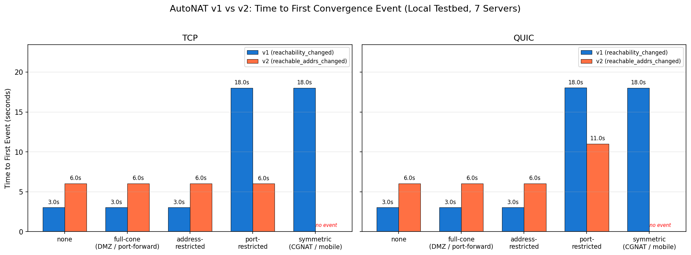
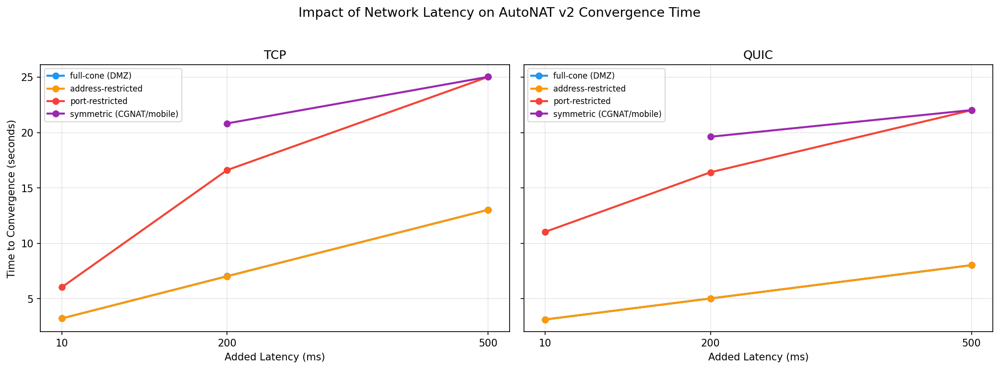
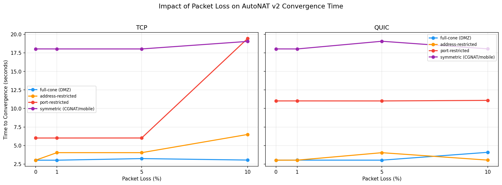
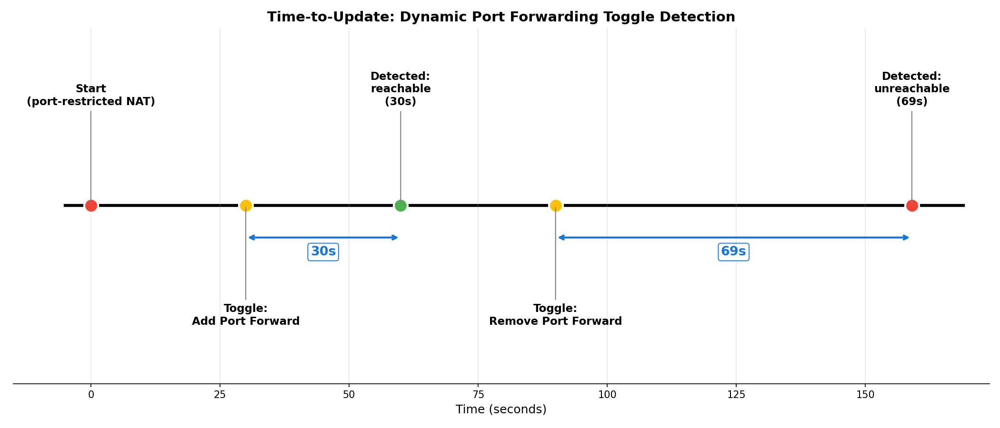
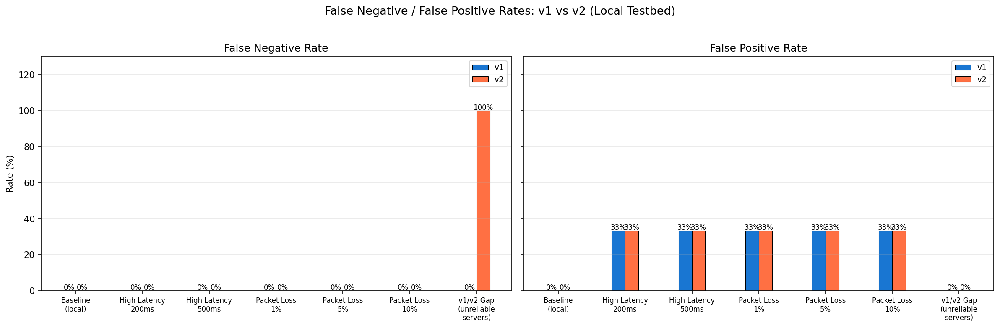

# Testbed Measurement Results

Complete results from all testbed experiments. For findings and
interpretation, see [final-report.md](final-report.md). For testbed
architecture, see [testbed.md](testbed.md).

**Total: 178 runs** across 69 scenarios, 7 scenario files.

---

## 1. Baseline Matrix (10 scenarios, 1 run each)

**Scenario file:** `testbed/scenarios/matrix.yaml`
**Traces:** `results/testbed/full-matrix-20260312T223319Z/`

5 NAT types × 2 transports, 7 servers, no degradation.

| Scenario | NAT Type | Transport | Result | TTC (ms) | FNR | FPR | Probes |
|----------|----------|-----------|--------|----------|-----|-----|--------|
| none-tcp-7 | none | TCP | reachable | 6,022 | 0% | — | 3 |
| none-quic-7 | none | QUIC | reachable | 6,019 | 0% | — | 3 |
| full-cone-tcp-7 | full-cone | TCP | reachable | 6,022 | 0% | — | 3 |
| full-cone-quic-7 | full-cone | QUIC | reachable | 6,021 | 0% | — | 3 |
| addr-restricted-tcp-7 | address-restricted | TCP | reachable | 6,021 | 0% | — | 3 |
| addr-restricted-quic-7 | address-restricted | QUIC | reachable | 6,021 | 0% | — | 3 |
| port-restricted-tcp-7 | port-restricted | TCP | unreachable | 6,013 | — | 0% | 3 |
| port-restricted-quic-7 | port-restricted | QUIC | unreachable | 11,015 | — | 0% | 4 |
| symmetric-tcp-7 | symmetric | TCP | **NO SIGNAL** | — | — | — | 0 |
| symmetric-quic-7 | symmetric | QUIC | **NO SIGNAL** | — | — | — | 0 |

**Observations:**
- 0% FNR and 0% FPR across all non-symmetric NATs
- TTC consistently ~6s for TCP, ~6-11s for QUIC
- Port-restricted QUIC needs extra probe round (11s vs 6s)
- Address-restricted reports reachable — false positive (Finding #4)
- Symmetric produces zero events (Finding #5)


*v1 vs v2 time to first convergence event by NAT type.*


*Detection correctness heatmap.*

---

## 2. High Latency (16 scenarios, 1 run each)

**Scenario file:** `testbed/scenarios/high-latency.yaml`
**Traces:** `results/testbed/high-latency-20260313T085635Z/`

4 NAT types × 2 transports × {200ms, 500ms} one-way latency.

| Scenario | NAT | Transport | Latency | TTC (ms) | vs baseline | FNR/FPR |
|----------|-----|-----------|---------|----------|-------------|---------|
| full-cone-tcp-7-lat200 | full-cone | TCP | 200ms | 18,670 | +210% | 0% |
| full-cone-tcp-7-lat500 | full-cone | TCP | 500ms | 32,023 | +432% | 0% |
| full-cone-quic-7-lat200 | full-cone | QUIC | 200ms | 12,617 | +110% | 0% |
| full-cone-quic-7-lat500 | full-cone | QUIC | 500ms | 20,022 | +233% | 0% |
| addr-restricted-tcp-7-lat200 | addr-restricted | TCP | 200ms | 18,421 | +206% | 0% |
| addr-restricted-tcp-7-lat500 | addr-restricted | TCP | 500ms | 32,021 | +432% | 0% |
| addr-restricted-quic-7-lat200 | addr-restricted | QUIC | 200ms | 12,623 | +110% | 0% |
| addr-restricted-quic-7-lat500 | addr-restricted | QUIC | 500ms | 20,020 | +232% | 0% |
| port-restricted-tcp-7-lat200 | port-restricted | TCP | 200ms | 16,874 | +181% | 0% |
| port-restricted-tcp-7-lat500 | port-restricted | TCP | 500ms | 27,519 | +358% | 0% |
| port-restricted-quic-7-lat200 | port-restricted | QUIC | 200ms | 16,417 | +173% | 0% |
| port-restricted-quic-7-lat500 | port-restricted | QUIC | 500ms | 22,015 | +100% | 0% |
| symmetric-tcp-7-lat200 | symmetric | TCP | 200ms | — | — | NO SIGNAL |
| symmetric-tcp-7-lat500 | symmetric | TCP | 500ms | — | — | NO SIGNAL |
| symmetric-quic-7-lat200 | symmetric | QUIC | 200ms | — | — | NO SIGNAL |
| symmetric-quic-7-lat500 | symmetric | QUIC | 500ms | — | — | NO SIGNAL |

**Observations:**
- Correctness unaffected (0% FNR/FPR at all latencies)
- QUIC more latency-resilient: +110% at 200ms vs TCP +210%
- At 500ms (1s RTT), TCP TTC reaches 32s but still within AutoNAT v2's 15s stream timeout
- Symmetric NAT still NO SIGNAL at all latencies


*Convergence time vs added latency.*

---

## 3. Packet Loss (24 scenarios, 1 run each)

**Scenario file:** `testbed/scenarios/packet-loss.yaml`
**Traces:** `results/testbed/packet-loss-20260313T093822Z/`

4 NAT types × 2 transports × {1%, 5%, 10%} loss.

| Scenario | NAT | Transport | Loss | TTC (ms) | vs baseline | FNR/FPR |
|----------|-----|-----------|------|----------|-------------|---------|
| full-cone-tcp-7-loss1 | full-cone | TCP | 1% | 6,018 | +0% | 0% |
| full-cone-tcp-7-loss5 | full-cone | TCP | 5% | 7,036 | +17% | 0% |
| full-cone-tcp-7-loss10 | full-cone | TCP | 10% | 14,877 | +147% | 0% |
| full-cone-quic-7-loss1 | full-cone | QUIC | 1% | 6,025 | +0% | 0% |
| full-cone-quic-7-loss5 | full-cone | QUIC | 5% | 6,245 | +4% | 0% |
| full-cone-quic-7-loss10 | full-cone | QUIC | 10% | 6,089 | +1% | 0% |
| addr-restricted-tcp-7-loss1 | addr-restricted | TCP | 1% | 6,223 | +3% | 0% |
| addr-restricted-tcp-7-loss5 | addr-restricted | TCP | 5% | 6,024 | +0% | 0% |
| addr-restricted-tcp-7-loss10 | addr-restricted | TCP | 10% | 8,501 | +41% | 0% |
| addr-restricted-quic-7-loss1 | addr-restricted | QUIC | 1% | 6,020 | +0% | 0% |
| addr-restricted-quic-7-loss5 | addr-restricted | QUIC | 5% | 6,226 | +3% | 0% |
| addr-restricted-quic-7-loss10 | addr-restricted | QUIC | 10% | 6,225 | +3% | 0% |
| port-restricted-tcp-7-loss1 | port-restricted | TCP | 1% | 6,015 | +0% | 0% |
| port-restricted-tcp-7-loss5 | port-restricted | TCP | 5% | 6,018 | +0% | 0% |
| port-restricted-tcp-7-loss10 | port-restricted | TCP | 10% | 19,430 | +223% | 0% |
| port-restricted-quic-7-loss1 | port-restricted | QUIC | 1% | 11,018 | +0% | 0% |
| port-restricted-quic-7-loss5 | port-restricted | QUIC | 5% | 11,014 | +0% | 0% |
| port-restricted-quic-7-loss10 | port-restricted | QUIC | 10% | 11,088 | +1% | 0% |
| symmetric-tcp-7-loss1 | symmetric | TCP | 1% | — | — | NO SIGNAL |
| symmetric-tcp-7-loss5 | symmetric | TCP | 5% | — | — | NO SIGNAL |
| symmetric-tcp-7-loss10 | symmetric | TCP | 10% | — | — | NO SIGNAL |
| symmetric-quic-7-loss1 | symmetric | QUIC | 1% | — | — | NO SIGNAL |
| symmetric-quic-7-loss5 | symmetric | QUIC | 5% | — | — | NO SIGNAL |
| symmetric-quic-7-loss10 | symmetric | QUIC | 10% | — | — | NO SIGNAL |

**Observations:**
- Correctness unaffected (0% FNR/FPR at all loss rates)
- QUIC dramatically more loss-resilient: +1% at 10% loss vs TCP +147%
- QUIC handles retransmission at transport layer
- 1% loss has negligible impact on both transports
- Symmetric NAT still NO SIGNAL at all loss rates


*Convergence time vs packet loss rate.*

---

## 4. ADF False Positive (6 scenarios, 20 runs each = 120 total)

**Scenario file:** `testbed/scenarios/adf-false-positive.yaml`
**Traces:** `results/testbed/adf-false-positive-{tcp,quic,both}/`

Address-restricted (ADF) vs port-restricted (APDF) × 3 transports.

| Scenario | NAT | Transport | Runs | Reported reachable | FPR |
|----------|-----|-----------|------|-------------------|-----|
| adf-tcp | address-restricted | TCP | 20 | 20/20 | **100%** |
| adf-quic | address-restricted | QUIC | 20 | 20/20 | **100%** |
| adf-both | address-restricted | both | 20 | 20/20 | **100%** |
| apdf-tcp | port-restricted | TCP | 20 | 0/20 | **0%** |
| apdf-quic | port-restricted | QUIC | 20 | 0/20 | **0%** |
| apdf-both | port-restricted | both | 20 | 0/20 | **0%** |

**Observations:**
- ADF false positive is deterministic (100% FPR), not probabilistic
- Consistent across all transports
- Port-restricted control shows 0% FPR (correct behavior)
- See [adf-false-positive.md](adf-false-positive.md) for protocol analysis

---

## 5. Time-to-Update / Toggle Scenarios (5 scenarios, 1 run each)

**Scenario file:** `testbed/scenarios/reachable-forwarded.yaml` (section 3)
**Traces:** `results/testbed/toggle-all/`

Port forwarding added then removed mid-session. 600s timeout per scenario.

| Scenario | NAT | Transport | Add forward | Remove forward |
|----------|-----|-----------|-------------|----------------|
| toggle-port-restricted-tcp | port-restricted | TCP | **30s** | **69s** |
| toggle-port-restricted-quic | port-restricted | QUIC | **30s** | **69s** |
| toggle-port-restricted-both | port-restricted | both | **30s** | **69s** |
| toggle-symmetric-both | symmetric | both | NOT detected (180s) | NOT detected (180s) |
| toggle-address-restricted-both | address-restricted | both | NOT detected (180s) | NOT detected (180s) |

**Observations:**
- Port-restricted: perfectly consistent 30s add / 69s remove across all transports
- Removal takes longer (existing confirmation must expire before re-probing)
- Symmetric: NOT detected — autonat v2 never runs, can't detect changes
- Address-restricted: NOT detected — already falsely reported as reachable


*Time-to-update timeline for port-restricted NAT toggle.*

---

## 6. v1/v2 Gap (2 scenarios, 5 runs total)

**Scenario file:** `testbed/scenarios/v1-v2-gap.yaml`
**Traces:** `results/testbed/v1-v2-gap-20260313T{111857,122413,123118,131939}Z/`

Full-cone NAT, 2 reliable + 5 unreliable servers, v1 refresh=30s,
600s observation window.

### Event Timelines

**Run: v1v2-gap-fullcone-tcp (122413Z) — clearest oscillation:**
```
  3,026ms   v1  PUBLIC
  5,010ms   v2  reachable=0 (initial)
  6,018ms   v2  reachable=1 [/ip4/73.0.0.2/tcp/4001]  ← stable
108,027ms   v1  PRIVATE  ← flipped!
183,027ms   v1  PUBLIC   ← flipped back!
```

**Run: v1v2-gap-fullcone-tcp (111857Z):**
```
  5,008ms   v2  reachable=0
 16,025ms   v2  reachable=1 [/ip4/73.0.0.2/tcp/4001]
 18,024ms   v1  PRIVATE  ← v1 starts private (unreliable server hit first)
 95,025ms   v1  PUBLIC   ← takes 95s to reach public
```

**Run: v1v2-gap-fullcone-tcp (131939Z):**
```
  5,014ms   v2  reachable=0
 18,028ms   v1  PRIVATE
185,030ms   v1  PUBLIC   ← 3+ minutes to reach public
```

**Run: v1v2-gap-fullcone-both (111857Z):**
```
  3,033ms   v1  PUBLIC
  5,014ms   v2  reachable=0
  6,028ms   v2  reachable=1 [/ip4/73.0.0.2/udp/4001/quic-v1]
```

**Run: v1v2-gap-fullcone-both (123118Z):**
```
  3,030ms   v1  PUBLIC
  5,012ms   v2  reachable=0
  6,034ms   v2  reachable=1 [/ip4/73.0.0.2/udp/4001/quic-v1]
```

### Summary

| Trace | Scenario | v1 flips | v2 stable? | v1 oscillated? |
|-------|----------|----------|------------|----------------|
| 111857Z | fullcone-both | 1 | Yes (QUIC at 6s) | No |
| 111857Z | fullcone-tcp | 2 | Yes (TCP at 16s) | **Yes** |
| 122413Z | fullcone-tcp | 3 | Yes (TCP at 6s) | **Yes** |
| 123118Z | fullcone-both | 1 | Yes (QUIC at 6s) | No |
| 131939Z | fullcone-tcp | 2 | — | **Yes** |

**v1 oscillation rate: 60%** (3/5 runs). **v2 oscillation rate: 0%.**

TCP-only scenarios oscillate more (all 3 TCP runs oscillate vs 0/2
both-transport runs).


*v1/v2 gap across three unreliable server ratios.*

---

## 7. Threshold Sensitivity (6 scenarios, 1 run each)

**Scenario file:** `testbed/scenarios/threshold-sensitivity.yaml`
**Traces:** `results/testbed/threshold-sensitivity/`

Testing `ActivationThresh` behavior with 3 servers.

| Scenario | Threshold | NAT | Result | Expected |
|----------|-----------|-----|--------|----------|
| thresh4-none-tcp-3 | 4 | none | REACHABLE | Expected no convergence — **surprised** |
| thresh4-none-quic-3 | 4 | none | REACHABLE | Expected no convergence — **surprised** |
| thresh2-none-tcp-3 | 2 | none | REACHABLE | Expected |
| thresh2-none-quic-3 | 2 | none | REACHABLE | Expected |
| thresh1-symmetric-tcp-3 | 1 | symmetric | UNREACHABLE | **Key finding** — v2 runs! |
| thresh1-symmetric-quic-3 | 1 | symmetric | UNREACHABLE | **Key finding** — v2 runs! |

**Observations:**
- No-NAT nodes converge regardless of threshold (listen address is directly public)
- Threshold only affects observed address promotion for NATted nodes
- **Symmetric NAT silence is fixable:** with thresh=1, nodes get correct UNREACHABLE
- Tradeoff: lower threshold = less confidence in observed address stability

---

## 8. Cross-Implementation (verified, not quantified)

**Client implementations tested:** go-libp2p, rust-libp2p, js-libp2p
**Server:** go-libp2p only (7 servers, no-NAT scenario)

| Client | Connected | Spans emitted | AutoNAT result |
|--------|-----------|---------------|----------------|
| go-libp2p | 7/7 servers | started, connected(7), reachable_addrs_changed | REACHABLE (correct) |
| rust-libp2p | 7/7 servers | started, connected(7), reachable_addrs_changed(7) | UNREACHABLE — ephemeral ports |
| js-libp2p | 7/7 servers | started, connected(7), reachable_addrs_changed(2) | Peer update events (proxy) |

Quantitative cross-implementation comparison not meaningful due to
fundamental issues in rust (wrong addresses probed) and js (proxy events).
See implementation docs for code-level analysis.

---

## Aggregate Metrics

| Metric | Value | Source |
|--------|-------|--------|
| Total runs | 178 | All scenario files |
| FNR (non-symmetric, non-rust) | **0%** | Baseline + latency + loss |
| FPR (non-ADF) | **0%** | Baseline + latency + loss |
| ADF FPR | **100%** | 120 runs |
| Baseline TTC (TCP) | ~6,000ms | Baseline matrix |
| Baseline TTC (QUIC) | ~6,000-11,000ms | Baseline matrix |
| Probes to converge | 3 | = targetConfidence |
| TTU add forward | ~30s | Toggle scenarios |
| TTU remove forward | ~69s | Toggle scenarios |
| v1 oscillation rate | 60% (3/5) | v1/v2 gap |
| v2 oscillation rate | 0% | v1/v2 gap |
| QUIC TTC increase at 10% loss | +1% | Packet loss |
| TCP TTC increase at 10% loss | +147% | Packet loss |

---

## Convergence Heatmaps


*Convergence time: NAT type × condition (TCP).*


*Convergence time: NAT type × condition (QUIC).*


*False negative and false positive rates across all conditions.*
