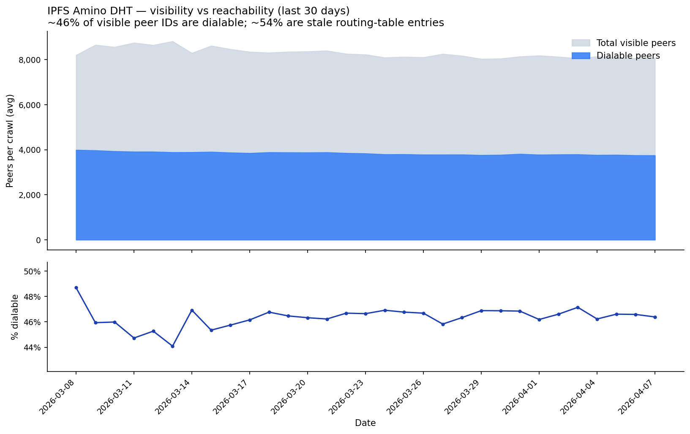
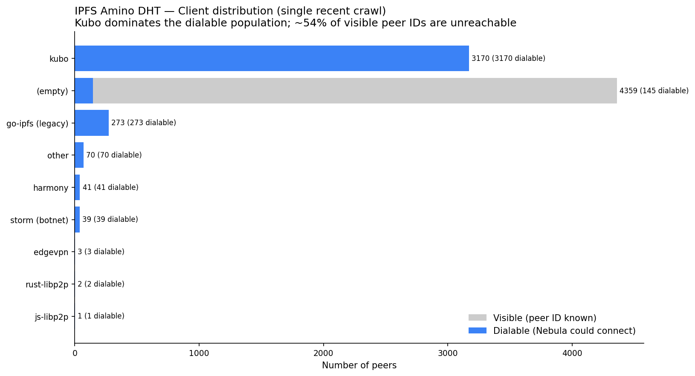
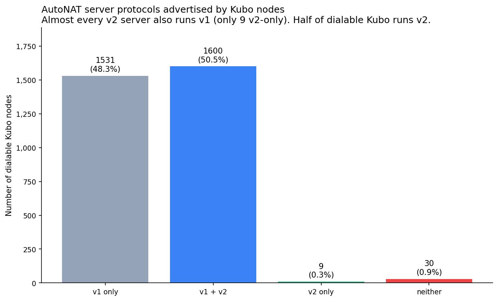
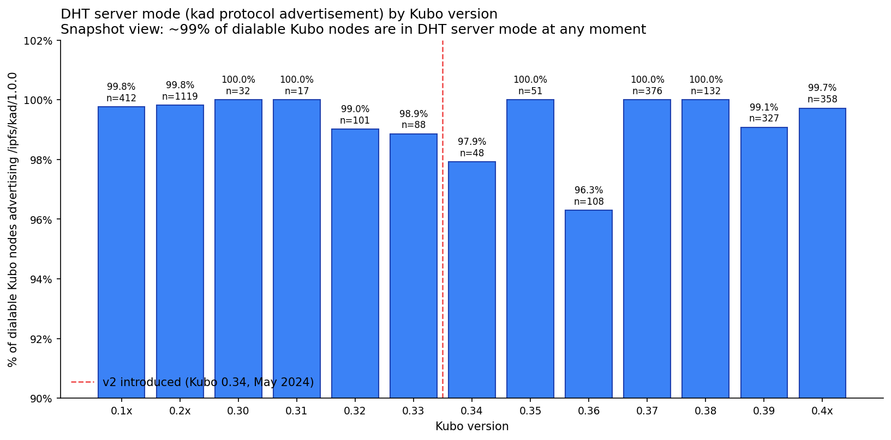
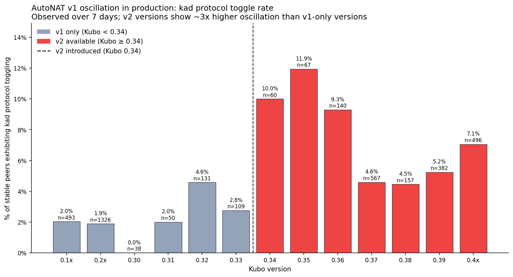
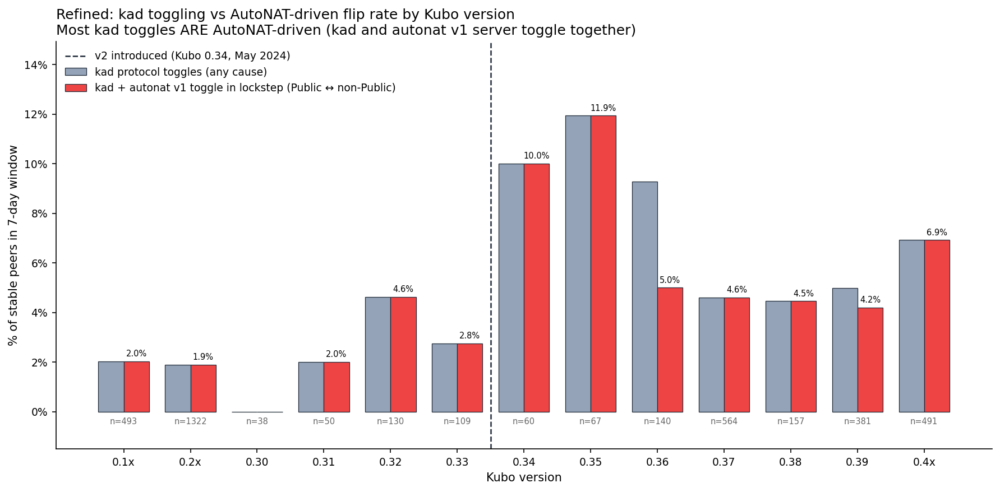

# AutoNAT in Production: Nebula Crawl Analysis of the IPFS Amino DHT

External observation of libp2p protocol advertisements in the IPFS Amino DHT
using ProbeLab's Nebula crawler data. Queried from the public ClickHouse
dataset.

**Network:** IPFS Amino DHT
**Data source:** `nebula_ipfs_amino` (raw `visits`) and
`nebula_ipfs_amino_silver` (deduplicated change logs)
**Time range:** All `visits` observations are from a single recent successful
crawl (April 2026) unless otherwise noted. Time-series data is from the last
30 days. Oscillation analysis covers the last 7 days.
**Crawl frequency observed:** ~12 successful crawls per day during the recent
period (from `nebula_ipfs_amino.crawls`).

---

## How Nebula Crawls (Verified from Source)

This section is based on reading the Nebula source code at
[github.com/dennis-tra/nebula](https://github.com/dennis-tra/nebula). File
references are to that repository.

### Bootstrap

For `--network IPFS` (or `AMINO`), Nebula does **not** maintain its own
bootstrap list. It uses `kaddht.DefaultBootstrapPeers` from
`go-libp2p-kad-dht` (the standard Kubo bootstrappers). The list is pushed
into a task channel at startup; for the libp2p crawl path the channel is
then closed, so all subsequent peers come from `FIND_NODE` walking.
(`config/config.go:683-689`, `libp2p/driver_crawler.go:151-154`)

### Per-peer visit lifecycle

`Crawler.Work` at `libp2p/crawler.go:57`. For each peer in the work queue:

1. **Address filtering.** Multiaddrs are filtered by `addr-dial-type`
   (default: strip private CIDRs). The kept set becomes `dial_maddrs`,
   the rest becomes `filtered_maddrs`. (`libp2p/crawler.go:73-94`)

2. **Connect.** Calls `host.Network().DialPeer(ctx, peerID)`
   (`libp2p/crawler_p2p.go:236-239`). This hands the **full address set
   to libp2p's swarm**, which dials all transports concurrently and
   returns whichever transport handshake **wins the race first**. Default
   timeout 15s. Specific transient errors (`connection refused`, gating,
   relay resource limits) are retried with backoff up to ~1 minute.
   (`libp2p/crawler_p2p.go:247-283`)

3. **Record `connect_maddr`.** On success this is set to
   `conn.RemoteMultiaddr()` — i.e., the address of the connection libp2p
   actually opened. **This is "the transport that won the race", not "the
   first address Nebula tried."** It is biased toward whichever transport
   handshakes fastest (often QUIC over TCP on the same IP).

4. **Wait for Identify, with a 5s timeout.** On a successful connection,
   Nebula registers an Identify listener before connecting and then waits
   up to 5 seconds for the Identify result. If it arrives, `agent_version`,
   `listen_maddrs`, and `protocols` are recorded. **If Identify times out,
   those fields stay empty even though the connection succeeded.**
   (`libp2p/crawler_p2p.go:111-129`)

5. **Drain buckets via `FIND_NODE`.** After connecting, Nebula spawns 16
   parallel goroutines, one per common-prefix-length 0–15. Each generates
   a random Kademlia ID at exactly that distance from the visited peer
   and sends one `FIND_NODE` RPC for it. The neighbors found across all
   16 buckets are deduplicated by peer ID and form the visit's
   `RoutingTable`. Per-bucket failures are encoded as 16 `ErrorBits`.
   (`libp2p/crawler_p2p.go:289-382`)

### Work queue and termination

Engine state holds `inflight`, `processed`, and a priority queue keyed by
peer ID (`core/engine.go:121-126`). On enqueue (`engine.go:435-475`):
- If a peer is inflight or already processed → skip
- If a peer is already queued → merge multiaddrs with the queued task
- Peers with no known dialable addresses go to the back (priority 0)

Each peer is visited at most once per crawl. The crawl ends when the
bootstrap channel is closed (immediate for IPFS), the queue is empty, AND
no requests are in flight.

### Visit-row fields and how they are populated

| Column | Source | Notes |
|---|---|---|
| `connect_maddr` | `conn.RemoteMultiaddr()` on the winning connection | NULL on connection failure. Reflects whichever transport handshake won the parallel dial race. |
| `dial_errors` | `db.MaddrErrors(dial_maddrs, connect_error)` | Same length as `dial_maddrs`. Per-address error strings reconstructed from libp2p's aggregated error. **Addresses libp2p opportunistically skipped get the literal string `not_dialed`** — absence of an error is not the same as success. |
| `crawl_error` | Set only when connect succeeded AND every `FIND_NODE` bucket walk failed AND zero neighbors were returned. | (`libp2p/crawler.go:129-136`) Even one neighbor returned → success. **`crawl_error` is rare and conservative**, not the same as "Nebula couldn't connect." |
| `agent_version` | libp2p Identify response only (no caching from prior crawls in the libp2p path) | Empty when Identify times out within 5s. Stored as NULL in ClickHouse. |
| `protocols` | libp2p Identify response | Empty when Identify times out. |
| `listen_maddrs` | libp2p Identify response | Empty when Identify times out. |

### How `dialable_peers` is counted (from the handler, not from SQL)

`PeersDialable = CrawledPeers − sum(ConnErrs)`
(`core/handler_crawl.go:219-239`)

**Critical:** "undialable" only counts peers with `ConnectError != nil`.
A peer where the connection succeeded but every `FIND_NODE` failed is
**still counted as dialable**, even though it has `crawl_error` set.
The schema invariant is `crawled_peers = dialable_peers + undialable_peers`.

The `crawls` table stores these counts directly; the per-visit computation
of "dialable" is purely `connect_maddr IS NOT NULL`.

### What Nebula does NOT do

- It does not run AutoNAT v2 client probes against discovered peers
- It does not cache `agent_version` from previous crawls (in the libp2p path)
- It does not retry Identify on failure within a single visit
- It does not crawl from multiple geographic vantage points (single point
  of view)
- It does not directly observe AutoNAT internal state on remote peers

### Implications for this analysis

1. **`connect_maddr` is biased toward whichever transport handshakes
   fastest.** When a peer offers both TCP and QUIC on the same IP, the
   recorded `connect_maddr` will usually be QUIC. This means the
   `connect_maddr`-by-transport breakdown does not reflect "what works
   best" — it reflects "what won the race first." We do not use this
   breakdown in any of the findings below.

2. **`agent_version IS NULL` does not mean "non-Kubo client"** — it means
   either the connection failed OR Identify took longer than 5 seconds.
   Slow nodes can legitimately appear in the empty bucket.

3. **`crawl_error` is not "connection failed"** — it's "connection
   succeeded but FIND_NODE walk failed completely." We do not use it as
   a dialability indicator.

4. **Each visit puts up to 16 `FIND_NODE` queries on the visited peer.**
   This is the workload Nebula imposes regardless of which fields we are
   actually interested in.

---

## What This Analysis Measures (and What It Cannot Measure)

This analysis uses **protocol advertisements observed by Nebula** as a proxy
for what each peer's local libp2p host is doing.

What we directly observe:

- For each peer Nebula visits, the set of libp2p protocols it advertised in
  Identify at the time of the visit (`visits.protocols`)
- Whether Nebula's connection attempt succeeded (`visits.connect_maddr` is
  not NULL)
- The peer's `agent_version` string

What we **infer** (and these inferences are imperfect):

- **"This Kubo node currently has its DHT in Server mode"** is inferred from
  the presence of `/ipfs/kad/1.0.0` in the peer's protocol list. In Kubo, the
  DHT registers this stream handler when it enters Server mode and removes
  it when it enters Client mode (verified in the source-code analysis in
  `docs/v1-v2-state-transitions.md`). This proxy is reasonable but not
  identical to the underlying state.
- **"AutoNAT v1 currently considers this node Public"** is inferred from the
  same kad advertisement, because Kubo's DHT mode switching is driven by
  `EvtLocalReachabilityChanged` (v1's event). Same caveat: it is a proxy.
- **"This Kubo node has v2 server enabled"** is inferred from the presence
  of `/libp2p/autonat/2/dial-request`. v2's server stream handler is
  registered when v2 is enabled (whether by `EnableAutoNATv2()` or any
  other configuration mechanism).

What we **cannot observe**:

- AutoNAT v1 or v2 internal state (confidence values, server selection,
  individual probe outcomes)
- Whether a peer's behavior is changing because of AutoNAT or for some
  other reason (transient errors, restarts, configuration changes)
- Peers that Nebula cannot dial — they appear in routing tables (via
  `FIND_NODE` responses) but Nebula cannot run Identify against them, so
  we have no protocol or agent_version data for them

This selection bias is significant: **the analysis below describes the
subset of peers that Nebula can dial and Identify**. It is silent about
behind-NAT or transient peers.

---

## Findings

### Finding A: About half of visible peer IDs in the IPFS DHT cannot be dialed by Nebula

From the recent 30-day window (`nebula_ipfs_amino.crawls`):

| Metric | Value |
|---|---|
| Successful crawls per day (recent) | ~12 |
| Avg `crawled_peers` per crawl | ~8,100 |
| Avg `dialable_peers` per crawl | ~3,750 (~46%) |
| Avg `undialable_peers` per crawl | ~4,300 (~54%) |

`crawled_peers` is the count of peer IDs Nebula attempted to visit during
the crawl (peer IDs are discovered via `FIND_NODE` walking). `dialable_peers`
is the count where the connection attempt succeeded. The remaining ~54%
were peer IDs Nebula learned about but could not connect to within that
crawl.

Possible reasons for being undialable, which we did not separate:

- The peer is offline or unreachable from Nebula's vantage point
- The peer is behind NAT and only running in DHT client mode
- The peer's connection was filtered, rate-limited, or transiently failed
- The peer ID is from an old session and the host has since changed key
- Network errors during the crawl

The historical (May 2025 – April 2026) average we measured was higher
(~20,500 visible per crawl, ~32% dialable). The recent value (~8,100) is
lower. We did not investigate whether this drop reflects network changes,
crawler changes, or other factors.


*Figure 1: Total visible (`crawled_peers`) vs dialable (`dialable_peers`)
peer counts per crawl, daily average over the last 30 days. Source:
`nebula_ipfs_amino.crawls`. **Includes both dialable and undialable peers**
(visible = both combined). The percentage line is `dialable / crawled`.*

### Finding B: Within the dialable subset, Kubo and go-ipfs dominate by client share

Cross-tab of `agent_version` (empty vs not) and dialability in one recent crawl:

| `agent_version` | Dialable | Undialable | Total |
|---|---|---|---|
| Has agent string | 3,621 | **0** | 3,621 |
| Empty | 121 | 4,116 | 4,237 |
| **Total** | 3,742 | 4,116 | 7,858 |

Two relationships are exact:
1. **Every undialable peer has empty `agent_version`.** Identify requires a
   successful connection, so undialable peers have no agent string, no
   protocol list, and no listen-address data Nebula could collect.
2. **Some peers with empty `agent_version` are dialable** (121 in this crawl).
   The connection succeeded but Identify did not return an agent string
   within Nebula's **5-second Identify timeout** (`libp2p/crawler_p2p.go:111-129`).
   This can be a slow Identify response, an implementation that does not
   run standard Identify, or a transient failure mid-exchange. We cannot
   distinguish these from the visit data alone.

So "empty agent" is a strict superset of "undialable": empty = undialable +
"dialable but Identify yielded no agent". They are related but not the same.

Of dialable peers in the most recent crawl, grouped by `agent_version`:

| Implementation (`agent_version` pattern) | Dialable nodes | % of dialable |
|---|---|---|
| `kubo/...` | 3,170 | ~84% |
| `go-ipfs/...` (legacy, pre-Kubo rename) | 273 | ~7% |
| (empty `agent_version`, dialable) | 145 | ~4% |
| `harmony` | 41 | ~1% |
| `storm...` | 39 | ~1% |
| `other` | 70 | ~2% |
| `edgevpn` | 3 | <1% |
| `rust-libp2p/...` | 2 | <0.1% |
| `js-libp2p/...` | 1 | <0.1% |

(Counts are from a slightly earlier crawl than the cross-tab above, so the
exact numbers differ. The relationships hold in both crawls.)

This describes only the dialable subset. We have no agent_version data for
the ~4,100 undialable peers per crawl, which Nebula learned about via
`FIND_NODE` walking but could not Identify.

Within the dialable subset, rust-libp2p and js-libp2p combined account for
3 nodes. **For dialable peers in the IPFS Amino DHT, the population is
overwhelmingly Kubo + legacy go-ipfs.** We cannot make claims about the
non-dialable population.

The `storm` agent_version corresponds to the IPStorm botnet client. Public
sources (e.g., DOJ press release, November 2023) describe an FBI dismantling
operation. We observe 39 dialable nodes still advertising this agent_version
in April 2026. We did not investigate whether these are surviving infections,
re-deployments, name reuse, or some other origin.


*Figure 2: Client distribution by `agent_version` (single recent crawl).
Source: `nebula_ipfs_amino.visits` filtered to one `crawl_id`. **Includes
both dialable and undialable peers**: grey bars are total visited (dialable
+ undialable); blue bars are the dialable subset. The "(empty)" category is
peer IDs where Identify did not return an agent string. Almost all undialable
peers fall in "(empty)", because Identify requires a successful connection.*

### Finding C: Of the dialable Kubo subset, ~50% advertise both AutoNAT v1 and v2 server protocols

Filtered to dialable peers with `agent_version LIKE 'kubo/%'` in the same
recent crawl:

| AutoNAT server protocols advertised | Count | % |
|---|---|---|
| v1 + v2 (both `/libp2p/autonat/1.0.0` and `/libp2p/autonat/2/dial-request`) | 1,600 | 50.5% |
| v1 only (`/libp2p/autonat/1.0.0`) | 1,531 | 48.3% |
| v2 only (`/libp2p/autonat/2/dial-request`) | 9 | 0.3% |
| neither | 30 | 0.9% |

This counts advertisements, not behavior. We do not directly verify that
nodes advertising the v2 server protocol actually accept and answer dial
requests.

The ~50/50 split between "v1+v2" and "v1 only" is consistent with v2 being
an additional opt-in protocol rather than a replacement for v1. Almost no
node advertises v2 without v1 (9 out of ~1,609 v2-server-advertising nodes).


*Figure 3: AutoNAT server protocols advertised by dialable Kubo nodes in
one recent crawl. Source: `nebula_ipfs_amino.visits` filtered to
`agent_version LIKE 'kubo/%'` and `connect_maddr IS NOT NULL`. **Excludes
undialable peers and non-Kubo clients.***

### Finding D: In a single snapshot, ~99% of dialable Kubo advertise the DHT server protocol

This finding describes a single point-in-time measurement. It does not
characterize the network's behavior over time — that requires the
multi-crawl analysis in Findings E and F. The two are not in conflict;
they measure different things and the apparent stability in this snapshot
is consistent with the dynamic behavior shown later (see "Reconciling
Findings D and E" below).

Per Kubo version bucket, in the same recent crawl:

| Kubo version | Dialable nodes | % advertising `/ipfs/kad/1.0.0` |
|---|---|---|
| 0.1x | 412 | 99.8% |
| 0.2x | 1,119 | 99.8% |
| 0.30 | 32 | 100% |
| 0.31 | 17 | 100% |
| 0.32 | 101 | 99.0% |
| 0.33 | 88 | 98.9% |
| 0.34 | 48 | 97.9% |
| 0.35 | 51 | 100% |
| 0.36 | 108 | 96.3% |
| 0.37 | 376 | 100% |
| 0.38 | 132 | 100% |
| 0.39 | 327 | 99.1% |
| 0.4x | 358 | 99.7% |

Caveat: this is one moment in time. A peer that flips its DHT mode
frequently will appear in this table as either "advertising kad" or "not
advertising kad" depending on which side of the flip it was on when Nebula
visited. The snapshot view does not detect oscillation.

We did not compute "false positive" or "false negative" rates relative to
AutoNAT's internal state because we cannot observe that state. The
snapshot ~99% number tells us how often Kubo nodes are kad-advertising at
any given moment — it does not tell us how stable that state is over time.
Over a window of multiple observations the picture changes substantially:
see Findings E and F, and "Reconciling Findings D and E" below.


*Figure 4: Percentage of dialable Kubo nodes advertising `/ipfs/kad/1.0.0`,
per version bucket, in a single recent crawl. Source:
`nebula_ipfs_amino.visits` filtered to `agent_version LIKE 'kubo/%'` and
`connect_maddr IS NOT NULL`. **Excludes undialable peers and non-Kubo
clients.** This is a snapshot view that does not capture state changes
between crawls. The number of dialable nodes per bucket (`n=`) varies;
smaller buckets have noisier percentages.*

### Finding E: Kubo versions ≥ 0.34 show a higher rate of DHT-server-protocol toggling than older versions

Tracking the same peers across multiple crawls over 7 days using the silver
change-log table. A peer is counted as "toggling" if its protocol set
contains `/ipfs/kad/1.0.0` in some logged states and not in others within
the 7-day window.

| Kubo version | Peers observed | Toggling | % |
|---|---|---|---|
| 0.1x | 493 | 10 | 2.03% |
| 0.2x | 1,326 | 25 | 1.89% |
| 0.30 | 38 | 0 | 0% |
| 0.31 | 50 | 1 | 2.00% |
| 0.32 | 131 | 6 | 4.58% |
| 0.33 (last v1-only) | 109 | 3 | 2.75% |
| 0.34 (v2 added) | 60 | 6 | 10.00% |
| 0.35 | 67 | 8 | 11.94% |
| 0.36 | 140 | 13 | 9.29% |
| 0.37 | 567 | 26 | 4.59% |
| 0.38 | 157 | 7 | 4.46% |
| 0.39 | 382 | 20 | 5.24% |
| 0.4x (latest) | 496 | 35 | 7.06% |

Aggregated across all observed Kubo peers in the 7-day window:

| Bucket | Total | Toggling | % |
|---|---|---|---|
| Kubo < 0.34 | 2,148 | 45 | 2.09% |
| Kubo ≥ 0.34 | 2,048 | 140 | 6.84% |

What the data shows:
- The rate of `/ipfs/kad/1.0.0` toggling per peer is approximately 3.3×
  higher in Kubo ≥ 0.34 than in Kubo < 0.34 in this 7-day window, on this
  network (IPFS Amino DHT), as observed by this crawler from this vantage
  point.
- Kubo 0.34 is the version that introduced AutoNAT v2 as an opt-in feature
  (`EnableAutoNATv2()`).

What the data does **not** show:
- We do not directly verify that any individual ≥0.34 peer has v2 enabled.
  We know from Finding C that ~50% of dialable Kubo run the v2 server
  protocol; the version-by-version v2-enabled fraction is not measured here.
- We do not verify that the toggling is caused by AutoNAT v1 state changes
  rather than restarts, network changes, or other reasons.
- We do not control for Kubo deployment patterns that may have changed
  alongside the version bump (Docker, ephemeral instances, default
  configurations, ResourceManager defaults, etc.).
- We did not measure toggling rates in Filecoin or Celestia networks (which
  also use go-libp2p with AutoNAT v1 but typically not v2) — that would
  help isolate whether the increase is v2-specific or go-libp2p-version-specific.

### Possible explanations for the increased toggling in newer Kubo versions

These are hypotheses, not conclusions:

1. **The v2 wiring gap is real and observable.** Source-code analysis
   (`docs/v1-v2-state-transitions.md` and the DHT subscriber notifee
   discussion) shows that v2's results are not consumed by Kubo's DHT, so
   v1's behavior continues to drive DHT mode regardless of v2 being
   enabled. Adding v2 does not address v1's oscillation. This explanation
   would predict no improvement in oscillation when v2 is added, but does
   not by itself explain an *increase*.

2. **Additional protocol churn from v2's lifecycle.** Adding the v2 server
   stream handlers introduces more protocol-set changes (when v2 is
   enabled or disabled), which could trigger more Identify pushes and
   more downstream events. We did not measure this.

3. **Behavioral changes in Kubo defaults.** Newer Kubo versions may have
   changed defaults around connection limits, ResourceManager, refresh
   intervals, or autonat probing schedule that interact with v1 behavior.
   We did not enumerate these changes.

4. **Confounded with deployment patterns.** Newer Kubo versions are likely
   correlated with newer deployment environments. If newer versions are
   more often run in conditions where v1 is more unstable (e.g., Docker
   on ephemeral cloud, residential broadband behind NAT), the version
   correlation could reflect deployment correlation rather than code
   changes. We did not control for this.

5. **Sampling differences.** Smaller buckets (e.g., 0.30 with 38 peers,
   0.34 with 60 peers) are noisier; the extreme percentages in 0.34/0.35
   could be partially explained by small-sample variance. The trend in
   the larger buckets (0.37 with 567 peers, 0.39 with 382 peers, 0.4x
   with 496 peers) is more reliable.

The data is consistent with the wiring-gap hypothesis but does not prove
it. To confirm, we would need either (a) the same comparison on networks
where v2 was never deployed, (b) a controlled deployment experiment, or
(c) a fork of Kubo that wires v2 into `EvtLocalReachabilityChanged` and
shows reduced oscillation in production.


*Figure 5: Percentage of observed Kubo peers (in the last 7 days) whose
protocol set toggled to/from including `/ipfs/kad/1.0.0`. Source:
`nebula_ipfs_amino_silver.peer_logs_protocols` joined to
`peer_logs_agent_version`. **Implicitly excludes peers that were undialable
throughout the 7-day window**: the silver `peer_logs_*` tables only insert
rows when a peer's state is observed via Identify, which requires a
successful connection. A peer that was never successfully Identified in
the 7-day window has no rows and is not counted. The vertical line marks
Kubo 0.34, the version that introduced AutoNAT v2 as an opt-in feature.
Smaller buckets have larger uncertainty.*

### Finding F: Most kad-protocol toggles are accompanied by autonat v1 server toggles in the same direction

The kad-only metric in Finding E counts any peer whose protocol set
contained `/ipfs/kad/1.0.0` in some silver-table observations and not in
others. This is a loose proxy for "DHT mode flip" because in principle a
peer could toggle the kad protocol for reasons unrelated to AutoNAT
(operator config changes, custom go-libp2p applications that wire kad
independently of autonat, partial protocol updates).

To tighten the inference we used a state-pattern check based on Kubo's
source code (`docs/v1-v2-state-transitions.md`):

- **Public state**: Kubo's DHT registers `/ipfs/kad/1.0.0` AND its
  `NATService` registers `/libp2p/autonat/1.0.0`
- **Unknown state**: kad **off**, autonat v1 server **on** (NATService
  stays enabled in Unknown — see `recordObservation` in
  `p2p/host/autonat/autonat.go`)
- **Private state**: kad **off**, autonat v1 server **off**
  (`service.Disable()` is called only on Private with confidence 0)

So a peer that, within the 7-day silver-table window, has at least one
row in the **Public** pattern AND at least one row in the **Private** or
**Unknown** pattern is exhibiting a Public ↔ non-Public state change in
exactly the way Kubo's `EvtLocalReachabilityChanged` handler would
produce. We call this an **AutoNAT-driven flip**.

There is also an **inconsistent state** (`kad on`, `autonat v1 off`)
which would not be produced by Kubo's normal AutoNAT handling. We
investigated separately and found that 198 peers in the 7-day window
have this state at some point — the majority are not Kubo at all (they
are custom go-libp2p applications such as BSV blockchain, licketyspliket,
nabu, etc., which enable kad without enabling autonat v1). For Kubo
specifically, the inconsistent state appears in 53 of the 4,003 stable
Kubo peers (~1.3%); most of those are kubo 0.36/0.37 nodes that also
advertise the v2 server protocol. These are excluded from the
"AutoNAT-driven flip" count because they could be operator-customized
deployments rather than AutoNAT state changes.

Refined per-version results, comparing kad-only toggling (Finding E) to
the AutoNAT-driven flip pattern:

| Kubo version | Stable peers | kad toggling % | AutoNAT-driven % |
|---|---|---|---|
| 0.1x | 493 | 2.03% | 2.03% |
| 0.2x | 1,322 | 1.89% | 1.89% |
| 0.30 | 38 | 0% | 0% |
| 0.31 | 50 | 2.00% | 2.00% |
| 0.32 | 130 | 4.62% | 4.62% |
| 0.33 (last v1-only) | 109 | 2.75% | 2.75% |
| 0.34 (v2 added) | 60 | 10.00% | 10.00% |
| 0.35 | 67 | 11.94% | 11.94% |
| 0.36 | 140 | 9.29% | **5.00%** |
| 0.37 | 564 | 4.61% | 4.61% |
| 0.38 | 157 | 4.46% | 4.46% |
| 0.39 | 381 | 4.99% | 4.20% |
| 0.4x (latest) | 491 | 6.92% | 6.92% |

For **most versions** the two metrics are identical or nearly so —
meaning the kad toggling we observed is, in fact, the AutoNAT-driven
Public ↔ non-Public pattern, not configuration drift. The 0.36 column
shows the largest reduction (9.29% → 5.00%): about half of the 0.36
"toggling" peers are in the inconsistent (`kad on, autonat off`) state
that we now exclude.

Aggregated:

| Bucket | Stable Kubo peers | AutoNAT-driven flips | % |
|---|---|---|---|
| Kubo < 0.34 (v1-only era) | 2,142 | 44 | **2.05%** |
| Kubo ≥ 0.34 (v2 available) | 2,000 | 105 | **5.25%** |

After the refinement, post-v2 Kubo still shows ~2.6× more AutoNAT-driven
flips than pre-v2 Kubo. The version trend is preserved; the absolute
numbers are slightly lower because some non-AutoNAT-pattern noise was
removed.

What the data shows:
- The toggling we observed is dominantly the AutoNAT Public ↔ non-Public
  pattern, not config drift or unrelated protocol changes
- The post-v2 vs pre-v2 ratio shrinks slightly (3.3× → 2.6×) but the
  trend is robust to the refinement
- Inconsistent states (`kad on, autonat off`) are concentrated in
  non-Kubo go-libp2p applications, not in Kubo itself

What the data does **not** show:
- Whether the AutoNAT state changes are "correct" responses to genuine
  reachability problems or "false" responses to unreliable AutoNAT
  servers. We can only see the state transitions, not their cause.
- Direction asymmetry: a peer counted as "AutoNAT-driven" might have
  flipped Public→Private once, Public→Unknown twice, etc. We do not
  count transitions, only presence-of-both-states.


*Figure 6: Kad toggling (grey) vs AutoNAT-driven flips (red) per Kubo
version. AutoNAT-driven flips are peers that have both a Public
(`kad on AND autonat-v1-server on`) state and a non-Public
(`kad off AND autonat-v1-server on/off`) state in the 7-day window.
Source: `nebula_ipfs_amino_silver.peer_logs_protocols` joined to
`peer_logs_agent_version`. The two bars are nearly identical for most
versions, indicating the kad toggling is dominantly explained by the
AutoNAT Public ↔ non-Public state-change pattern.*

---

## Reconciling Findings D and E

A reader looking at Findings D and E in sequence might see an apparent
contradiction:

- **Finding D**: in a single recent crawl, ~99% of dialable Kubo nodes
  advertise `/ipfs/kad/1.0.0`. The snapshot looks stable.
- **Finding E**: ~5% of stable Kubo peers in a 7-day window have
  observations both with kad on AND with kad off. The window looks
  unstable.

These are not in conflict — they measure different things on different
populations and time scales.

### How a single peer can appear in both numbers

Consider a Kubo peer that flips Public → Private → Public during the
7-day window. Each flip is recorded as a separate row in the silver
`peer_logs_protocols` table (one when kad disappears, one when kad
reappears).

- In the silver-table view, this peer has both `kad-on` and `kad-off`
  rows → counted in **Finding E** as toggling.
- In the bronze `visits` view of any single crawl, the peer is whichever
  state it happens to be in at that moment. If it spends more time
  Public than non-Public, it's most likely caught in the kad-on state,
  contributing to **Finding D's 99%**.

So the snapshot 99% is the time-averaged probability of being in
kad-on, while the toggling % is the probability of having flipped at
least once during the window. They are different statistics of the same
underlying behavior.

### Quantifying time spent in each state

To check whether the two numbers are quantitatively consistent, we
computed for the 158 Kubo peers that toggle: the fraction of their
silver-table observations that are in the kad-off state.

| Statistic | Value |
|---|---|
| Toggling Kubo peers (7-day window) | 158 |
| Mean fraction of observations in kad-off | **33.5%** |
| Median | 32.3% |
| Interquartile range | 17.5% – 50% |

So toggling peers do not spend most of their time kad-on with brief
blips off. On average they spend about a third of their observed time
in kad-off, and the middle half spend between 17% and 50% in kad-off.

This is more substantial DHT mode instability than the snapshot 99%
number suggests on its own.

### Mathematical consistency check

If 158 Kubo peers (out of ~4,000 stable peers) toggle, and they spend
~33% of their time in kad-off, then in any single snapshot we should
expect to catch:

- 158 × 0.335 ≈ 53 peers in kad-off due to toggling
- Plus a small number of peers that are always-off for other reasons
- Total expected snapshot fraction in kad-off ≈ 1.5%–2% of the dialable
  Kubo population

Finding D's snapshot showed roughly 1% of dialable Kubo not advertising
kad, depending on the version. **The two numbers are roughly consistent
within the noise of small per-version buckets.**

### What this means for the framing

Finding D (99% snapshot stability) and Finding E/F (5% toggling rate)
describe the same behavior at different time scales. They are not in
conflict, but the snapshot view by itself is misleading: "99% of Kubo
nodes are correctly in DHT server mode right now" obscures "and ~5% of
them will have flipped to client mode at least once by the end of the
week, spending on average a third of their observed time in client
mode." Both statements are true; the second is more relevant for the
question of whether AutoNAT-driven DHT mode behavior is stable in
practice.

---

## Could the toggling be node restarts rather than AutoNAT oscillation?

A reasonable alternative explanation: when a Kubo node restarts, it
boots in `Unknown` reachability state, the DHT defaults to client mode
(no `/ipfs/kad/1.0.0` advertisement), and only enters Server mode after
AutoNAT v1 confirms Public. So a restart looks like a kad-off → kad-on
transition in the silver table, exactly the pattern we count as
toggling.

We checked several signals against this hypothesis.

### 1. Toggling peers are not being upgraded

For the 158 toggling Kubo peers in the 7-day window:

| Metric | Value |
|---|---|
| Toggling Kubo peers | 158 |
| Average distinct agent versions per peer in window | **1.01** |
| Peers with more than one agent version | **1** |

Only 1 of 158 toggling peers changed its `agent_version` string during
the window. The rest are stable installations. So the toggling is not
caused by Kubo upgrades / rebuilds.

### 2. The fraction of time spent in kad-off is too large for restart-only

The mean fraction of silver-table observations in kad-off for toggling
peers is **33.5%** (median 32.3%, IQR 17.5%–50%). A typical Kubo
restart resolves to Public within seconds to minutes once AutoNAT
contacts servers (~6-15 seconds in our testbed measurements; even on
slow networks, less than a few minutes).

For 33% of a 7-day window to come from restarts alone, a peer would
need to either restart constantly or remain in `Unknown` for ~2.3 days
out of 7. Neither is consistent with stable production deployments
showing a single agent version.

### 3. Listen-address stability is suggestive but not conclusive

We counted, per toggling peer, the number of distinct listen-address
sets observed in the 7-day window (from
`nebula_ipfs_amino_silver.peer_logs_listen_maddrs`).

| Distinct listen-address sets in 7 days | Toggling peers |
|---|---|
| Exactly 1 (no observed change) | 24 |
| 2 | 19 |
| 3 | 16 |
| ≤3 (subtotal) | 59 |
| More than 3 | 99 |
| Median across all toggling peers | 5 |

24 toggling peers had only one distinct listen-address set across the
entire week. Spot-checking these, several are large pinning-service
deployments with fully deterministic configurations:

```
listen_maddr: /dns4/pinning-pinbyhash-1.ipfs-swarm.use1.pinata.cloud/tcp/4001
```

A static-config Kubo deployment (fixed `Addresses.Swarm`, no UPnP, no
relay reservations, stable host) **can** restart and come back with
exactly the same listen address set. So stable addresses do not by
themselves rule out restarts. This signal is suggestive — restart
patterns usually change *something* in the address set even with
deterministic configuration — but it is not conclusive on its own.

### 4. Multi-transition peers are not restart-explained

This is the strongest single signal. We computed the number of actual
kad-state transitions per peer in the 7-day window (transitions =
points where the kad-on/off state changed between consecutive silver
rows in chronological order):

| Transitions in 7 days | Toggling peers |
|---|---|
| 1 | 29 |
| 2 | 57 |
| 3 | 10 |
| **4 or more** | **62** |
| Median | 2 |
| Mean | 4.77 |
| Max | 28 |

A peer with **1 transition** could be a single restart caught at one
side. A peer with **2 transitions** is consistent with one restart
cycle (off → on, or briefly off → on → off depending on what Nebula
caught). A peer with **3 transitions** is ambiguous.

A peer with **4 or more transitions** in 7 days cannot be explained by
a single restart. **62 of 158 toggling Kubo peers** showed 4+
transitions. The peer at the maximum had **28 transitions** in 7 days
— roughly one state change every 6 hours for a week. No production
deployment restarts that frequently.

These 62 multi-transition peers are the cleanest "definitely not a
single restart" cases. They give us a lower bound: **at least ~1.5%
of stable Kubo peers in the 7-day window** (62 out of ~4,000) exhibit
oscillation that cannot be restart-explained.

The remaining 96 toggling peers (with 1-3 transitions) are
restart-compatible. We cannot distinguish "single restart caught at
both sides" from "single AutoNAT flip and recovery" without more
information. So the 158 number is an upper bound and 62 is a lower
bound for AutoNAT-driven flipping in this sample.

### 4. The kad-off observations come from successful Identify exchanges

By construction (see "How Nebula Crawls"), a row in the silver
`peer_logs_protocols` table only exists when Nebula successfully
connected and Identify returned a non-empty protocol list. The kad-off
observations are not Identify timeouts or connection failures — they
are real "this peer's libp2p host returned its current protocol set,
and `/ipfs/kad/1.0.0` was not in it" events.

### What we can and cannot conclude

| Hypothesis | Status |
|---|---|
| All toggling is restarts | **Ruled out** by the 62 multi-transition peers and the 33% kad-off-time-share. A single restart cannot produce 4+ state changes; production nodes do not restart every 6 hours for a week. |
| All toggling is AutoNAT oscillation | Not proven. Some single- or two-transition peers are likely restart-caught. |
| Some toggling is restarts, some is AutoNAT | Most consistent with the data. The two are not distinguishable from the silver table alone for the ~96 peers with ≤3 transitions. |
| Toggling is something else (deliberate config changes, custom Kubo builds) | Possible for a small fraction; the inconsistent-state peers in Finding F suggest this happens for non-Kubo applications, and the kubo 0.36/0.37 cohort with v2-only configurations may also fall here. |

**Bounds we can defend:**

- **Lower bound on AutoNAT-driven oscillation:** the 62 Kubo peers
  with 4+ kad-state transitions in 7 days. This is ~1.5% of the ~4,000
  stable Kubo peers in the window, or ~39% of the 158 toggling peers.
  These cannot be single-restart artifacts.

- **Upper bound on AutoNAT-driven oscillation:** the 158 Kubo peers
  with any kad toggling. This is ~3.95% of stable Kubo peers in the
  window (matching the kad-only Finding E rate). Some of these are
  likely restart cases that we cannot exclude.

The truth is somewhere between 1.5% and 4%. The version-by-version
trend (Finding E/F) is robust to the restart confound only insofar as
restart frequency is independent of Kubo version. We did not verify
this assumption — newer Kubo deployments could plausibly restart more
often (more frequent updates, more ephemeral cloud deployments), which
would inflate the post-v2 toggling rate via restart contamination.

We do not claim every toggling peer is an AutoNAT case. We claim that
**at least 1.5% of stable Kubo peers in the window exhibit oscillation
that cannot be explained by restarts**, and the version trend in
Finding E is consistent with the AutoNAT wiring-gap hypothesis but
not proven by it.

---

## How This Relates to the Final Report Findings

The Nebula data does not by itself prove any of the final report findings.
What it adds:

| Final report finding | What Nebula data adds |
|---|---|
| **#1 v1/v2 reachability gap** (source-code claim about Kubo's DHT not consuming v2 events) | Observed correlation: Kubo versions where v2 *can* be enabled (≥ 0.34) show ~2.6× more AutoNAT-driven flips than older versions in this 7-day window (5.25% vs 2.05% after the Finding F refinement). Consistent with the gap hypothesis (v2 not fixing oscillation) but not proof of causation. |
| **#2 v1 oscillation → DHT oscillation** (testbed result with controlled unreliable servers) | ~3.6% of observed Kubo peers in the 7-day window exhibit the AutoNAT-driven Public ↔ non-Public state pattern (Finding F). Confirms that AutoNAT-driven DHT mode flipping occurs in production at a measurable rate, on a population biased toward dialable peers. |

The fix proposed in Finding #1 (bridging v2 results into
`EvtLocalReachabilityChanged`) is supported by, but not proven by, this
data. A controlled comparison (forked Kubo with the bridge applied,
deployed alongside upstream Kubo, measured by Nebula in the same way)
would be the next step.

---

## How to Reproduce

The plotting script is `results/nebula-analysis/plot.py`. Charts are in
`results/nebula-analysis/*.png`. Raw CSVs are gitignored
(`results/*/data/`) and can be regenerated by running the queries
documented below against the public ClickHouse dataset (connection
details in `docs/future-work-nat-monitoring.md`).

### Charts and data sources

#### `01_clients.png` — Client distribution

- **Source table:** `nebula_ipfs_amino.visits`
- **Filter:** `crawl_id =` the most recent successful crawl from
  `nebula_ipfs_amino.crawls`
- **Columns used:** `agent_version`, `connect_maddr` (NULL = not dialable)
- **Bucketing:** `agent_version` matched against patterns (`kubo/%`,
  `go-ipfs/%`, `storm%`, etc.); empty agent versions placed in `(empty)`

#### `02_autonat_protocols.png` — AutoNAT v1/v2 server protocols

- **Source table:** `nebula_ipfs_amino.visits`
- **Filter:** Most recent successful crawl, `agent_version LIKE 'kubo/%'`,
  `connect_maddr IS NOT NULL`
- **Columns used:** `protocols` (Array), checked for membership of
  `/libp2p/autonat/1.0.0` and `/libp2p/autonat/2/dial-request`

#### `03_server_mode.png` — DHT kad protocol presence by Kubo version

- **Source table:** `nebula_ipfs_amino.visits`
- **Filter:** Most recent successful crawl, dialable Kubo only
- **Columns used:** `agent_version` (parsed into version buckets),
  `protocols` (checked for `/ipfs/kad/1.0.0`)
- **Caveat:** Snapshot only; does not reflect changes between crawls.

#### `04_oscillation.png` — DHT kad protocol toggling rate by Kubo version

- **Source tables:**
  - `nebula_ipfs_amino_silver.peer_logs_protocols` (deduplicated change log
    of protocol sets per peer; only inserts on change)
  - `nebula_ipfs_amino_silver.peer_logs_agent_version` (agent version
    history per peer)
- **Filter:** `updated_at > now() - INTERVAL 7 DAY`, peers with
  `>= 2` protocol log entries
- **Method:** Per peer, count silver-table rows where `/ipfs/kad/1.0.0` is
  in `protocols` and rows where it is not. A peer is "toggling" if both
  states appear in the window. Joined to `peer_logs_agent_version` (taking
  the latest known agent version per peer via `argMax(..., updated_at)`)
  to bucket by Kubo version.
- **Caveat:** The silver table only inserts on change, so peers with no
  observed changes in the window are excluded by the `>= 2` filter. This
  biases the population toward peers with at least some change activity.

#### `05_dialable_over_time.png` — Dialable peer counts over 30 days

- **Source table:** `nebula_ipfs_amino.crawls`
- **Filter:** `state = 'succeeded' AND created_at > now() - INTERVAL 30 DAY`
- **Columns used:** `created_at`, `crawled_peers`, `dialable_peers`,
  `undialable_peers`
- **Method:** Daily averages across the ~12 successful crawls per day. The
  per-crawl numbers are pre-aggregated by Nebula in the `crawls` table.

#### `06_oscillation_refined.png` — kad-only vs AutoNAT-driven flip rate

- **Source tables:**
  - `nebula_ipfs_amino_silver.peer_logs_protocols`
  - `nebula_ipfs_amino_silver.peer_logs_agent_version`
- **Filter:** `updated_at > now() - INTERVAL 7 DAY`, peers with
  `>= 2` silver-table observations, restricted to `agent_version LIKE 'kubo/%'`
- **Method:** Per peer, classify each silver-table row into one of four
  states based on the (kad, autonat-v1-server) protocol pair:
  - **Public**: kad ON, autonat ON
  - **Unknown**: kad OFF, autonat ON
  - **Private**: kad OFF, autonat OFF
  - **Inconsistent**: kad ON, autonat OFF (excluded; mostly non-Kubo)
  A peer is "AutoNAT-driven flipping" if it has at least one Public state
  and at least one non-Public state (Unknown or Private) in the window.
  Compared side-by-side with the looser kad-only metric from chart 04.
- **What it shows:** For most Kubo versions the two metrics are
  identical, indicating the kad toggling we observed is dominantly the
  AutoNAT Public ↔ non-Public state-change pattern, not unrelated
  protocol changes. The 0.36 column is the only one where the
  refinement removes a meaningful fraction.

---

## Caveats and Limitations

1. **Selection bias.** Nebula can only Identify peers it can dial. The
   non-dialable population (more than half of visible peer IDs) has no
   agent_version, no protocol list, no listen addresses. All findings
   above are conditional on being dialable from Nebula's vantage point.

2. **Single vantage point.** Nebula crawls from ProbeLab's infrastructure.
   "Dialable" means "dialable from there." A peer dialable from one vantage
   point may not be dialable from another (e.g., due to ISP-level filtering,
   geographic routing, or per-source NAT filtering).

3. **Protocol advertisement is a proxy, not a direct measurement.** We
   infer "DHT in Server mode" from `/ipfs/kad/1.0.0` advertisement, and
   "AutoNAT considers the node Public" from the same. These inferences are
   based on Kubo's source code (verified in
   `docs/v1-v2-state-transitions.md`) but are not directly observed.

4. **Silver table semantics.** The `peer_logs_*` tables only insert on
   change. A truly stable peer has very few rows. Our `>= 2` filter
   selects for peers with at least some observed change history,
   potentially biasing toward less stable peers.

5. **Snapshot vs window.** The single-crawl numbers (Findings B, C, D) are
   instantaneous snapshots and do not capture state changes between crawls.
   The 7-day window (Finding E) catches more changes but may miss cycles
   shorter than the ~2-hour crawl interval.

6. **Causation vs correlation.** Finding E shows a correlation between
   Kubo version and toggling rate. It does not establish causation. We did
   not control for deployment environment, configuration, or other
   confounds.

7. **Sample sizes.** Some Kubo version buckets contain few peers (e.g.,
   0.30 with 38, 0.31 with 50, 0.34 with 60). Percentages in small buckets
   are subject to higher variance. The most reliable comparisons are in
   the larger buckets (0.1x, 0.2x, 0.37, 0.39, 0.4x).

8. **No comparison network.** We did not run the same analysis on Filecoin
   or Celestia (other go-libp2p networks). Doing so would help isolate
   whether the version trend in Finding E is specific to Kubo's v2 rollout
   or to go-libp2p version changes generally.

9. **Restart vs AutoNAT-driven flipping.** A Kubo restart briefly puts
   the DHT in client mode (Unknown reachability) until AutoNAT runs its
   first probes — this looks identical to an AutoNAT-driven Public →
   Unknown transition in the silver table. We checked several signals
   against this confound (toggling peers do not change agent versions
   during the window; the kad-off time share is too large for restart
   recovery alone; 24 toggling peers have completely stable listen
   addresses). The bulk of toggling cannot be explained by restarts, but
   we do not assert that every individual toggling peer is an AutoNAT
   case. See "Could the toggling be node restarts rather than AutoNAT
   oscillation?" above.
