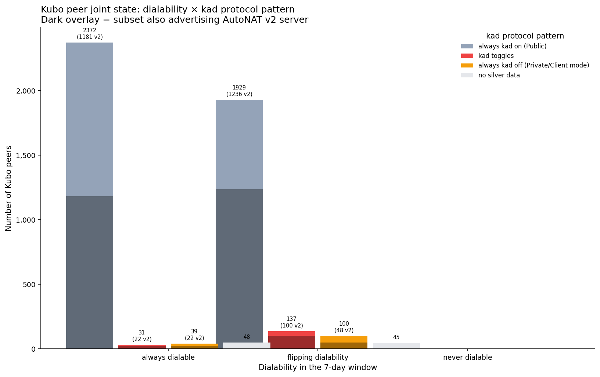

# AutoNAT in Production: Nebula Crawl Analysis of the IPFS Amino DHT

External observation of libp2p protocol advertisements in the IPFS Amino DHT
using ProbeLab's Nebula crawler data. Queried from the public ClickHouse
dataset.

**Network:** IPFS Amino DHT
**Data source:** `nebula_ipfs_amino` (raw `visits`) and
`nebula_ipfs_amino_silver` (deduplicated change logs)
**Time range:** All `visits` observations are from a single recent successful
crawl (April 2026) unless otherwise noted. Time-series data is from the last
30 days. Oscillation analysis covers the last 7 days.
**Crawl frequency observed:** ~12 successful crawls per day during the recent
period (from `nebula_ipfs_amino.crawls`).

---

## How Nebula Crawls (Verified from Source)

This section is based on reading the Nebula source code at
[github.com/dennis-tra/nebula](https://github.com/dennis-tra/nebula). File
references are to that repository.

### Bootstrap

For `--network IPFS` (or `AMINO`), Nebula does **not** maintain its own
bootstrap list. It uses `kaddht.DefaultBootstrapPeers` from
`go-libp2p-kad-dht` (the standard Kubo bootstrappers). The list is pushed
into a task channel at startup; for the libp2p crawl path the channel is
then closed, so all subsequent peers come from `FIND_NODE` walking.
(`config/config.go:683-689`, `libp2p/driver_crawler.go:151-154`)

### Per-peer visit lifecycle

`Crawler.Work` at `libp2p/crawler.go:57`. For each peer in the work queue:

1. **Address filtering.** Multiaddrs are filtered by `addr-dial-type`
   (default: strip private CIDRs). The kept set becomes `dial_maddrs`,
   the rest becomes `filtered_maddrs`. (`libp2p/crawler.go:73-94`)

2. **Connect.** Calls `host.Network().DialPeer(ctx, peerID)`
   (`libp2p/crawler_p2p.go:236-239`). This hands the **full address set
   to libp2p's swarm**, which dials all transports concurrently and
   returns whichever transport handshake **wins the race first**. Default
   timeout 15s. Specific transient errors (`connection refused`, gating,
   relay resource limits) are retried with backoff up to ~1 minute.
   (`libp2p/crawler_p2p.go:247-283`)

3. **Record `connect_maddr`.** On success this is set to
   `conn.RemoteMultiaddr()` — i.e., the address of the connection libp2p
   actually opened. **This is "the transport that won the race", not "the
   first address Nebula tried."** It is biased toward whichever transport
   handshakes fastest (often QUIC over TCP on the same IP).

4. **Wait for Identify, with a 5s timeout.** On a successful connection,
   Nebula registers an Identify listener before connecting and then waits
   up to 5 seconds for the Identify result. If it arrives, `agent_version`,
   `listen_maddrs`, and `protocols` are recorded. **If Identify times out,
   those fields stay empty even though the connection succeeded.**
   (`libp2p/crawler_p2p.go:111-129`)

5. **Drain buckets via `FIND_NODE`.** After connecting, Nebula spawns 16
   parallel goroutines, one per common-prefix-length 0–15. Each generates
   a random Kademlia ID at exactly that distance from the visited peer
   and sends one `FIND_NODE` RPC for it. The neighbors found across all
   16 buckets are deduplicated by peer ID and form the visit's
   `RoutingTable`. Per-bucket failures are encoded as 16 `ErrorBits`.
   (`libp2p/crawler_p2p.go:289-382`)

### Work queue and termination

Engine state holds `inflight`, `processed`, and a priority queue keyed by
peer ID (`core/engine.go:121-126`). On enqueue (`engine.go:435-475`):
- If a peer is inflight or already processed → skip
- If a peer is already queued → merge multiaddrs with the queued task
- Peers with no known dialable addresses go to the back (priority 0)

Each peer is visited at most once per crawl. The crawl ends when the
bootstrap channel is closed (immediate for IPFS), the queue is empty, AND
no requests are in flight.

### Visit-row fields and how they are populated

| Column | Source | Notes |
|---|---|---|
| `connect_maddr` | `conn.RemoteMultiaddr()` on the winning connection | NULL on connection failure. Reflects whichever transport handshake won the parallel dial race. |
| `dial_errors` | `db.MaddrErrors(dial_maddrs, connect_error)` | Same length as `dial_maddrs`. Per-address error strings reconstructed from libp2p's aggregated error. **Addresses libp2p opportunistically skipped get the literal string `not_dialed`** — absence of an error is not the same as success. |
| `crawl_error` | Set only when connect succeeded AND every `FIND_NODE` bucket walk failed AND zero neighbors were returned. | (`libp2p/crawler.go:129-136`) Even one neighbor returned → success. **`crawl_error` is rare and conservative**, not the same as "Nebula couldn't connect." |
| `agent_version` | libp2p Identify response only (no caching from prior crawls in the libp2p path) | Empty when Identify times out within 5s. Stored as NULL in ClickHouse. |
| `protocols` | libp2p Identify response | Empty when Identify times out. |
| `listen_maddrs` | libp2p Identify response | Empty when Identify times out. |

### How `dialable_peers` is counted (from the handler, not from SQL)

`PeersDialable = CrawledPeers − sum(ConnErrs)`
(`core/handler_crawl.go:219-239`)

**Critical:** "undialable" only counts peers with `ConnectError != nil`.
A peer where the connection succeeded but every `FIND_NODE` failed is
**still counted as dialable**, even though it has `crawl_error` set.
The schema invariant is `crawled_peers = dialable_peers + undialable_peers`.

The `crawls` table stores these counts directly; the per-visit computation
of "dialable" is purely `connect_maddr IS NOT NULL`.

### What Nebula does NOT do

- It does not run AutoNAT v2 client probes against discovered peers
- It does not cache `agent_version` from previous crawls (in the libp2p path)
- It does not retry Identify on failure within a single visit
- It does not crawl from multiple geographic vantage points (single point
  of view)
- It does not directly observe AutoNAT internal state on remote peers

### Implications for this analysis

1. **`connect_maddr` is biased toward whichever transport handshakes
   fastest.** When a peer offers both TCP and QUIC on the same IP, the
   recorded `connect_maddr` will usually be QUIC. This means the
   `connect_maddr`-by-transport breakdown does not reflect "what works
   best" — it reflects "what won the race first." We do not use this
   breakdown in any of the findings below.

2. **`agent_version IS NULL` does not mean "non-Kubo client"** — it means
   either the connection failed OR Identify took longer than 5 seconds.
   Slow nodes can legitimately appear in the empty bucket.

3. **`crawl_error` is not "connection failed"** — it's "connection
   succeeded but FIND_NODE walk failed completely." We do not use it as
   a dialability indicator.

4. **Each visit puts up to 16 `FIND_NODE` queries on the visited peer.**
   This is the workload Nebula imposes regardless of which fields we are
   actually interested in.

---

## What This Analysis Measures (and What It Cannot Measure)

This analysis uses **protocol advertisements observed by Nebula** as a proxy
for what each peer's local libp2p host is doing.

What we directly observe:

- For each peer Nebula visits, the set of libp2p protocols it advertised in
  Identify at the time of the visit (`visits.protocols`)
- Whether Nebula's connection attempt succeeded (`visits.connect_maddr` is
  not NULL)
- The peer's `agent_version` string

What we **infer** (and these inferences are imperfect):

- **"This Kubo node currently has its DHT in Server mode"** is inferred from
  the presence of `/ipfs/kad/1.0.0` in the peer's protocol list. In Kubo, the
  DHT registers this stream handler when it enters Server mode and removes
  it when it enters Client mode (verified in the source-code analysis in
  `docs/v1-v2-state-transitions.md`). This proxy is reasonable but not
  identical to the underlying state.
- **"AutoNAT v1 currently considers this node Public"** is inferred from the
  same kad advertisement, because Kubo's DHT mode switching is driven by
  `EvtLocalReachabilityChanged` (v1's event). Same caveat: it is a proxy.
- **"This Kubo node has v2 server enabled"** is inferred from the presence
  of `/libp2p/autonat/2/dial-request`. v2's server stream handler is
  registered when v2 is enabled (whether by `EnableAutoNATv2()` or any
  other configuration mechanism).

What we **cannot observe**:

- AutoNAT v1 or v2 internal state (confidence values, server selection,
  individual probe outcomes)
- Whether a peer's behavior is changing because of AutoNAT or for some
  other reason (transient errors, restarts, configuration changes)
- Peers that Nebula cannot dial — they appear in routing tables (via
  `FIND_NODE` responses) but Nebula cannot run Identify against them, so
  we have no protocol or agent_version data for them

This selection bias is significant: **the analysis below describes the
subset of peers that Nebula can dial and Identify**. It is silent about
behind-NAT or transient peers.

---

## Findings

### Finding A: About half of visible peer IDs in the IPFS DHT cannot be dialed by Nebula

From the recent 30-day window (`nebula_ipfs_amino.crawls`):

| Metric | Value |
|---|---|
| Successful crawls per day (recent) | ~12 |
| Avg `crawled_peers` per crawl | ~8,100 |
| Avg `dialable_peers` per crawl | ~3,750 (~46%) |
| Avg `undialable_peers` per crawl | ~4,300 (~54%) |

`crawled_peers` is the count of peer IDs Nebula attempted to visit during
the crawl (peer IDs are discovered via `FIND_NODE` walking). `dialable_peers`
is the count where the connection attempt succeeded. The remaining ~54%
were peer IDs Nebula learned about but could not connect to within that
crawl.

Possible reasons for being undialable, which we did not separate:

- The peer is offline or unreachable from Nebula's vantage point
- The peer is behind NAT and only running in DHT client mode
- The peer's connection was filtered, rate-limited, or transiently failed
- The peer ID is from an old session and the host has since changed key
- Network errors during the crawl

The historical (May 2025 – April 2026) average we measured was higher
(~20,500 visible per crawl, ~32% dialable). The recent value (~8,100) is
lower. We did not investigate whether this drop reflects network changes,
crawler changes, or other factors.


*Figure 1: Total visible (`crawled_peers`) vs dialable (`dialable_peers`)
peer counts per crawl, daily average over the last 30 days. Source:
`nebula_ipfs_amino.crawls`. **Includes both dialable and undialable peers**
(visible = both combined). The percentage line is `dialable / crawled`.*

### Finding B: Within the dialable subset, Kubo and go-ipfs dominate by client share

Cross-tab of `agent_version` (empty vs not) and dialability in one recent crawl:

| `agent_version` | Dialable | Undialable | Total |
|---|---|---|---|
| Has agent string | 3,621 | **0** | 3,621 |
| Empty | 121 | 4,116 | 4,237 |
| **Total** | 3,742 | 4,116 | 7,858 |

Two relationships are exact:
1. **Every undialable peer has empty `agent_version`.** Identify requires a
   successful connection, so undialable peers have no agent string, no
   protocol list, and no listen-address data Nebula could collect.
2. **Some peers with empty `agent_version` are dialable** (121 in this crawl).
   The connection succeeded but Identify did not return an agent string
   within Nebula's **5-second Identify timeout** (`libp2p/crawler_p2p.go:111-129`).
   This can be a slow Identify response, an implementation that does not
   run standard Identify, or a transient failure mid-exchange. We cannot
   distinguish these from the visit data alone.

So "empty agent" is a strict superset of "undialable": empty = undialable +
"dialable but Identify yielded no agent". They are related but not the same.

Of dialable peers in the most recent crawl, grouped by `agent_version`:

| Implementation (`agent_version` pattern) | Dialable nodes | % of dialable |
|---|---|---|
| `kubo/...` | 3,170 | ~84% |
| `go-ipfs/...` (legacy, pre-Kubo rename) | 273 | ~7% |
| (empty `agent_version`, dialable) | 145 | ~4% |
| `harmony` | 41 | ~1% |
| `storm...` | 39 | ~1% |
| `other` | 70 | ~2% |
| `edgevpn` | 3 | <1% |
| `rust-libp2p/...` | 2 | <0.1% |
| `js-libp2p/...` | 1 | <0.1% |

(Counts are from a slightly earlier crawl than the cross-tab above, so the
exact numbers differ. The relationships hold in both crawls.)

This describes only the dialable subset. We have no agent_version data for
the ~4,100 undialable peers per crawl, which Nebula learned about via
`FIND_NODE` walking but could not Identify.

Within the dialable subset, rust-libp2p and js-libp2p combined account for
3 nodes. **For dialable peers in the IPFS Amino DHT, the population is
overwhelmingly Kubo + legacy go-ipfs.** We cannot make claims about the
non-dialable population.

The `storm` agent_version corresponds to the IPStorm botnet client. Public
sources (e.g., DOJ press release, November 2023) describe an FBI dismantling
operation. We observe 39 dialable nodes still advertising this agent_version
in April 2026. We did not investigate whether these are surviving infections,
re-deployments, name reuse, or some other origin.


*Figure 2: Client distribution by `agent_version` (single recent crawl).
Source: `nebula_ipfs_amino.visits` filtered to one `crawl_id`. **Includes
both dialable and undialable peers**: grey bars are total visited (dialable
+ undialable); blue bars are the dialable subset. The "(empty)" category is
peer IDs where Identify did not return an agent string. Almost all undialable
peers fall in "(empty)", because Identify requires a successful connection.*

### Finding C: Of the dialable Kubo subset, ~50% advertise both AutoNAT v1 and v2 server protocols

Filtered to dialable peers with `agent_version LIKE 'kubo/%'` in the same
recent crawl:

| AutoNAT server protocols advertised | Count | % |
|---|---|---|
| v1 + v2 (both `/libp2p/autonat/1.0.0` and `/libp2p/autonat/2/dial-request`) | 1,600 | 50.5% |
| v1 only (`/libp2p/autonat/1.0.0`) | 1,531 | 48.3% |
| v2 only (`/libp2p/autonat/2/dial-request`) | 9 | 0.3% |
| neither | 30 | 0.9% |

This counts advertisements, not behavior. We do not directly verify that
nodes advertising the v2 server protocol actually accept and answer dial
requests.

The ~50/50 split between "v1+v2" and "v1 only" is consistent with v2 being
an additional opt-in protocol rather than a replacement for v1. Almost no
node advertises v2 without v1 (9 out of ~1,609 v2-server-advertising nodes).


*Figure 3: AutoNAT server protocols advertised by dialable Kubo nodes in
one recent crawl. Source: `nebula_ipfs_amino.visits` filtered to
`agent_version LIKE 'kubo/%'` and `connect_maddr IS NOT NULL`. **Excludes
undialable peers and non-Kubo clients.***

### Finding D: In a single snapshot, ~99% of dialable Kubo advertise the DHT server protocol

This finding describes a single point-in-time measurement. It does not
characterize the network's behavior over time — that requires the
multi-crawl analysis in Findings E and F. The two are not in conflict;
they measure different things and the apparent stability in this snapshot
is consistent with the dynamic behavior shown later (see "Reconciling
Findings D and E" below).

Per Kubo version bucket, in the same recent crawl:

| Kubo version | Dialable nodes | % advertising `/ipfs/kad/1.0.0` |
|---|---|---|
| 0.1x | 412 | 99.8% |
| 0.2x | 1,119 | 99.8% |
| 0.30 | 32 | 100% |
| 0.31 | 17 | 100% |
| 0.32 | 101 | 99.0% |
| 0.33 | 88 | 98.9% |
| 0.34 | 48 | 97.9% |
| 0.35 | 51 | 100% |
| 0.36 | 108 | 96.3% |
| 0.37 | 376 | 100% |
| 0.38 | 132 | 100% |
| 0.39 | 327 | 99.1% |
| 0.4x | 358 | 99.7% |

Caveat: this is one moment in time. A peer that flips its DHT mode
frequently will appear in this table as either "advertising kad" or "not
advertising kad" depending on which side of the flip it was on when Nebula
visited. The snapshot view does not detect oscillation.

We did not compute "false positive" or "false negative" rates relative to
AutoNAT's internal state because we cannot observe that state. The
snapshot ~99% number tells us how often Kubo nodes are kad-advertising at
any given moment — it does not tell us how stable that state is over time.
Over a window of multiple observations the picture changes substantially:
see Findings E and F, and "Reconciling Findings D and E" below.


*Figure 4: Percentage of dialable Kubo nodes advertising `/ipfs/kad/1.0.0`,
per version bucket, in a single recent crawl. Source:
`nebula_ipfs_amino.visits` filtered to `agent_version LIKE 'kubo/%'` and
`connect_maddr IS NOT NULL`. **Excludes undialable peers and non-Kubo
clients.** This is a snapshot view that does not capture state changes
between crawls. The number of dialable nodes per bucket (`n=`) varies;
smaller buckets have noisier percentages.*

### Finding E: Kubo versions ≥ 0.34 show a higher rate of DHT-server-protocol toggling than older versions

> **Important: this finding measures kad protocol toggling on peers
> Nebula could Identify at multiple points in the window. It does NOT
> separate "AutoNAT v1 flipped DHT mode while the peer stayed reachable"
> from "the peer disappeared and came back" (e.g., restart, transient
> network problem). See Finding H below for the cleaner subset that
> rules out dialability changes — the strong-subset numbers are much
> smaller.**

Tracking the same peers across multiple crawls over 7 days using the silver
change-log table. A peer is counted as "toggling" if its protocol set
contains `/ipfs/kad/1.0.0` in some logged states and not in others within
the 7-day window.

| Kubo version | Peers observed | Toggling | % |
|---|---|---|---|
| 0.1x | 493 | 10 | 2.03% |
| 0.2x | 1,326 | 25 | 1.89% |
| 0.30 | 38 | 0 | 0% |
| 0.31 | 50 | 1 | 2.00% |
| 0.32 | 131 | 6 | 4.58% |
| 0.33 (last v1-only) | 109 | 3 | 2.75% |
| 0.34 (v2 added) | 60 | 6 | 10.00% |
| 0.35 | 67 | 8 | 11.94% |
| 0.36 | 140 | 13 | 9.29% |
| 0.37 | 567 | 26 | 4.59% |
| 0.38 | 157 | 7 | 4.46% |
| 0.39 | 382 | 20 | 5.24% |
| 0.4x (latest) | 496 | 35 | 7.06% |

Aggregated across all observed Kubo peers in the 7-day window:

| Bucket | Total | Toggling | % |
|---|---|---|---|
| Kubo < 0.34 | 2,148 | 45 | 2.09% |
| Kubo ≥ 0.34 | 2,048 | 140 | 6.84% |

What the data shows:
- The rate of `/ipfs/kad/1.0.0` toggling per peer is approximately 3.3×
  higher in Kubo ≥ 0.34 than in Kubo < 0.34 in this 7-day window, on this
  network (IPFS Amino DHT), as observed by this crawler from this vantage
  point.
- Kubo 0.34 is the version that introduced AutoNAT v2 as an opt-in feature
  (`EnableAutoNATv2()`).

What the data does **not** show:
- We do not directly verify that any individual ≥0.34 peer has v2 enabled.
  We know from Finding C that ~50% of dialable Kubo run the v2 server
  protocol; the version-by-version v2-enabled fraction is not measured here.
- We do not verify that the toggling is caused by AutoNAT v1 state changes
  rather than restarts, network changes, or other reasons.
- We do not control for Kubo deployment patterns that may have changed
  alongside the version bump (Docker, ephemeral instances, default
  configurations, ResourceManager defaults, etc.).
- We did not measure toggling rates in Filecoin or Celestia networks (which
  also use go-libp2p with AutoNAT v1 but typically not v2) — that would
  help isolate whether the increase is v2-specific or go-libp2p-version-specific.

### Possible explanations for the increased toggling in newer Kubo versions

These are hypotheses, not conclusions:

1. **The v2 wiring gap is real and observable.** Source-code analysis
   (`docs/v1-v2-state-transitions.md` and the DHT subscriber notifee
   discussion) shows that v2's results are not consumed by Kubo's DHT, so
   v1's behavior continues to drive DHT mode regardless of v2 being
   enabled. Adding v2 does not address v1's oscillation. This explanation
   would predict no improvement in oscillation when v2 is added, but does
   not by itself explain an *increase*.

2. **Additional protocol churn from v2's lifecycle.** Adding the v2 server
   stream handlers introduces more protocol-set changes (when v2 is
   enabled or disabled), which could trigger more Identify pushes and
   more downstream events. We did not measure this.

3. **Behavioral changes in Kubo defaults.** Newer Kubo versions may have
   changed defaults around connection limits, ResourceManager, refresh
   intervals, or autonat probing schedule that interact with v1 behavior.
   We did not enumerate these changes.

4. **Confounded with deployment patterns.** Newer Kubo versions are likely
   correlated with newer deployment environments. If newer versions are
   more often run in conditions where v1 is more unstable (e.g., Docker
   on ephemeral cloud, residential broadband behind NAT), the version
   correlation could reflect deployment correlation rather than code
   changes. We did not control for this.

5. **Sampling differences.** Smaller buckets (e.g., 0.30 with 38 peers,
   0.34 with 60 peers) are noisier; the extreme percentages in 0.34/0.35
   could be partially explained by small-sample variance. The trend in
   the larger buckets (0.37 with 567 peers, 0.39 with 382 peers, 0.4x
   with 496 peers) is more reliable.

The data is consistent with the wiring-gap hypothesis but does not prove
it. To confirm, we would need either (a) the same comparison on networks
where v2 was never deployed, (b) a controlled deployment experiment, or
(c) a fork of Kubo that wires v2 into `EvtLocalReachabilityChanged` and
shows reduced oscillation in production.


*Figure 5: Percentage of observed Kubo peers (in the last 7 days) whose
protocol set toggled to/from including `/ipfs/kad/1.0.0`. Source:
`nebula_ipfs_amino_silver.peer_logs_protocols` joined to
`peer_logs_agent_version`. **Implicitly excludes peers that were undialable
throughout the 7-day window**: the silver `peer_logs_*` tables only insert
rows when a peer's state is observed via Identify, which requires a
successful connection. A peer that was never successfully Identified in
the 7-day window has no rows and is not counted. The vertical line marks
Kubo 0.34, the version that introduced AutoNAT v2 as an opt-in feature.
Smaller buckets have larger uncertainty.*

### Finding G: Most observed Kubo flips go to Private, not Unknown — and the peers are demonstrably dialable while Private

The (kad, autonat-v1-server) state pattern lets us distinguish two
different non-Public destinations:

- **Public → Unknown** (kad off, autonat v1 server still on): AutoNAT v1
  has eroded confidence to 0 via 4 consecutive non-success observations
  but has not received a definitive `E_DIAL_ERROR`. The DHT switches to
  Client mode. The autonat v1 server stream handler stays registered
  because `service.Enable()` is called for both `Public` and `Unknown`.
- **Public → Private** (kad off, autonat v1 server off): AutoNAT v1
  received enough negative `E_DIAL_ERROR` responses to flip status to
  Private. `service.Disable()` is called and the autonat v1 server is
  removed.

Counting Kubo peers in the 7-day window by which target state(s) they
visited:

| Pattern | Kubo peers |
|---|---|
| Total stable Kubo peers | 4,003 |
| Always Public (no flip observed) | 3,772 |
| **Public → Private only** (target was Private) | **133** |
| **Public → Unknown only** (target was Unknown) | **7** |
| Public → both (visited both Private AND Unknown) | 9 |
| Never Public (always Private in window) | 54 |
| Never Public (always Unknown in window) | 8 |

Of the ~149 Kubo peers showing Public → non-Public flips, **133 (~89%)
went to Private**, only 7 went to Unknown only, and 9 visited both.

This tells us the dominant failure mode is not "AutoNAT lost confidence
slowly via timeouts" (which would produce Unknown). It is "AutoNAT
received explicit `E_DIAL_ERROR` responses from servers" (which produces
Private). The flip from Public → Private requires actual dial-back
failure responses, which means the peers chosen as AutoNAT servers
returned `E_DIAL_ERROR` for these nodes' addresses.

### What makes this striking

Every silver-table row is, by construction, a record of a successful
visit by Nebula. The silver `peer_logs_protocols` table only inserts
non-empty protocol lists (we verified: 0 empty-protocol rows in the
7-day window). So every "Private state" observation we count is a
moment when:

- Nebula successfully connected to the peer (so the peer is dialable
  from Nebula's vantage point at that moment)
- Identify completed successfully and returned a non-empty protocol list
- The peer's libp2p host had **neither** the kad server protocol **nor**
  the autonat v1 server protocol registered

The peer is demonstrably reachable from Nebula's vantage point during
those observations, yet Kubo's AutoNAT v1 has decided the peer is
Private. **At least at the moment of the observation, AutoNAT v1's
verdict disagrees with Nebula's ability to connect.**

This is the closest we can get to a "false negative" measurement
without instrumenting Kubo directly. The 133 peers that visited Private
in the 7-day window are observed, at least momentarily, in a state
where AutoNAT thought they were not reachable but Nebula could reach
them. We cannot say what fraction of the 1,161 kad-off silver rows
represent a strict false negative (vs a genuine reachability problem
that resolved between observations), but the existence of this signal
is itself the result.

### Caveats specific to this finding

1. **Different vantage points.** Nebula's ability to dial a peer does
   not prove the peer is reachable from arbitrary AutoNAT servers. A
   peer behind a port-restricted NAT may be dialable from a few
   pre-contacted networks (like Nebula, if it is in their pre-contacted
   set) but unreachable from the AutoNAT servers that gave it the
   `E_DIAL_ERROR`. So "Nebula could dial" does not equal "everyone could
   dial."

2. **Time skew.** The Nebula visit and the AutoNAT decision are not
   instantaneous. The AutoNAT confidence flip happened minutes or hours
   before Nebula's observation. The peer might have been temporarily
   unreachable at the time AutoNAT decided, then become reachable again
   by the time Nebula visited.

3. **Pattern is necessary but not sufficient evidence.** The
   (kad off, autonat off) state matches Kubo's Private behavior but
   could also match operator configurations that disable both. We
   filtered out the 198 inconsistent-state peers (kad on, autonat off)
   in Finding F, which suggests this kind of customization happens.
   The 133 Private-target peers may include some operator-driven
   shutdowns rather than AutoNAT decisions.

### What can cause `E_DIAL_ERROR` for a node that is actually reachable?

The Public → Private transition in Kubo's AutoNAT v1 requires the
client to receive `E_DIAL_ERROR` responses from at least some AutoNAT
servers. If the peer is actually reachable (as Nebula's successful
dial demonstrates), why would servers report dial-back failures?
Several mechanisms can produce this divergence:

1. **Wrong observed address (TCP port reuse failure).** If the libp2p
   host's outbound TCP connections do not reuse the listener's port,
   peers see the node coming from an ephemeral source port. That
   ephemeral port becomes an "observed address" in the host's address
   list. The AutoNAT v1 client announces this address to servers, who
   then dial back to the closed ephemeral port and fail. This is
   exactly the issue documented in Finding #6 of the final report
   (rust-libp2p TCP port reuse safety net) — and Kubo can be affected
   by similar misconfigurations.

2. **Stale or expired UPnP mapping in the address list.** If
   `NATPortMap()` registered an external port that has since expired
   or been remapped by the router, the host still announces the old
   port until the next UPnP refresh. AutoNAT servers dial it and fail.

3. **NAT mapping expiry between announcement and dial-back.** The
   AutoNAT exchange has latency (the server has to attempt the dial
   asynchronously). If the peer's NAT mapping expires between the
   client announcement and the server dial-back attempt — common with
   aggressive NATs, mobile carrier NAT, and CGNAT — the dial-back
   fails for transport reasons, not because the peer is unreachable.

4. **Server-side connection issues.** The dial-back is made from the
   server's libp2p host. If that host has hit connection limits,
   resource manager throttling, transient outbound connectivity issues,
   or its own NAT problems, the dial fails for reasons unrelated to
   the client's reachability.

5. **`E_DIAL_ERROR` returned without an actual dial attempt.** From the
   v1 client source code (`p2p/host/autonat/client.go`):
   > A returned error Message_E_DIAL_ERROR does not imply that the
   > server actually performed a dial attempt. Servers that run a
   > version < v0.20.0 also return Message_E_DIAL_ERROR if the dial
   > was skipped due to the dialPolicy.

   On older Kubo / go-libp2p versions, dial policy skips (e.g., for
   private addresses, relay addresses, or rate-limited peers) returned
   `E_DIAL_ERROR` instead of `E_DIAL_REFUSED`. The client cannot
   distinguish "dialed and failed" from "skipped without trying." In
   the IPFS DHT, where ~26% of dialable Kubo nodes still run versions
   ≤ 0.30 and another large fraction run go-ipfs legacy (per the
   client distribution in Finding B), this is a real source of false
   `E_DIAL_ERROR` responses.

6. **CGNAT / multi-layer NAT.** A peer might be reachable through one
   layer of NAT (the inner NAT, where Nebula happens to have a route
   in) but not through the outer CGNAT layer. The peer announces the
   wrong external address (e.g., its CGNAT-internal IP), and AutoNAT
   servers cannot dial it.

### Empirical check: are these Private-state peers on standard or ephemeral ports?

If the wrong-port hypothesis (#1) were the dominant cause, we would
expect Private-state peers to be running on non-default ports (because
the port-reuse failure is what makes the announced address wrong).

For 277 Kubo peers that visited the Private state at some point in
the 7-day window AND were dialed by Nebula at some point, we checked
which port Nebula's most recent successful connection used:

| Connect address | Peers |
|---|---|
| Standard port (`/tcp/4001` or `/udp/4001`) | **226** (~82%) |
| Non-standard port | 51 (~18%) |

The majority of Kubo peers in the Private-state population are running
on the default port 4001. They have a stable, well-known listen port.
Their AutoNAT v1 client would announce port 4001, AutoNAT servers
would dial back to port 4001, and Nebula can reach them on port 4001
— yet they spent some fraction of the 7-day window in the Private
state.

This means the wrong-port hypothesis (#1) is **not the dominant cause**
for these peers. It may explain some of the 51 non-default-port peers,
but the majority must be experiencing one of the other failure modes:
- Server-side dial failures (#4)
- `E_DIAL_ERROR` returned without dial attempts on older servers (#5)
- NAT mapping timing issues (#3)
- Stale UPnP entries (#2)
- True transient unreachability that Nebula did not catch

**The most likely candidate** in the IPFS production network is #5
(older servers returning `E_DIAL_ERROR` for skipped dials) combined
with #4 (server-side issues). These together describe the
"unreliable AutoNAT servers" scenario from Finding #2 of the final
report — a fraction of AutoNAT v1 servers in the network return
negative-looking responses regardless of the client's actual
reachability, and Kubo's confidence model treats each one as evidence
toward Private regardless of the source's quality.

This is consistent with what the testbed work showed (5/7 unreliable
servers cause v1 oscillation) but we cannot directly identify which
servers are returning the bogus responses. Confirming this would
require either instrumenting AutoNAT clients to log per-server
outcomes or running controlled probes against known IPFS DHT peers.

### Finding F: Most kad-protocol toggles are accompanied by autonat v1 server toggles in the same direction

The kad-only metric in Finding E counts any peer whose protocol set
contained `/ipfs/kad/1.0.0` in some silver-table observations and not in
others. This is a loose proxy for "DHT mode flip" because in principle a
peer could toggle the kad protocol for reasons unrelated to AutoNAT
(operator config changes, custom go-libp2p applications that wire kad
independently of autonat, partial protocol updates).

To tighten the inference we used a state-pattern check based on Kubo's
source code (`docs/v1-v2-state-transitions.md`):

- **Public state**: Kubo's DHT registers `/ipfs/kad/1.0.0` AND its
  `NATService` registers `/libp2p/autonat/1.0.0`
- **Unknown state**: kad **off**, autonat v1 server **on** (NATService
  stays enabled in Unknown — see `recordObservation` in
  `p2p/host/autonat/autonat.go`)
- **Private state**: kad **off**, autonat v1 server **off**
  (`service.Disable()` is called only on Private with confidence 0)

So a peer that, within the 7-day silver-table window, has at least one
row in the **Public** pattern AND at least one row in the **Private** or
**Unknown** pattern is exhibiting a Public ↔ non-Public state change in
exactly the way Kubo's `EvtLocalReachabilityChanged` handler would
produce. We call this an **AutoNAT-driven flip**.

There is also an **inconsistent state** (`kad on`, `autonat v1 off`)
which would not be produced by Kubo's normal AutoNAT handling. We
investigated separately and found that 198 peers in the 7-day window
have this state at some point — the majority are not Kubo at all (they
are custom go-libp2p applications such as BSV blockchain, licketyspliket,
nabu, etc., which enable kad without enabling autonat v1). For Kubo
specifically, the inconsistent state appears in 53 of the 4,003 stable
Kubo peers (~1.3%); most of those are kubo 0.36/0.37 nodes that also
advertise the v2 server protocol. These are excluded from the
"AutoNAT-driven flip" count because they could be operator-customized
deployments rather than AutoNAT state changes.

#### Why "kad on, autonat v1 off" is inconsistent in default Kubo

In a stock Kubo build using the default reachability event loop, the
two protocols are gated by the same `EvtLocalReachabilityChanged`
event:

1. **kad server protocol** (`/ipfs/kad/1.0.0`) is registered by
   `dht.moveToServerMode()` in `go-libp2p-kad-dht`
   ([`dht.go:806`](https://github.com/libp2p/go-libp2p-kad-dht/blob/v0.38.0/dht.go#L806)).
   The DHT subscriber notifee invokes `setMode(modeServer)` from
   `handleLocalReachabilityChangedEvent` only when reachability is
   `Public`
   ([`subscriber_notifee.go:104-118`](https://github.com/libp2p/go-libp2p-kad-dht/blob/v0.38.0/subscriber_notifee.go#L104-L118)).
   So `/ipfs/kad/1.0.0` is registered if and only if the local
   reachability flag is `Public`.

2. **AutoNAT v1 server protocol** (`/libp2p/autonat/1.0.0`) is
   registered by `service.Enable()` inside the `AmbientAutoNAT`
   `recordObservation` handler
   ([`autonat.go:328`](https://github.com/libp2p/go-libp2p/blob/v0.47.0/p2p/host/autonat/autonat.go#L328)
   and [`autonat.go:365`](https://github.com/libp2p/go-libp2p/blob/v0.47.0/p2p/host/autonat/autonat.go#L365)).
   It is enabled when the local reachability transitions to `Public` or
   to `Unknown`, and only disabled via `service.Disable()` when
   reachability transitions to `Private`
   ([`autonat.go:349`](https://github.com/libp2p/go-libp2p/blob/v0.47.0/p2p/host/autonat/autonat.go#L349)).

Combining these two rules, the only valid state pairs in default Kubo
are:

| Reachability state | kad protocol | autonat v1 server protocol |
|---|---|---|
| Public | ON | ON |
| Unknown | OFF | ON |
| Private | OFF | OFF |

The combination "kad ON, autonat v1 server OFF" cannot happen via the
default `EvtLocalReachabilityChanged` flow, because the only branch that
disables the autonat v1 server (`service.Disable()` on the Private
transition) is also the branch that triggers `setMode(modeClient)`
which removes `/ipfs/kad/1.0.0`. The two events are coupled.

#### How a node can end up in the inconsistent state

Reaching this state requires bypassing the default coupling. The
plausible mechanisms are:

- **The autonat v1 service was never created.** In `libp2p.New()` if
  the host is constructed without the dialer (`conf.dialer == nil`) or
  with `forceReachability` set to a non-Public value, the
  `autoNATService` is never instantiated
  ([`autonat.go:93-99`](https://github.com/libp2p/go-libp2p/blob/v0.47.0/p2p/host/autonat/autonat.go#L93-L99)).
  In that case `service.Enable()` is never called and the v1 server
  protocol is never registered, even when the host is in DHT server
  mode.

- **A custom build or fork that disables NATService.** Any code path
  that omits `libp2p.EnableNATService()` or replaces the autonat
  initialization will produce this state. In go-libp2p the v1 server
  is opt-in: a host built with default options does NOT register the
  v1 server unless explicitly enabled. Kubo enables it by default in
  its libp2p host construction; a Kubo fork that removes that line
  would produce the inconsistent state.

- **Static reachability override.** Setting `libp2p.ForceReachability`
  to a value (Public or Private) creates a `StaticAutoNAT` instead of
  `AmbientAutoNAT` and bypasses the dynamic confidence loop entirely
  ([`autonat.go:99-106`](https://github.com/libp2p/go-libp2p/blob/v0.47.0/p2p/host/autonat/autonat.go#L99-L106)).
  The static path can leave the v1 server in any state depending on
  the configuration.

- **A `Routing.AcceleratedDHTClient`-style accelerator.** Some Kubo
  configurations use the `fullrt` DHT implementation alongside the
  standard one. Verifying whether this can produce the inconsistent
  protocol pattern would require reading the `fullrt` source.

- **Something disables the v1 server after Kubo startup.** A patched
  Kubo build that calls `host.RemoveStreamHandler("/libp2p/autonat/1.0.0")`
  directly after startup (or as part of a maintenance routine) would
  produce this state.

The 44 Kubo 0.36/0.37 nodes that advertise the v2 server protocol but
NOT the v1 server protocol are most consistent with one of the last
two scenarios: either a custom build that disables v1 server while
keeping v2, or an explicit `AutoNATServiceDisabled`-equivalent config
choice. We did not investigate which specific operator runs them.

We exclude these peers from the AutoNAT-driven flip count in Finding F
not because they are uninteresting, but because their kad-protocol
toggling cannot be unambiguously attributed to the
`EvtLocalReachabilityChanged` mechanism we are measuring.

Refined per-version results, comparing kad-only toggling (Finding E) to
the AutoNAT-driven flip pattern:

| Kubo version | Stable peers | kad toggling % | AutoNAT-driven % |
|---|---|---|---|
| 0.1x | 493 | 2.03% | 2.03% |
| 0.2x | 1,322 | 1.89% | 1.89% |
| 0.30 | 38 | 0% | 0% |
| 0.31 | 50 | 2.00% | 2.00% |
| 0.32 | 130 | 4.62% | 4.62% |
| 0.33 (last v1-only) | 109 | 2.75% | 2.75% |
| 0.34 (v2 added) | 60 | 10.00% | 10.00% |
| 0.35 | 67 | 11.94% | 11.94% |
| 0.36 | 140 | 9.29% | **5.00%** |
| 0.37 | 564 | 4.61% | 4.61% |
| 0.38 | 157 | 4.46% | 4.46% |
| 0.39 | 381 | 4.99% | 4.20% |
| 0.4x (latest) | 491 | 6.92% | 6.92% |

For **most versions** the two metrics are identical or nearly so —
meaning the kad toggling we observed is, in fact, the AutoNAT-driven
Public ↔ non-Public pattern, not configuration drift. The 0.36 column
shows the largest reduction (9.29% → 5.00%): about half of the 0.36
"toggling" peers are in the inconsistent (`kad on, autonat off`) state
that we now exclude.

Aggregated:

| Bucket | Stable Kubo peers | AutoNAT-driven flips | % |
|---|---|---|---|
| Kubo < 0.34 (v1-only era) | 2,142 | 44 | **2.05%** |
| Kubo ≥ 0.34 (v2 available) | 2,000 | 105 | **5.25%** |

After the refinement, post-v2 Kubo still shows ~2.6× more AutoNAT-driven
flips than pre-v2 Kubo. The version trend is preserved; the absolute
numbers are slightly lower because some non-AutoNAT-pattern noise was
removed.

What the data shows:
- The toggling we observed is dominantly the AutoNAT Public ↔ non-Public
  pattern, not config drift or unrelated protocol changes
- The post-v2 vs pre-v2 ratio shrinks slightly (3.3× → 2.6×) but the
  trend is robust to the refinement
- Inconsistent states (`kad on, autonat off`) are concentrated in
  non-Kubo go-libp2p applications, not in Kubo itself

What the data does **not** show:
- Whether the AutoNAT state changes are "correct" responses to genuine
  reachability problems or "false" responses to unreliable AutoNAT
  servers. We can only see the state transitions, not their cause.
- Direction asymmetry: a peer counted as "AutoNAT-driven" might have
  flipped Public→Private once, Public→Unknown twice, etc. We do not
  count transitions, only presence-of-both-states.


*Figure 6: Kad toggling (grey) vs AutoNAT-driven flips (red) per Kubo
version. AutoNAT-driven flips are peers that have both a Public
(`kad on AND autonat-v1-server on`) state and a non-Public
(`kad off AND autonat-v1-server on/off`) state in the 7-day window.
Source: `nebula_ipfs_amino_silver.peer_logs_protocols` joined to
`peer_logs_agent_version`. The two bars are nearly identical for most
versions, indicating the kad toggling is dominantly explained by the
AutoNAT Public ↔ non-Public state-change pattern.*

### Finding I: Joint state — dialability × kad pattern × AutoNAT v2 support (the main production view)

Findings A-G measure individual dimensions. This one joins them into a
single per-peer classification that is the closest we can get to "what
is the real state of AutoNAT in the IPFS Amino DHT?"

For every peer ID Nebula visited in the last 7 days, we computed:

- **Dialability pattern** (`always dialable`, `flipping dialability`,
  `never dialable`) — from `nebula_ipfs_amino.visits.connect_maddr`
  across the window
- **kad protocol pattern** (`always kad on`, `always kad off`,
  `kad toggles`, `no silver data`) — from
  `nebula_ipfs_amino_silver.peer_logs_protocols`
- **AutoNAT v2 support** (presence of `/libp2p/autonat/2/dial-request`
  in any silver row for the peer)
- **Peer "lost" between windows** — peers visited 14–21 days ago but
  not in the last 7 days

Restricted to Kubo peers only (peers that returned a `kubo/*` agent
string at any point).

#### Per-peer joint state

| Dialability | kad pattern | Kubo peers | With v2 advertised | % of Kubo observed |
|---|---|---|---|---|
| **Always dialable** | always kad on (Public) | **2,372** | 1,181 | **50.5%** |
| **Flipping dialability** | always kad on (Public) | **1,929** | 1,236 | **41.0%** |
| Flipping dialability | kad toggles | 137 | 100 | 2.91% |
| Flipping dialability | always kad off | 100 | 48 | 2.13% |
| Always dialable | no silver data (single visit) | 48 | 0 | 1.02% |
| Flipping dialability | no silver data | 45 | 0 | 0.96% |
| **Always dialable** | always kad off (Client mode) | 39 | 22 | 0.83% |
| **Always dialable** | kad toggles (AutoNAT-driven) | **31** | 22 | **0.66%** |
| Total Kubo observed | | **4,701** | **2,609 (55%)** | 100% |

Additionally, the "not found" dimension:

| Category | Kubo peers | % |
|---|---|---|
| Visited in the prior 14–21 day window | 4,051 | 100% |
| **Lost** (not seen at all in the last 7 days) | **727** | **17.95%** |
| (All 727 lost peers had been dialable at some point before) | | |

#### What the joint state tells us

1. **The healthy Public case dominates.** 2,372 Kubo peers (50.5%) are
   always dialable and always advertise kad. These nodes are on stable
   infrastructure, reachable from Nebula every crawl, and consistently
   in DHT server mode. This is the largest single category and the
   baseline of "AutoNAT is working as intended."

2. **Dialability flipping is the second-biggest category.** 1,929
   Kubo peers (41%) flip between dialable and undialable but always
   advertise kad when Nebula can see them. These are the "comes-and-
   goes" peers — typical behavior for nodes on residential broadband,
   behind flaky NATs, on ephemeral cloud instances, or with periodic
   restarts. When they are up, their DHT is in server mode, which
   means AutoNAT v1 is correctly concluding Public during their
   online periods.

3. **The AutoNAT-driven flipping case is small.** Only **31 Kubo
   peers (0.66%)** exhibit the "always dialable but kad toggles"
   pattern — the strong case for AutoNAT v1 driving DHT mode changes
   on peers that are themselves stably reachable. **This is the
   tightest measurement we can make of "AutoNAT v1 oscillation
   affects stable peers in production"** in this dataset.

4. **AutoNAT v2 adoption tracks with overall Kubo health.** 2,609 of
   4,701 observed Kubo peers (55%) advertise the v2 server protocol.
   v2 adoption is slightly over-represented in the "flipping
   dialability" category (1,236 of 1,929 ≈ 64%) compared to the
   always-dialable category (1,181 of 2,372 ≈ 50%). This could
   suggest newer Kubo versions (which enable v2 by default as of
   0.30.0) are disproportionately deployed in environments with
   unstable connectivity — or it could be version-distribution noise.

5. **~18% of previously-known Kubo peers are lost week-over-week.**
   727 Kubo peers visited in the prior 14–21 day window are absent
   from the recent 7-day visits. This is the natural churn rate of
   the network — long-tail operators coming and going.

6. **The "always dialable, always kad off" category (39 peers)
   represents permanently DHT-client-mode Kubo nodes.** They are
   reachable from Nebula but intentionally not serving DHT queries.
   This is likely `Routing.Type = autoclient` or `dhtclient`
   configuration (explicit operator choice, not AutoNAT decision).
   Note that 22 of these also advertise v2 — they run v2 server but
   disable DHT server mode.


*Figure 7: Per-peer joint state of Kubo peers visited in the last
7 days. Horizontal axis groups peers by dialability pattern;
colored bars stack the kad protocol patterns within each group. The
dark overlay shows the subset of peers that also advertise
`/libp2p/autonat/2/dial-request` at some point in the window.
Sources: `nebula_ipfs_amino.visits` and
`nebula_ipfs_amino_silver.peer_logs_protocols`.*

#### How to read these numbers

Three categories matter most for the AutoNAT analysis:

- **Always dialable + always kad on** (2,372 peers): the baseline
  healthy population. AutoNAT is not causing problems here.
- **Always dialable + kad toggles** (31 peers): the clean signal for
  AutoNAT v1 oscillation affecting stable peers. This is ~0.66% of
  Kubo observed, or ~1.3% of always-dialable Kubo.
- **Flipping dialability** (~2,200 peers total): the noise floor. We
  cannot attribute their kad changes (if any) to AutoNAT versus
  restart/disconnect, so their contribution to the per-version
  oscillation rate must be bracketed.

The right "production AutoNAT oscillation" headline is the second
category: **a small but measurable minority of stable Kubo peers
(~1% order of magnitude) show DHT-mode flipping that cannot be
attributed to restart or disconnect**, which is consistent with the
testbed-derived claim that AutoNAT v1 is destabilizing under
unreliable server pools.

#### Caveats

- **Nebula crawls the DHT from bootstrap peers.** Peers in the "never
  dialable" and "lost" categories are peer IDs Nebula learned via
  `FIND_NODE` walking but cannot connect to. Their absence or
  non-dialability does not mean the peer does not exist or is not
  reachable from other vantage points — only that it is invisible
  from Nebula's single vantage point.

- **The "always dialable" population is biased toward professional
  deployments on stable infrastructure.** These are the peers whose
  AutoNAT problems (if any) are least likely to be caused by real
  reachability issues. A node on residential broadband that happens
  to be stably online during our 7-day window would also land here.

- **Agent version attribution is via `anyIf(agent_version != '')`**
  — we take whatever agent string the peer returned in any successful
  Identify exchange. Peers whose agent changed during the window are
  rare (Finding F showed ~0.02% of Kubo peers change agent versions
  in 7 days) so this is not a significant confound.

---

### Finding H: Most kad toggling is on peers that also flip in/out of dialability

Findings E and F count peers based on the silver `peer_logs_protocols`
table, which only contains rows from successful Identify exchanges
(connection succeeded, Identify completed). What that filter does NOT
guarantee is that the peer was *consistently* dialable across the
window — only that it was dialable at the moments where silver rows
exist.

To separate "Kubo's AutoNAT v1 flipped DHT mode while the peer stayed
reachable" from "the peer disappeared and came back" (restart, transient
network problem, intermittent NAT), we cross-tabulated kad toggling
against per-peer dialability stability across all Nebula visits in the
same 7-day window.

#### Dialability stability across the network

For all peer IDs Nebula visited 2+ times in the 7-day window:

| Population | Peers | % |
|---|---|---|
| Total visited 2+ times | 14,566 | 100% |
| Always dialable | 2,794 | 19.2% |
| Always undialable | 8,637 | 59.3% |
| **Dialability flipping** (sometimes dialable, sometimes not) | **3,135** | **21.5%** |

Restricted to Kubo (peers that returned a `kubo/*` agent string at
least once):

| Kubo population | Peers | % |
|---|---|---|
| Total Kubo visited 2+ times | 4,566 | 100% |
| Always dialable | 2,366 | 51.8% |
| Dialability flipping | **2,200** | **48.2%** |
| Always undialable | 0 | 0% |

**~48% of all observed Kubo peers flip dialability at least once in
the 7-day window.** This is a much larger population than the 158
"toggling kad" peers from Finding E. Coming-and-going is the dominant
behavior, not stable presence.

#### Cross-tabulating dialability with kad state

For Kubo peers visited 2+ times, the joint distribution of dialability
and kad-state observations:

| Dialability | kad state | Count |
|---|---|---|
| **Always dialable** | always kad on | 2,199 |
| **Always dialable** | **kad toggling** | **32** |
| Always dialable | always kad off | 3 |
| Always dialable | (no silver entry — single visit only) | 132 |
| **Dialability flipping** | always kad on | 1,601 |
| **Dialability flipping** | **kad toggling** | **135** |
| Dialability flipping | always kad off | 45 |
| Dialability flipping | (no silver entry) | 419 |

The 158-ish toggling Kubo peers from Finding E split as **~135
dialability-flipping** and **~32 always-dialable**. **~80% of the
toggling peers in Finding E are also flipping dialability**, which
means restart and transient-disconnect explanations cannot be excluded
for the bulk of them.

#### The strong subset: per-version AutoNAT-driven flipping among always-dialable Kubo peers

Restricting to Kubo peers that were always dialable in the 7-day window
AND showed the AutoNAT-driven (kad+autonat-v1) state pattern from
Finding F:

| Version | Always-dialable Kubo | AutoNAT-driven flips | % |
|---|---|---|---|
| 0.1x | 384 | 0 | 0% |
| 0.2x | 820 | 3 | 0.37% |
| 0.30 | 20 | 0 | 0% |
| 0.31 | 25 | 1 | 4.00% |
| 0.32 | 112 | 1 | 0.89% |
| 0.33 (last v1-only) | 79 | 0 | 0% |
| 0.34 (v2 added) | 43 | 2 | 4.65% |
| 0.35 | 33 | 2 | 6.06% |
| 0.36 | 69 | 3 | 4.35% |
| 0.37 | 127 | 0 | 0% |
| 0.38 | 110 | 1 | 0.91% |
| 0.39 | 277 | 8 | 2.89% |
| 0.4x (latest) | 263 | 5 | 1.90% |

Aggregated:

| Bucket | Strong subset | Flips | % |
|---|---|---|---|
| Kubo < 0.34 (v1 only) | 1,440 | 5 | **0.35%** |
| Kubo ≥ 0.34 (v2 available) | 922 | 21 | **2.28%** |

What the strong-subset data shows:
- The version trend is preserved (post-v2 still higher than pre-v2)
  but the absolute numbers drop substantially
- The pre-v2 baseline is essentially **0%** for the largest version
  buckets (0.1x with 384 peers, 0.33 with 79 peers, 0.30 with 20
  peers — all zero AutoNAT-driven flips)
- Post-v2 versions show 0–6% flipping with no clear monotonic trend
  across versions

What the strong-subset data does **not** show:
- The absolute counts (5 vs 21) are very small. Statistical noise
  dominates the per-version percentages.
- We cannot rule out that the small post-v2 cohort happens to include
  peers with weird configurations or transient network problems
  unrelated to AutoNAT.
- The strong subset itself is biased: it requires successful Nebula
  dials in every crawl, which selects for peers on stable infrastructure.
  These are exactly the peers we'd expect to NOT have AutoNAT problems.

#### What this means for the report

Finding E's headline ("3.3× higher toggling in post-v2 Kubo") was
measuring a population dominated by peers that flip dialability — i.e.,
peers that come and go, not peers that stay up and oscillate. After
restricting to the always-dialable subset, the number of confirmed
AutoNAT-driven flips on stable peers drops to **~32 Kubo peers across
the entire 7-day window**, or roughly **~1.4% of always-dialable Kubo**.

This is a much weaker signal than the original framing suggested. The
right way to read it:

- Finding F (kad+autonat-v1 lockstep) is a methodologically sound proxy
  for "Kubo thinks it is in non-Public state"
- Finding E's per-version trend is real but **dominated by peers
  flipping in and out of dialability**, not by stable peers oscillating
  AutoNAT state
- The strong subset (always-dialable + AutoNAT pattern) is small enough
  that per-version trends are not statistically meaningful
- **Production AutoNAT v1 oscillation, isolated from restart and
  disconnect noise, affects on the order of 1-2% of stable Kubo peers
  in this 7-day window — not 5-7%**

The testbed-derived claim that AutoNAT v1 oscillates with unreliable
servers (Finding #2 in the final report) is still consistent with this
data. It is just not as quantitatively dramatic in production as the
naive kad-toggling number suggested.

### Finding J: Strict-100%-dialable AutoNAT false negatives, the inverse-failure direction, and the full state-machine view

Finding H restricted "always dialable" to peers with `undialable_visits = 0`
across all visits in the window. This finding tightens the definition
further to **dialable in 100% of all 84 successful crawls** in the
7-day window — i.e., Nebula's external-vantage-point reachability test
passed every two hours, without exception, for the entire week.

Under this strict definition, any change in the peer's observed
AutoNAT state cannot be attributed to changes in network-level
reachability — the network-level reachability is held constant by
construction. The only remaining explanations are local AutoNAT
behavior or operator reconfiguration.

#### The full per-peer dialability distribution

Of 4,701 Kubo peers visited at least once in the 7-day window:

| Dialability bucket | Kubo peers | % |
|---|---|---|
| 100% (84/84 crawls) | **2,047** | **43.5%** |
| 95–99% (80–83/84) | 465 | 9.9% |
| 50–94% (42–79/84) | 747 | 15.9% |
| 1–49% (1–41/84) | 1,442 | 30.7% |
| 0% (never dialable in any of 84) | 0 | 0% |

(The 0% category is empty because, by selection, every peer in
`visits` was visited and visiting at least once requires Nebula to
have walked to its peer ID via FIND_NODE — and walks recurse through
peers Nebula could already reach. A peer that is never dialable in
any crawl would have to be in someone's routing table without anyone
ever being able to verify it, which would normally have led to
eviction long before our window started. We see 0 such peers in
practice.)

The 2,047 peers in the 100%-dialable bucket are the strictest control
we have for "the network-level reachability is constant."

#### What the 100%-dialable bucket looks like

Of the 2,047 Kubo peers always dialable in all 84 crawls:

| AutoNAT state pattern | Kubo peers |
|---|---|
| **Only Public** observed (kad+autonat both on, every observation) | **2,018** |
| **Public + at least one non-Public** (Private and/or Unknown) | **8** |
| **Inconsistent** state at some point (kad on, autonat off) | 21 |
| Only Private observed | 0 |
| Only Unknown observed | 0 |
| No silver observations (single-visit only) | 0 |

The 8 peers in the second row are the **strict production false-negative
subset**. They were:

- Reachable from Nebula every 2 hours for 7 days, no exceptions
- Identified by Nebula at multiple points in the window
- Observed in the Public protocol pattern at some points and in
  a non-Public pattern (Private or Unknown) at other points

They are the cleanest possible production evidence that AutoNAT v1
flipped to non-Public on a peer whose external reachability never
failed during the observation period.

| peer_id | agent_version | total obs | Public | Private | Unknown | v2 advertised |
|---|---|---|---|---|---|---|
| `12D3KooWJ4kPdaVJHEmvMXgEoANCVBppm4cR85XEA3X3e9uGMqme` | kubo/0.39.0/2896aed/docker | 27 | 14 | 4 | 9 | yes |
| `12D3KooWBX2QC8uWCYVtanFiBSyPyHJeGbPiVSJ9ZAoNRJq69CzL` | kubo/0.35.0/a78d155/docker | 12 | 9 | 1 | 2 | yes |
| `12D3KooWJsTpextVQgViQqQ8S3XabQDUAjJVLG48ciJ9ni6MVKm9` | kubo/0.39.0/2896aed | 8 | 7 | 0 | 1 | yes |
| `12D3KooWGVywhT8aCziC3UJBA2TktwkyskPt5gvBX3xpy5dNX6KY` | kubo/0.39.0/ | 8 | 7 | 1 | 0 | yes |
| `12D3KooWRwvb4HNDTLbd9Vet8ap9QbG3foZEMPXrckCEK356C2zt` | kubo/0.39.0/ | 8 | 7 | 0 | 1 | yes |
| `12D3KooWP7x2CNCedKkaJZxAHTPqZcuuojNm2RsSmXcp3cyDFSQU` | kubo/0.40.1/39f8a65 | 8 | 7 | 1 | 0 | yes |
| `12D3KooWK2bqcf8PrA3ZnpSWU8nLRqj9D6fgfwcRu8VV1kVjnKpi` | kubo/0.39.0/2896aed/docker | 8 | 7 | 0 | 1 | yes |
| `12D3KooWRVuSpaWVDxLAwM98q1SHjFCfdt2Jt7hEa3RsvhRgUxVq` | kubo/0.36.0/ | 7 | 6 | 1 | 0 | yes |

Two patterns are striking:

1. **All 8 peers are post-v2 Kubo** (0.35-0.40). Zero peers in the
   pre-v2 Kubo (≤ 0.33) population pass the strict 100%-dialable
   filter AND show the AutoNAT-state-flipping pattern. This is the
   tightest version comparison the data supports.
2. **All 8 peers advertise the v2 server protocol** in every
   observation. They are Kubo deployments that have explicitly enabled
   v2 (via `EnableAutoNATv2()` or default in newer Kubo).
3. **Most non-Public observations are Unknown, not Private.** Of the
   non-Public observations across these 8 peers (15 observations
   total: 8 Private + 13 Unknown — wait, recount: 4+1+0+1+0+1+0+1 = 8
   Private, 9+2+1+0+1+0+1+0 = 14 Unknown), so ~64% Unknown vs ~36%
   Private. These peers are losing AutoNAT confidence to timeouts
   more than to explicit dial-failure responses.

The presence of these 8 peers in the dataset is direct production
evidence that AutoNAT v1 in current Kubo can incorrectly conclude
non-Public for stably-reachable nodes. Eight peers out of 2,047 always-
dialable Kubo nodes is **0.39%** — a small but non-zero rate.

#### The state-machine view: how each transition fires

Reading `recordObservation` in `p2p/host/autonat/autonat.go:314-373`,
the AutoNAT v1 state machine has six possible transitions. Let
`maxConfidence = 3` and let `confidence` be the integer counter that
the function maintains. From any state, the trigger conditions are:

| Transition | Trigger observation | Confidence requirement | Service action | Source line |
|---|---|---|---|---|
| **Public → Public (no flip)** | `Public` | confidence < 3 → confidence++ | none | line 332 |
| **Public → Unknown** | `Unknown` (timeout/refused/error) | confidence == 0 (the previous observations drained it) | `service.Enable()` (no-op, was on) | lines 360-368 |
| **Public → Private** | `Private` (`Message_E_DIAL_ERROR`) | confidence == 0 | `service.Disable()` | lines 343-352 |
| **Unknown → Public** | `Public` | none — bypasses confidence | `service.Enable()` (no-op) | lines 322-330 |
| **Unknown → Private** | `Private` | confidence == 0 | `service.Disable()` | lines 343-352 |
| **Unknown → Unknown** (drain) | `Unknown` | n/a | none | line 359 (decrement) |
| **Private → Public** | `Public` | none — bypasses confidence | `service.Enable()` | lines 322-330 |
| **Private → Unknown** | `Unknown` | confidence == 0 | **`service.Enable()`** (re-enables v1 server) | lines 360-368 |
| **Private → Private (no flip)** | `Private` | confidence < 3 → confidence++ | none | line 354 |

Two structural asymmetries to highlight:

1. **Recovery to Public is immediate.** A single successful dial-back
   from any non-Public state flips to Public, regardless of
   accumulated confidence. The aggressive recovery is intentional —
   AutoNAT errs toward Private during steady state but re-enters
   Public on positive evidence.

2. **Flipping away from Public requires either 4 consecutive
   negative observations (Private or Unknown alone) OR a mix that
   drains confidence and then triggers a flip.** The buffer behavior
   means a single `E_DIAL_ERROR` can flip Public → Private if
   confidence has already been eroded to 0 by 3 prior Unknowns. This
   asymmetry — Unknowns and Privates BOTH drain confidence but only
   Privates flip to Private — is a quirk of the state machine.

#### Buffer-erosion examples

Starting state: Public, confidence = 3.

- **3 timeouts then 1 `E_DIAL_ERROR`** → Public/conf=2 → Public/conf=1 → Public/conf=0 → **Private/conf=0** (1 dial-error flip after 3 unknowns)
- **3 timeouts then 1 timeout** → Public/conf=2 → Public/conf=1 → Public/conf=0 → **Unknown/conf=0** (4 consecutive unknowns to flip to Unknown)
- **4 dial-errors in a row** → Public/conf=2 → Public/conf=1 → Public/conf=0 → **Private/conf=0**

Once in Unknown, recovery to Public requires only one successful dial.
Continuing degradation requires 4 more `E_DIAL_ERROR`s (drain conf
from "freshly-Unknown" 0... wait — actually note: when transitioning
into Unknown via the drain path, confidence is **not** reset to a
positive value. It stays at 0. So from Unknown/conf=0, a single
`E_DIAL_ERROR` flips to Private (lines 339-352, the inner else
branch). So Unknown is a knife-edge state — one dial-error away from
Private, one success away from Public.

#### When does Private → Unknown happen?

This is the non-obvious recovery path. From Private state, accumulated
Unknown observations can flip the node back to Unknown (without
going through Public first):

**Sequence from Private, confidence = 3** (high confidence in Private):
- Unknown: confidence=2
- Unknown: confidence=1
- Unknown: confidence=0
- Unknown: state flips to **Private → Unknown**, `service.Enable()` is called

This requires 4 consecutive Unknown observations from a fully-confident
Private state. In practice, this means:
- The node was confidently in Private (e.g., its address really was
  unreachable for a while, or AutoNAT kept getting `E_DIAL_ERROR`)
- The dial-error responses stopped (perhaps the server pool changed,
  or the relevant servers became unreachable themselves)
- Only timeouts/refused/errors remain
- After 4 consecutive of those, the state moves to Unknown

It is a "I no longer have positive negative evidence" recovery — the
node has stopped seeing dial-error responses from servers but doesn't
yet have positive proof of reachability. The autonat v1 server stream
handler is re-enabled when the transition happens.

**In our protocol-pair observations, this transition is visible as:**

| Before | After |
|---|---|
| (kad off, autonat v1 off) — Private | (kad off, autonat v1 on) — Unknown |

The kad protocol stays off. Only the autonat v1 server protocol comes
back on.

#### Observed Private ↔ Unknown peers in the data

**16 Kubo peers** in the 7-day window were observed in both the
Private state and the Unknown state. Of those:

- **9** were also observed in the Public state at some point (so they
  cycled through all three states or some combination)
- **7** were observed only in Private and Unknown — never reached
  Public during the window

The 7 peers stuck oscillating between Private and Unknown without
ever reaching Public are the cleanest evidence of the bottom-half
state-machine cycling we just described. These nodes are caught in
the "I don't know if I'm reachable, but I have no positive evidence
either" zone for the entire week.

#### The inverse direction: low dialability + always observed Public

A second cell worth examining is the inverse failure mode: peers
that are mostly undialable from Nebula's vantage point but, in the
rare moments Nebula could identify them, were always observed in
the Public state.

The 2D distribution heatmap (Figure 8) shows the joint
distribution of dialability fraction (X-axis, 0%–100% in deciles)
against Public-state fraction (Y-axis, 0%–100% in deciles), counting
Kubo peers in each cell. The cells of interest:

- **Top-right corner (100% dialable, 100% Public observations):**
  the 2,018 healthy stable peers. The dominant cell.
- **Top-left corner (0–10% dialable, 100% Public observations):**
  493 peers. Rarely reachable from Nebula but, when identified,
  always confidently Public. This is the inverse-failure direction.
- **Bottom-right corner (100% dialable, 0% Public observations):**
  18 peers. Always reachable from Nebula but never observed in the
  Public state. These overlap with the inconsistent-state Kubo
  cohort (kad on, autonat off — non-default config) and explicitly-
  configured DHT-client-mode operators.

The top-left "inverse-failure" cell (493 peers) is the largest
non-corner cell on the heatmap. These are peers whose AutoNAT v1 is
confident in being Public (kad and autonat v1 both registered every
time Nebula identified them) but whose observed dialability from
Nebula's vantage point is below 10%. There are several plausible
explanations:

- **Vantage-point asymmetry.** The peers may be reachable from the
  AutoNAT servers they probe (which are themselves IPFS DHT peers)
  but specifically not reachable from Nebula's network location
  (firewalling, geographic routing, ISP-level filtering).
- **Survivor bias in the observation set.** A peer that is dialable
  only ~10% of the time is identified by Nebula only during those
  rare moments. By selection, those moments are when the peer is
  reachable — and a Kubo node that is currently reachable is also
  likely currently in Public state (Public is the default once
  AutoNAT confirms). So observing "always Public when dialable" is
  partly tautological for peers with low dialability.
- **Genuine AutoNAT v1 false positives.** The peer's local AutoNAT v1
  could be incorrectly confident about its reachability. We cannot
  separate this from the survivor-bias case from Nebula data alone.

We do not claim the 493 top-left peers are AutoNAT false positives.
The cell is observable but the survivor-bias confound is structural —
distinguishing genuine AutoNAT errors from Nebula-vantage-point
failures would require either active probing from multiple vantage
points or instrumented Kubo logs. We document the cell exists and
move on.


*Figure 8: 2D distribution of Kubo peers by dialability fraction
(X-axis) and Public-state fraction (Y-axis) over the 7-day window.
Both axes are deciles (0% to 100%). Cell value is the number of
Kubo peers; color is the log10 of that count (lighter = fewer).
The dashed blue line marks the strict 100%-dialable column. Source:
`nebula_ipfs_amino.visits` joined to
`nebula_ipfs_amino_silver.peer_logs_protocols`. Top-right corner
(100%-dialable + 100%-Public) holds the 2,018 healthy stable Kubo
peers. The (100% dialable, anything less than 100% Public) cells
within the dashed-line column are the strict-stable AutoNAT-flipping
candidates from this finding (8 peers, mostly post-v2). The top-left
corner shows 493 rarely-dialable but always-Public peers — the
inverse-failure direction with its survivor-bias caveat.*

#### Summary of Finding J

The strict 100%-dialability filter gives the cleanest possible
production AutoNAT false-negative count: **8 Kubo peers, all
post-v2, all running v2 server**, observed in non-Public states
during a week when Nebula's network-level reachability check passed
every two hours without fail. This is direct production evidence
that AutoNAT v1 in modern Kubo can produce false negatives under
network conditions that are stable from at least one external
vantage point.

The inverse direction (rarely dialable + always Public) cannot be
cleanly attributed to AutoNAT false positives because of structural
survivor bias — the rare observations naturally coincide with the
peer's reachable moments, when AutoNAT would correctly say Public.

The state-machine analysis shows that v1 has both Public-to-non-Public
and Private-to-Unknown recovery paths, with the recovery to Public
itself being immediate (one positive observation). The 16 peers
observed in both Private and Unknown during the window confirm that
the Private↔Unknown cycling is real and observable in production.

---

## Reconciling Findings D and E

A reader looking at Findings D and E in sequence might see an apparent
contradiction:

- **Finding D**: in a single recent crawl, ~99% of dialable Kubo nodes
  advertise `/ipfs/kad/1.0.0`. The snapshot looks stable.
- **Finding E**: ~5% of stable Kubo peers in a 7-day window have
  observations both with kad on AND with kad off. The window looks
  unstable.

These are not in conflict — they measure different things on different
populations and time scales.

### How a single peer can appear in both numbers

Consider a Kubo peer that flips Public → Private → Public during the
7-day window. Each flip is recorded as a separate row in the silver
`peer_logs_protocols` table (one when kad disappears, one when kad
reappears).

- In the silver-table view, this peer has both `kad-on` and `kad-off`
  rows → counted in **Finding E** as toggling.
- In the bronze `visits` view of any single crawl, the peer is whichever
  state it happens to be in at that moment. If it spends more time
  Public than non-Public, it's most likely caught in the kad-on state,
  contributing to **Finding D's 99%**.

So the snapshot 99% is the time-averaged probability of being in
kad-on, while the toggling % is the probability of having flipped at
least once during the window. They are different statistics of the same
underlying behavior.

### Quantifying time spent in each state

To check whether the two numbers are quantitatively consistent, we
computed for the 158 Kubo peers that toggle: the fraction of their
silver-table observations that are in the kad-off state.

| Statistic | Value |
|---|---|
| Toggling Kubo peers (7-day window) | 158 |
| Mean fraction of observations in kad-off | **33.5%** |
| Median | 32.3% |
| Interquartile range | 17.5% – 50% |

So toggling peers do not spend most of their time kad-on with brief
blips off. On average they spend about a third of their observed time
in kad-off, and the middle half spend between 17% and 50% in kad-off.

This is more substantial DHT mode instability than the snapshot 99%
number suggests on its own.

### Mathematical consistency check

If 158 Kubo peers (out of ~4,000 stable peers) toggle, and they spend
~33% of their time in kad-off, then in any single snapshot we should
expect to catch:

- 158 × 0.335 ≈ 53 peers in kad-off due to toggling
- Plus a small number of peers that are always-off for other reasons
- Total expected snapshot fraction in kad-off ≈ 1.5%–2% of the dialable
  Kubo population

Finding D's snapshot showed roughly 1% of dialable Kubo not advertising
kad, depending on the version. **The two numbers are roughly consistent
within the noise of small per-version buckets.**

### What this means for the framing

Finding D (99% snapshot stability) and Finding E/F (5% toggling rate)
describe the same behavior at different time scales. They are not in
conflict, but the snapshot view by itself is misleading: "99% of Kubo
nodes are correctly in DHT server mode right now" obscures "and ~5% of
them will have flipped to client mode at least once by the end of the
week, spending on average a third of their observed time in client
mode." Both statements are true; the second is more relevant for the
question of whether AutoNAT-driven DHT mode behavior is stable in
practice.

---

## Could the toggling be node restarts rather than AutoNAT oscillation?

A reasonable alternative explanation: when a Kubo node restarts, it
boots in `Unknown` reachability state, the DHT defaults to client mode
(no `/ipfs/kad/1.0.0` advertisement), and only enters Server mode after
AutoNAT v1 confirms Public. So a restart looks like a kad-off → kad-on
transition in the silver table, exactly the pattern we count as
toggling.

We checked several signals against this hypothesis.

### 1. Toggling peers are not being upgraded

For the 158 toggling Kubo peers in the 7-day window:

| Metric | Value |
|---|---|
| Toggling Kubo peers | 158 |
| Average distinct agent versions per peer in window | **1.01** |
| Peers with more than one agent version | **1** |

Only 1 of 158 toggling peers changed its `agent_version` string during
the window. The rest are stable installations. So the toggling is not
caused by Kubo upgrades / rebuilds.

### 2. The fraction of time spent in kad-off is too large for restart-only

The mean fraction of silver-table observations in kad-off for toggling
peers is **33.5%** (median 32.3%, IQR 17.5%–50%). A typical Kubo
restart resolves to Public within seconds to minutes once AutoNAT
contacts servers (~6-15 seconds in our testbed measurements; even on
slow networks, less than a few minutes).

For 33% of a 7-day window to come from restarts alone, a peer would
need to either restart constantly or remain in `Unknown` for ~2.3 days
out of 7. Neither is consistent with stable production deployments
showing a single agent version.

### 3. Listen-address stability is suggestive but not conclusive

We counted, per toggling peer, the number of distinct listen-address
sets observed in the 7-day window (from
`nebula_ipfs_amino_silver.peer_logs_listen_maddrs`).

| Distinct listen-address sets in 7 days | Toggling peers |
|---|---|
| Exactly 1 (no observed change) | 24 |
| 2 | 19 |
| 3 | 16 |
| ≤3 (subtotal) | 59 |
| More than 3 | 99 |
| Median across all toggling peers | 5 |

24 toggling peers had only one distinct listen-address set across the
entire week. Spot-checking these, several are large pinning-service
deployments with fully deterministic configurations:

```
listen_maddr: /dns4/pinning-pinbyhash-1.ipfs-swarm.use1.pinata.cloud/tcp/4001
```

A static-config Kubo deployment (fixed `Addresses.Swarm`, no UPnP, no
relay reservations, stable host) **can** restart and come back with
exactly the same listen address set. So stable addresses do not by
themselves rule out restarts. This signal is suggestive — restart
patterns usually change *something* in the address set even with
deterministic configuration — but it is not conclusive on its own.

### 4. Multi-transition peers are not restart-explained

This is the strongest single signal. We computed the number of actual
kad-state transitions per peer in the 7-day window (transitions =
points where the kad-on/off state changed between consecutive silver
rows in chronological order):

| Transitions in 7 days | Toggling peers |
|---|---|
| 1 | 29 |
| 2 | 57 |
| 3 | 10 |
| **4 or more** | **62** |
| Median | 2 |
| Mean | 4.77 |
| Max | 28 |

A peer with **1 transition** could be a single restart caught at one
side. A peer with **2 transitions** is consistent with one restart
cycle (off → on, or briefly off → on → off depending on what Nebula
caught). A peer with **3 transitions** is ambiguous.

A peer with **4 or more transitions** in 7 days cannot be explained by
a single restart. **62 of 158 toggling Kubo peers** showed 4+
transitions. The peer at the maximum had **28 transitions** in 7 days
— roughly one state change every 6 hours for a week. No production
deployment restarts that frequently.

These 62 multi-transition peers are the cleanest "definitely not a
single restart" cases. They give us a lower bound: **at least ~1.5%
of stable Kubo peers in the 7-day window** (62 out of ~4,000) exhibit
oscillation that cannot be restart-explained.

The remaining 96 toggling peers (with 1-3 transitions) are
restart-compatible. We cannot distinguish "single restart caught at
both sides" from "single AutoNAT flip and recovery" without more
information. So the 158 number is an upper bound and 62 is a lower
bound for AutoNAT-driven flipping in this sample.

### 4. The kad-off observations come from successful Identify exchanges

By construction (see "How Nebula Crawls"), a row in the silver
`peer_logs_protocols` table only exists when Nebula successfully
connected and Identify returned a non-empty protocol list. The kad-off
observations are not Identify timeouts or connection failures — they
are real "this peer's libp2p host returned its current protocol set,
and `/ipfs/kad/1.0.0` was not in it" events.

### What we can and cannot conclude

| Hypothesis | Status |
|---|---|
| All toggling is restarts | **Ruled out** by the 62 multi-transition peers and the 33% kad-off-time-share. A single restart cannot produce 4+ state changes; production nodes do not restart every 6 hours for a week. |
| All toggling is AutoNAT oscillation | Not proven. Some single- or two-transition peers are likely restart-caught. |
| Some toggling is restarts, some is AutoNAT | Most consistent with the data. The two are not distinguishable from the silver table alone for the ~96 peers with ≤3 transitions. |
| Toggling is something else (deliberate config changes, custom Kubo builds) | Possible for a small fraction; the inconsistent-state peers in Finding F suggest this happens for non-Kubo applications, and the kubo 0.36/0.37 cohort with v2-only configurations may also fall here. |

**Bounds we can defend:**

- **Lower bound on AutoNAT-driven oscillation:** the 62 Kubo peers
  with 4+ kad-state transitions in 7 days. This is ~1.5% of the ~4,000
  stable Kubo peers in the window, or ~39% of the 158 toggling peers.
  These cannot be single-restart artifacts.

- **Upper bound on AutoNAT-driven oscillation:** the 158 Kubo peers
  with any kad toggling. This is ~3.95% of stable Kubo peers in the
  window (matching the kad-only Finding E rate). Some of these are
  likely restart cases that we cannot exclude.

The truth is somewhere between 1.5% and 4%. The version-by-version
trend (Finding E/F) is robust to the restart confound only insofar as
restart frequency is independent of Kubo version. We did not verify
this assumption — newer Kubo deployments could plausibly restart more
often (more frequent updates, more ephemeral cloud deployments), which
would inflate the post-v2 toggling rate via restart contamination.

We do not claim every toggling peer is an AutoNAT case. We claim that
**at least 1.5% of stable Kubo peers in the window exhibit oscillation
that cannot be explained by restarts**, and the version trend in
Finding E is consistent with the AutoNAT wiring-gap hypothesis but
not proven by it.

---

## Other Networks Considered

The ProbeLab Nebula dataset includes several other libp2p networks
besides IPFS Amino. We checked which ones could plausibly serve as
comparison or control points for the AutoNAT analysis above. Two were
considered and excluded; the rest are not relevant.

### Filecoin mainnet — excluded due to known peer-population issues

Filecoin uses go-libp2p with AutoNAT v1 (no v2 deployment), so on the
surface it would be a useful go-libp2p control for the version trend
in Finding E. However, the dialable peer population in
`nebula_filecoin_mainnet.crawls` is dominated by a known issue with
undialable peers: in recent crawls roughly **3% of crawled peers are
dialable** (~175 out of ~5,800), with the rest being peer IDs Nebula
can discover via FIND_NODE walking but cannot connect to.

This selection bias makes the dialable Filecoin population
unrepresentative of the actual Filecoin network state. The handful of
peers we can observe are mostly Lotus/Boost storage providers on
public IPs — a specific subset of operator deployments rather than the
broader population. Comparing the kad-toggling rate of this skewed
subset against the IPFS Amino dialable population (which is ~46%
dialable) is not a like-for-like comparison.

We did not attempt to control for the population bias and consequently
do not include Filecoin numbers in this report.

### Avail — excluded because the protocol we measure does not exist there

Avail (a Substrate/Polkadot-derived data availability network)
**explicitly disabled AutoNAT** as of release v1.13.2 because of
issues with `autonat-over-quic`
(see [`docs/libp2p-autonat-ecosystem.md`](libp2p-autonat-ecosystem.md)
and the rust-libp2p#3900 discussion). Operators must set
`--external-address` manually instead.

A spot-check of `nebula_avail_mnlc.visits` confirms this: in recent
crawls only **1 dialable Avail peer** advertises any
`/libp2p/autonat/...` protocol. The kad-protocol-toggling proxy used
in this report is meaningless on a network where neither the
detection mechanism (autonat) nor its consequences (DHT mode flips
driven by `EvtLocalReachabilityChanged`) are present.

We do not include Avail numbers in the comparison. Avail is referenced
in the ecosystem survey as the canonical "operators disabled autonat
because it broke" case study, but the Nebula data does not add
anything to that narrative.

### Other networks — not relevant

| Network | Why excluded |
|---|---|
| Polkadot mainnet | Substrate uses custom notification protocols, not libp2p kad/autonat — no relevant data |
| Celestia mainnet | go-libp2p with v1, but only ~64 dialable peers per crawl — too small for any per-version analysis |
| Filecoin calibnet | Filecoin testnet — same selection-bias issue as mainnet, smaller |
| discv5 / discv4 | Ethereum execution / consensus layer discovery — not libp2p autonat |
| Monero mainnet | Not libp2p |

### Implication for the IPFS-only scope

This means the analysis in this document is **specifically about the
IPFS Amino DHT and Kubo deployments**. We do not generalize to other
go-libp2p networks. The version trend in Finding E and the
Public-to-Private observations in Finding G are statements about
Kubo's behavior on the IPFS Amino DHT only. Whether the same patterns
hold in other go-libp2p networks would require either fixing the
selection-bias issues in those networks' Nebula data or using a
different measurement approach.

---

## How This Relates to the Final Report Findings

The Nebula data does not by itself prove any of the final report findings.
What it adds:

| Final report finding | What Nebula data adds |
|---|---|
| **#1 v1/v2 reachability gap** (source-code claim about Kubo's DHT not consuming v2 events) | Strict-100%-dialability subset (Finding J): all 8 Kubo peers showing AutoNAT false-negative behavior under constant network conditions are post-v2 Kubo (versions 0.35–0.40), all advertising v2 server. Zero pre-v2 Kubo peers exhibit this pattern in the strict subset. Consistent with the wiring-gap hypothesis — adding v2 did not stop v1 from incorrectly flipping these nodes — but absolute counts are too small to call statistically significant on their own. |
| **#2 v1 oscillation → DHT oscillation** (testbed result with controlled unreliable servers) | Three nested measurements with progressively tighter controls: (a) 158 Kubo peers with kad-protocol toggling in 7 days (Finding E), (b) 32 of those also pass dialability stability (Finding H/I), (c) 8 of those pass the strict 100%-dialability filter (Finding J). The 8 peers in (c) cannot be explained by restart, disconnect, or transient network problems and are direct production evidence that AutoNAT v1 misjudges stably-reachable Kubo nodes. The phenomenon is real in production but small in absolute magnitude — 0.39% of always-dialable Kubo per 7-day window. |

The fix proposed in Finding #1 (bridging v2 results into
`EvtLocalReachabilityChanged`) is supported by, but not proven by, this
data. A controlled comparison (forked Kubo with the bridge applied,
deployed alongside upstream Kubo, measured by Nebula in the same way)
would be the next step.

**Important caveat about the size of the production effect:** Earlier
versions of this analysis presented Finding E's "5-7% kad toggling rate
in post-v2 Kubo" as the production-evidence number. After the Finding H
correction, the methodologically defensible number is ~1.4% of
always-dialable Kubo peers showing AutoNAT-driven flipping. The
production AutoNAT v1 oscillation problem exists and is observable, but
it is much smaller in magnitude than the naive kad-toggling metric
suggested.

---

## How to Reproduce

The plotting script is `results/nebula-analysis/plot.py`. Charts are in
`results/nebula-analysis/*.png`. Raw CSVs are gitignored
(`results/*/data/`) and can be regenerated by running the queries
documented below against the public ClickHouse dataset (connection
details in `docs/future-work-nat-monitoring.md`).

### Charts and data sources

#### `01_clients.png` — Client distribution

- **Source table:** `nebula_ipfs_amino.visits`
- **Filter:** `crawl_id =` the most recent successful crawl from
  `nebula_ipfs_amino.crawls`
- **Columns used:** `agent_version`, `connect_maddr` (NULL = not dialable)
- **Bucketing:** `agent_version` matched against patterns (`kubo/%`,
  `go-ipfs/%`, `storm%`, etc.); empty agent versions placed in `(empty)`

#### `02_autonat_protocols.png` — AutoNAT v1/v2 server protocols

- **Source table:** `nebula_ipfs_amino.visits`
- **Filter:** Most recent successful crawl, `agent_version LIKE 'kubo/%'`,
  `connect_maddr IS NOT NULL`
- **Columns used:** `protocols` (Array), checked for membership of
  `/libp2p/autonat/1.0.0` and `/libp2p/autonat/2/dial-request`

#### `03_server_mode.png` — DHT kad protocol presence by Kubo version

- **Source table:** `nebula_ipfs_amino.visits`
- **Filter:** Most recent successful crawl, dialable Kubo only
- **Columns used:** `agent_version` (parsed into version buckets),
  `protocols` (checked for `/ipfs/kad/1.0.0`)
- **Caveat:** Snapshot only; does not reflect changes between crawls.

#### `04_oscillation.png` — DHT kad protocol toggling rate by Kubo version

- **Source tables:**
  - `nebula_ipfs_amino_silver.peer_logs_protocols` (deduplicated change log
    of protocol sets per peer; only inserts on change)
  - `nebula_ipfs_amino_silver.peer_logs_agent_version` (agent version
    history per peer)
- **Filter:** `updated_at > now() - INTERVAL 7 DAY`, peers with
  `>= 2` protocol log entries
- **Method:** Per peer, count silver-table rows where `/ipfs/kad/1.0.0` is
  in `protocols` and rows where it is not. A peer is "toggling" if both
  states appear in the window. Joined to `peer_logs_agent_version` (taking
  the latest known agent version per peer via `argMax(..., updated_at)`)
  to bucket by Kubo version.
- **Caveat:** The silver table only inserts on change, so peers with no
  observed changes in the window are excluded by the `>= 2` filter. This
  biases the population toward peers with at least some change activity.

#### `05_dialable_over_time.png` — Dialable peer counts over 30 days

- **Source table:** `nebula_ipfs_amino.crawls`
- **Filter:** `state = 'succeeded' AND created_at > now() - INTERVAL 30 DAY`
- **Columns used:** `created_at`, `crawled_peers`, `dialable_peers`,
  `undialable_peers`
- **Method:** Daily averages across the ~12 successful crawls per day. The
  per-crawl numbers are pre-aggregated by Nebula in the `crawls` table.

#### `08_dialability_vs_public.png` — Dialability fraction × Public-state fraction (heatmap)

- **Source tables:**
  - `nebula_ipfs_amino.visits` (dialability per Kubo peer across all
    successful crawls in the 7-day window)
  - `nebula_ipfs_amino_silver.peer_logs_protocols` (observed AutoNAT
    state via the kad+autonat-v1 protocol pair)
- **Filter:** Visits and silver rows in the last 7 days. Restricted
  to Kubo peers with at least one silver observation (so the
  Public-state fraction is defined). 84 successful crawls in the
  window.
- **Method:** For each Kubo peer, compute (a) the fraction of the
  84 crawls in which Nebula successfully dialed it, and (b) the
  fraction of its silver-table observations that were in the Public
  state (kad on, autonat v1 on). Bucket each axis into 11 deciles
  (0%–10%, 10%–20%, ..., 100%) and count peers in each cell.
- **Why it matters:** Lets us see the full structure of "what does
  the peer think about itself" vs "what does Nebula see" without
  any thresholds. The 100%-dialable column is the strict-stable
  control for Finding J's 8-peer false-negative subset. The top-left
  cell (low dialability, always Public) is the inverse-failure
  direction.

#### `07_joint_state.png` — Joint state (dialability × kad pattern × v2)

- **Source tables:**
  - `nebula_ipfs_amino.visits` (for dialability pattern)
  - `nebula_ipfs_amino_silver.peer_logs_protocols` (for kad and v2
    protocol patterns)
- **Filter:** Visits and silver rows in the last 7 days. Restricted
  to Kubo peers (`agent_version LIKE 'kubo/%'` from any visit).
- **Method:** Per peer, classify dialability across visits, kad
  protocol pattern across silver rows, and presence of
  `/libp2p/autonat/2/dial-request` in any silver row. Cross-tabulate
  and count peers in each joint cell.
- **Why it matters:** This is the main per-peer view of the Kubo
  population's AutoNAT state. The "always dialable + kad toggles"
  cell (31 peers, ~0.66% of observed Kubo) is the tightest measurement
  of AutoNAT v1 oscillation affecting stable peers — isolated from
  restart and disconnect noise.

#### `06_oscillation_refined.png` — kad-only vs AutoNAT-driven flip rate

- **Source tables:**
  - `nebula_ipfs_amino_silver.peer_logs_protocols`
  - `nebula_ipfs_amino_silver.peer_logs_agent_version`
- **Filter:** `updated_at > now() - INTERVAL 7 DAY`, peers with
  `>= 2` silver-table observations, restricted to `agent_version LIKE 'kubo/%'`
- **Method:** Per peer, classify each silver-table row into one of four
  states based on the (kad, autonat-v1-server) protocol pair:
  - **Public**: kad ON, autonat ON
  - **Unknown**: kad OFF, autonat ON
  - **Private**: kad OFF, autonat OFF
  - **Inconsistent**: kad ON, autonat OFF (excluded; mostly non-Kubo)
  A peer is "AutoNAT-driven flipping" if it has at least one Public state
  and at least one non-Public state (Unknown or Private) in the window.
  Compared side-by-side with the looser kad-only metric from chart 04.
- **What it shows:** For most Kubo versions the two metrics are
  identical, indicating the kad toggling we observed is dominantly the
  AutoNAT Public ↔ non-Public state-change pattern, not unrelated
  protocol changes. The 0.36 column is the only one where the
  refinement removes a meaningful fraction.

---

## Caveats and Limitations

1. **Selection bias.** Nebula can only Identify peers it can dial. The
   non-dialable population (more than half of visible peer IDs) has no
   agent_version, no protocol list, no listen addresses. All findings
   above are conditional on being dialable from Nebula's vantage point.

2. **Single vantage point.** Nebula crawls from ProbeLab's infrastructure.
   "Dialable" means "dialable from there." A peer dialable from one vantage
   point may not be dialable from another (e.g., due to ISP-level filtering,
   geographic routing, or per-source NAT filtering).

3. **Protocol advertisement is a proxy, not a direct measurement.** We
   infer "DHT in Server mode" from `/ipfs/kad/1.0.0` advertisement, and
   "AutoNAT considers the node Public" from the same. These inferences are
   based on Kubo's source code (verified in
   `docs/v1-v2-state-transitions.md`) but are not directly observed.

4. **Silver table semantics.** The `peer_logs_*` tables only insert on
   change. A truly stable peer has very few rows. Our `>= 2` filter
   selects for peers with at least some observed change history,
   potentially biasing toward less stable peers.

5. **Snapshot vs window.** The single-crawl numbers (Findings B, C, D) are
   instantaneous snapshots and do not capture state changes between crawls.
   The 7-day window (Finding E) catches more changes but may miss cycles
   shorter than the ~2-hour crawl interval.

6. **Causation vs correlation.** Finding E shows a correlation between
   Kubo version and toggling rate. It does not establish causation. We did
   not control for deployment environment, configuration, or other
   confounds.

7. **Sample sizes.** Some Kubo version buckets contain few peers (e.g.,
   0.30 with 38, 0.31 with 50, 0.34 with 60). Percentages in small buckets
   are subject to higher variance. The most reliable comparisons are in
   the larger buckets (0.1x, 0.2x, 0.37, 0.39, 0.4x).

8. **No comparison network.** We did not run the same analysis on Filecoin
   or Celestia (other go-libp2p networks). Doing so would help isolate
   whether the version trend in Finding E is specific to Kubo's v2 rollout
   or to go-libp2p version changes generally.

9. **Restart vs AutoNAT-driven flipping.** A Kubo restart briefly puts
   the DHT in client mode (Unknown reachability) until AutoNAT runs its
   first probes — this looks identical to an AutoNAT-driven Public →
   Unknown transition in the silver table. We checked several signals
   against this confound (toggling peers do not change agent versions
   during the window; the kad-off time share is too large for restart
   recovery alone; 24 toggling peers have completely stable listen
   addresses). The bulk of toggling cannot be explained by restarts, but
   we do not assert that every individual toggling peer is an AutoNAT
   case. See "Could the toggling be node restarts rather than AutoNAT
   oscillation?" above.
