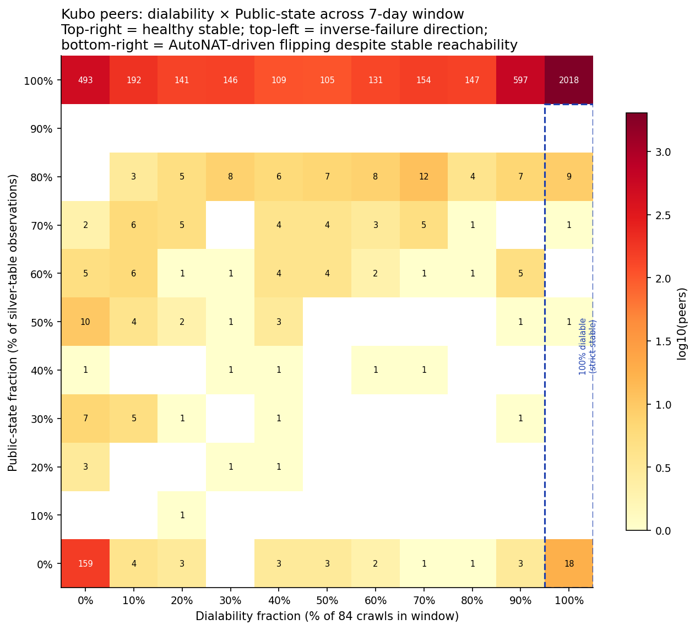

# AutoNAT in Production: Nebula Crawl Analysis of the IPFS Amino DHT

External observation of libp2p protocol advertisements in the IPFS Amino DHT
using ProbeLab's Nebula crawler data, queried from the public ClickHouse
dataset.

**Network:** IPFS Amino DHT
**Source:** `nebula_ipfs_amino` (raw `visits`) and `nebula_ipfs_amino_silver`
(deduplicated change logs)
**Time range:** Single recent crawl for cross-sectional snapshots; last
7 days for longitudinal analysis (84 successful crawls); last 30 days
for the dialability time series.
**Crawl frequency:** ~12 successful crawls per day (every ~2 hours).

## TL;DR

- **The IPFS Amino DHT is dominated by Kubo deployments.** ~46% of visible
  peer IDs are dialable from Nebula's vantage point; of the dialable peers,
  ~84% are Kubo (~3,170 nodes per crawl). rust-libp2p and js-libp2p
  combined have <5 dialable nodes.
- **AutoNAT v2 server adoption among Kubo is ~50%.** Half of dialable
  Kubo nodes advertise both v1 and v2 server protocols. The other half
  run v1 only. Almost no node runs v2 without v1.
- **Production AutoNAT v1 false negatives on stably-reachable Kubo nodes
  exist but are rare.** Out of 2,047 Kubo peers dialable in 100% of all
  84 crawls in the 7-day window, **8 peers** show AutoNAT-state-flipping
  that cannot be explained by network changes, restart, or disconnect.
  All 8 are post-v2 Kubo (versions 0.35–0.40), all advertise the v2 server
  protocol.

---

## What we measure

For each Kubo peer Nebula visits, we observe two things:

1. **Dialability** — does Nebula's connection attempt succeed in each crawl?
2. **AutoNAT-derived state** — for each successful Identify, the
   `(/ipfs/kad/1.0.0, /libp2p/autonat/1.0.0)` protocol pair tells us
   what Kubo's local libp2p host thinks about its own reachability:

   | kad protocol | autonat v1 server protocol | Kubo state |
   |---|---|---|
   | ON | ON | Public |
   | OFF | ON | Unknown |
   | OFF | OFF | Private |
   | ON | OFF | Inconsistent (non-default config or non-Kubo) |

   This mapping is derived from Kubo's source code: kad is registered by
   `dht.moveToServerMode()` only on `Public`, and the autonat v1 server is
   registered on `Public` and `Unknown` and disabled on `Private`. See
   Appendix A for the full state-machine reference.

Cross-tabbing these two observations across the 7-day window for each peer
is how we identify production AutoNAT behavior. The full methodology and
caveats are in Appendix A; the source-code references are in Appendix C.

---

## Findings

### F1 — Network composition

| Metric | Value |
|---|---|
| Visible peer IDs per crawl (avg, last 30d) | ~8,100 |
| Dialable per crawl | ~3,750 (~46%) |
| Of dialable peers, Kubo | ~3,170 (~84%) |
| rust-libp2p / js-libp2p (combined dialable) | 3 nodes |
| Kubo peers visited 2+ times in 7 days | 4,701 |
| Kubo peers "lost" between prior week and current week | 727 (~18%) |

About half of visible peer IDs are stale routing-table entries — peer IDs
Nebula learned via FIND_NODE walking but cannot connect to from its single
vantage point. The dialable subset is dominated by Kubo and legacy
go-ipfs; the rest of the libp2p ecosystem (rust-libp2p, js-libp2p) is
essentially absent from this DHT.

*Figure 1: Total visible vs dialable peer counts per crawl, daily average
over the last 30 days. Source: `nebula_ipfs_amino.crawls`.*

*Figure 2: Client distribution by `agent_version` in one recent crawl.
Grey bars are total visited; blue bars are the dialable subset.*

**See Appendix B.1 and B.2** for the full client and dialability breakdowns,
the cross-tab of empty agent vs undialable, and the historical decline in
visible peer count.

### F2 — AutoNAT v2 adoption among Kubo

Of dialable Kubo nodes in one recent crawl:

| AutoNAT server protocols | Count | % |
|---|---|---|
| v1 + v2 (both) | 1,600 | 50.5% |
| v1 only | 1,531 | 48.3% |
| v2 only | 9 | 0.3% |
| neither | 30 | 0.9% |

About half of Kubo nodes have v2 enabled (default since Kubo 0.30.0,
introduced as opt-in in 0.34.0). v2 is consistently additive: only 9
peers run v2 without v1. The data confirms that v2 has been broadly
deployed but has not replaced v1 — nodes run both side-by-side.

*Figure 3: AutoNAT server protocols advertised by dialable Kubo nodes
in one recent crawl. Source: `nebula_ipfs_amino.visits` filtered to
`agent_version LIKE 'kubo/%'`.*

**See Appendix B.3** for the per-version v2 adoption breakdown.

### F3 — Snapshot DHT mode tracking is correct (in single-crawl view)

In a single recent crawl, **~99% of dialable Kubo nodes** advertise
`/ipfs/kad/1.0.0` (DHT server mode) regardless of version. AutoNAT-driven
DHT mode is correctly tracking reachability at any moment.

*Figure 4: Percentage of dialable Kubo nodes advertising
`/ipfs/kad/1.0.0`, per Kubo version, in one recent crawl. Source:
`nebula_ipfs_amino.visits`.*

**Important caveat:** the snapshot view does not capture flipping over
time. Multi-crawl analysis (F4) shows a small but real subset of
stably-reachable Kubo peers whose DHT mode flips during the week. **See
Appendix B.4** for the per-version snapshot table and **F4 below** for
the time-series result.

### F4 — Production AutoNAT v1 false negatives on stable Kubo peers

This is the headline production result. Methodology: restrict to Kubo
peers Nebula successfully dialed in **all 84** of the successful crawls
in the 7-day window — this holds network-level reachability constant
from Nebula's vantage point. For each such peer, classify the observed
AutoNAT state from the protocol pair. Any state change for these peers
cannot be explained by network conditions changing, by node restart
(restarts would cause at least one undialable observation), or by
intermittent network problems.

| Always-dialable Kubo peers (84/84 crawls) | 2,047 |
|---|---|
| Only ever observed in **Public** state | 2,018 |
| Observed in both **Public** AND a non-Public state | **8** |
| Observed in **inconsistent** state (non-default Kubo config) | 21 |
| Only ever Private or only ever Unknown | 0 |

The **8 peers** in the second row are the cleanest possible production
evidence that AutoNAT v1 in current Kubo can flip to non-Public on a
node whose external reachability never failed during the observation
period. Three patterns are striking:

- **All 8 are post-v2 Kubo** (versions 0.35 through 0.40). Zero pre-v2
  Kubo peers are in the strict subset.
- **All 8 advertise the v2 server protocol** in every observation —
  they are deployments that have explicitly enabled v2.
- **About 64% of their non-Public observations are Unknown** rather than
  Private. AutoNAT is losing confidence to timeouts/refused/errors more
  than to explicit `E_DIAL_ERROR` responses.

The strict subset rate is **8 / 2,047 ≈ 0.39%** of always-dialable Kubo,
or roughly 0.17% of all observed Kubo. The phenomenon is real and
verifiable, but small in absolute magnitude.

*Figure 5: AutoNAT-state-change rate per Kubo version on the broader
"any kad toggling" population, which is an upper bound on the rate
(includes peers with restart or disconnect confounds). The strict-stable
subset for F4 is much smaller — see Appendix C.2.*

*Figure 6: 2D distribution of Kubo peers by dialability fraction (X)
and Public-state fraction (Y) over the 7-day window. The dashed blue
line marks the strict 100%-dialable column. The 8 strict-flipping peers
sit inside that column at Y < 100%.*

**See Appendix C** for the full state-machine reference, the list of
the 8 peers, the version-by-version breakdown across multiple
methodological cuts (kad toggling, kad+autonat lockstep, dialability
controls, restart confound), and the Private↔Unknown direction.

### F5 — The inverse direction (rarely-dialable + always-Public) cannot be cleanly attributed to AutoNAT false positives

The opposite failure mode would be a peer that AutoNAT thinks is Public
but is mostly unreachable. The heatmap (Figure 6) shows **493 Kubo
peers** in the bottom-left region (≤10% dialability + 100% Public-state
fraction). However, this cell is structurally biased: a peer dialable
only ~10% of the time is identified by Nebula only during the moments
it is actually reachable, and during those reachable moments AutoNAT
correctly says Public. The cell exists but cannot be attributed to
AutoNAT misjudgment without active probing from multiple vantage points.

We document the cell exists and do not claim it is an AutoNAT false-positive
finding. **See Appendix C.4** for the full discussion.

---

## What this adds to the final report

The Nebula data does not by itself prove the testbed-derived findings
in the AutoNAT v2 final report, but it confirms two of them in
production at small but measurable rates:

| Final report finding | What Nebula data adds |
|---|---|
| **#1 v1/v2 reachability gap** | All 8 strict-stable AutoNAT-flipping Kubo peers (F4) are post-v2 Kubo running v2 server. v2 being enabled did not stop v1 from incorrectly flipping these nodes — consistent with the wiring-gap hypothesis (DHT consumes v1 events, not v2). |
| **#2 v1 oscillation → DHT oscillation** | F4 confirms the phenomenon exists in production at ~0.39% of always-dialable Kubo per 7-day window. The rate is much smaller than the naive kad-toggling number (~5%), because most of that broader population is confounded by restart and disconnect. |

The fix proposed in Finding #1 of the final report (bridging v2 results
into `EvtLocalReachabilityChanged`) is supported by, but not proven by,
this data. A controlled comparison (forked Kubo with the bridge applied,
deployed alongside upstream Kubo, measured by Nebula in the same way)
would be the next step.

---

## Appendix index

- **Appendix A** — Methodology: how Nebula crawls, what we observe and
  what we cannot, the kad/autonat-v1 state-pattern proxy
- **Appendix B** — Network and population data: client distributions,
  per-version breakdowns, time series, snapshot tables
- **Appendix C** — AutoNAT state-change analysis: state machine reference,
  methodology refinements (E→F→G→H→I→J), restart confound, the 8 strict
  peers, the inverse direction, the inconsistent-state cohort
- **Appendix D** — Caveats and limitations: selection bias, vantage
  point, silver table semantics, sample sizes
- **Appendix E** — Other networks considered (Filecoin, Avail, Celestia,
  others) and why they are excluded from the comparison
- **Appendix F** — Charts and data sources: per-chart query, filter,
  method, and CSV file mapping

---

# Appendix A — Methodology

## A.1 How Nebula crawls (verified from source)

This subsection is based on reading the Nebula source code at
[github.com/dennis-tra/nebula](https://github.com/dennis-tra/nebula).
File references are to that repository.

### Bootstrap

For `--network IPFS` (or `AMINO`), Nebula does **not** maintain its own
bootstrap list. It uses `kaddht.DefaultBootstrapPeers` from
`go-libp2p-kad-dht` (the standard Kubo bootstrappers). The list is pushed
into a task channel at startup; for the libp2p crawl path the channel is
then closed, so all subsequent peers come from `FIND_NODE` walking.
(`config/config.go:683-689`, `libp2p/driver_crawler.go:151-154`)

### Per-peer visit lifecycle

`Crawler.Work` at `libp2p/crawler.go:57`. For each peer in the work queue:

1. **Address filtering.** Multiaddrs are filtered by `addr-dial-type`
   (default: strip private CIDRs). The kept set becomes `dial_maddrs`,
   the rest becomes `filtered_maddrs`. (`libp2p/crawler.go:73-94`)

2. **Connect.** Calls `host.Network().DialPeer(ctx, peerID)`
   (`libp2p/crawler_p2p.go:236-239`). This hands the **full address set
   to libp2p's swarm**, which dials all transports concurrently and
   returns whichever transport handshake **wins the race first**. Default
   timeout 15s. Specific transient errors (`connection refused`, gating,
   relay resource limits) are retried with backoff up to ~1 minute.
   (`libp2p/crawler_p2p.go:247-283`)

3. **Record `connect_maddr`.** On success this is set to
   `conn.RemoteMultiaddr()` — i.e., the address of the connection libp2p
   actually opened. **This is "the transport that won the race", not "the
   first address Nebula tried."** It is biased toward whichever transport
   handshakes fastest (often QUIC over TCP on the same IP).

4. **Wait for Identify, with a 5s timeout.** On a successful connection,
   Nebula registers an Identify listener before connecting and then waits
   up to 5 seconds for the Identify result. If it arrives, `agent_version`,
   `listen_maddrs`, and `protocols` are recorded. **If Identify times out,
   those fields stay empty even though the connection succeeded.**
   (`libp2p/crawler_p2p.go:111-129`)

5. **Drain buckets via `FIND_NODE`.** After connecting, Nebula spawns 16
   parallel goroutines, one per common-prefix-length 0–15. Each generates
   a random Kademlia ID at exactly that distance from the visited peer
   and sends one `FIND_NODE` RPC for it. The neighbors found across all
   16 buckets are deduplicated by peer ID and form the visit's
   `RoutingTable`. Per-bucket failures are encoded as 16 `ErrorBits`.
   (`libp2p/crawler_p2p.go:289-382`)

### Work queue and termination

Engine state holds `inflight`, `processed`, and a priority queue keyed by
peer ID (`core/engine.go:121-126`). On enqueue (`engine.go:435-475`):
- If a peer is inflight or already processed → skip
- If a peer is already queued → merge multiaddrs with the queued task
- Peers with no known dialable addresses go to the back (priority 0)

Each peer is visited at most once per crawl. The crawl ends when the
bootstrap channel is closed (immediate for IPFS), the queue is empty,
AND no requests are in flight.

### Visit-row fields and how they are populated

| Column | Source | Notes |
|---|---|---|
| `connect_maddr` | `conn.RemoteMultiaddr()` on the winning connection | NULL on connection failure. Reflects whichever transport handshake won the parallel dial race. |
| `dial_errors` | `db.MaddrErrors(dial_maddrs, connect_error)` | Same length as `dial_maddrs`. Per-address error strings reconstructed from libp2p's aggregated error. **Addresses libp2p opportunistically skipped get the literal string `not_dialed`** — absence of an error is not the same as success. |
| `crawl_error` | Set only when connect succeeded AND every `FIND_NODE` bucket walk failed AND zero neighbors were returned. (`libp2p/crawler.go:129-136`) | Even one neighbor returned → success. **`crawl_error` is rare and conservative**, not the same as "Nebula couldn't connect." |
| `agent_version` | libp2p Identify response only (no caching from prior crawls in the libp2p path) | Empty when Identify times out within 5s. Stored as NULL in ClickHouse. |
| `protocols` | libp2p Identify response | Empty when Identify times out. |
| `listen_maddrs` | libp2p Identify response | Empty when Identify times out. |

### How `dialable_peers` is counted

`PeersDialable = CrawledPeers − sum(ConnErrs)`
(`core/handler_crawl.go:219-239`)

**Critical:** "undialable" only counts peers with `ConnectError != nil`.
A peer where the connection succeeded but every `FIND_NODE` failed is
**still counted as dialable**, even though it has `crawl_error` set.
The schema invariant is `crawled_peers = dialable_peers + undialable_peers`.

## A.2 What we measure (and what we cannot)

This analysis uses **protocol advertisements observed by Nebula** as a
proxy for what each peer's local libp2p host is doing.

### What we directly observe

- For each peer Nebula visits, the set of libp2p protocols it advertised
  in Identify at the time of the visit (`visits.protocols`)
- Whether Nebula's connection attempt succeeded (`visits.connect_maddr`
  is not NULL)
- The peer's `agent_version` string

### What we infer (proxies, not direct measurements)

- **"This Kubo node currently has its DHT in Server mode"** is inferred
  from the presence of `/ipfs/kad/1.0.0` in the peer's protocol list. In
  Kubo, the DHT registers this stream handler when it enters Server mode
  and removes it when it enters Client mode (verified in source —
  `dht.go:806`, `subscriber_notifee.go:104-118`). The proxy is reasonable
  but not identical to the underlying state.
- **"AutoNAT v1 currently considers this node Public"** is inferred from
  the same kad advertisement plus the autonat v1 server protocol presence,
  because Kubo's DHT mode switching is driven by
  `EvtLocalReachabilityChanged` (v1's event). Same caveat: it is a proxy.
- **"This Kubo node has v2 server enabled"** is inferred from the
  presence of `/libp2p/autonat/2/dial-request`.

### What we cannot observe

- AutoNAT v1 or v2 internal state (confidence values, server selection,
  individual probe outcomes)
- Whether a peer's behavior is changing because of AutoNAT or for some
  other reason (transient errors, restarts, configuration changes)
- Peers that Nebula cannot dial — they appear in routing tables (via
  `FIND_NODE` responses) but Nebula cannot run Identify against them, so
  we have no protocol or agent_version data for them

This selection bias is significant: **the analysis describes the subset
of peers that Nebula can dial and Identify**. It is silent about
behind-NAT or transient peers. See Appendix D for the full caveat list.

---

# Appendix B — Network and population data

## B.1 Dialable peer count over time

From `nebula_ipfs_amino.crawls` over the recent 30-day window:

- ~12 successful crawls per day
- Avg `crawled_peers` per crawl: ~8,100
- Avg `dialable_peers` per crawl: ~3,750 (~46%)
- Avg `undialable_peers` per crawl: ~4,300 (~54%)

The historical (May 2025 – April 2026) average we measured was higher
(~20,500 visible per crawl, ~32% dialable). The recent value (~8,100) is
lower. We did not investigate whether this drop reflects network changes,
crawler changes, or other factors. Possible interpretations include
botnet remnants being evicted, real network shrinkage, or changes in
how Nebula bootstraps and walks the DHT.

## B.2 Client distribution and the empty/undialable cross-tab

Cross-tab of `agent_version` (empty vs not) and dialability in one recent
crawl:

| `agent_version` | Dialable | Undialable | Total |
|---|---|---|---|
| Has agent string | 3,621 | 0 | 3,621 |
| Empty | 121 | 4,116 | 4,237 |
| **Total** | 3,742 | 4,116 | 7,858 |

Two relationships are exact:
1. **Every undialable peer has empty `agent_version`.** Identify requires
   a successful connection, so undialable peers have no agent string, no
   protocol list, and no listen-address data Nebula could collect.
2. **Some peers with empty `agent_version` are dialable** (121 in this
   crawl). The connection succeeded but Identify did not return an agent
   string within Nebula's **5-second Identify timeout**
   (`libp2p/crawler_p2p.go:111-129`). This can be a slow Identify
   response, an implementation that does not run standard Identify, or
   a transient failure mid-exchange.

So "empty agent" is a strict superset of "undialable": empty = undialable
+ "dialable but Identify yielded no agent". They are related but not the
same.

Of dialable peers in the most recent crawl, grouped by `agent_version`:

| Implementation (`agent_version` pattern) | Dialable nodes | % of dialable |
|---|---|---|
| `kubo/...` | 3,170 | ~84% |
| `go-ipfs/...` (legacy, pre-Kubo rename) | 273 | ~7% |
| (empty `agent_version`, dialable) | 145 | ~4% |
| `harmony` | 41 | ~1% |
| `storm...` | 39 | ~1% |
| `other` | 70 | ~2% |
| `edgevpn` | 3 | <1% |
| `rust-libp2p/...` | 2 | <0.1% |
| `js-libp2p/...` | 1 | <0.1% |

Within the dialable subset, rust-libp2p and js-libp2p combined account
for 3 nodes. **For dialable peers in the IPFS Amino DHT, the population
is overwhelmingly Kubo + legacy go-ipfs.** We cannot make claims about
the non-dialable population.

The `storm` agent_version corresponds to the IPStorm botnet client.
Public sources (e.g., DOJ press release, November 2023) describe an FBI
dismantling operation. We observe 39 dialable nodes still advertising
this agent_version in April 2026. We did not investigate whether these
are surviving infections, re-deployments, name reuse, or some other
origin.

## B.3 AutoNAT v2 server adoption among Kubo

Filtered to dialable peers with `agent_version LIKE 'kubo/%'` in the
same recent crawl:

| AutoNAT server protocols advertised | Count | % |
|---|---|---|
| v1 + v2 (both `/libp2p/autonat/1.0.0` and `/libp2p/autonat/2/dial-request`) | 1,600 | 50.5% |
| v1 only (`/libp2p/autonat/1.0.0`) | 1,531 | 48.3% |
| v2 only (`/libp2p/autonat/2/dial-request`) | 9 | 0.3% |
| neither | 30 | 0.9% |

This counts advertisements, not behavior. We do not directly verify that
nodes advertising the v2 server protocol actually accept and answer dial
requests.

The ~50/50 split between "v1+v2" and "v1 only" is consistent with v2
being an additional opt-in protocol rather than a replacement for v1.
Almost no node advertises v2 without v1 (9 out of ~1,609 v2-server-
advertising nodes).

## B.4 Snapshot DHT mode by Kubo version

Per Kubo version bucket, in the same recent crawl:

| Kubo version | Dialable nodes | % advertising `/ipfs/kad/1.0.0` |
|---|---|---|
| 0.1x | 412 | 99.8% |
| 0.2x | 1,119 | 99.8% |
| 0.30 | 32 | 100% |
| 0.31 | 17 | 100% |
| 0.32 | 101 | 99.0% |
| 0.33 | 88 | 98.9% |
| 0.34 | 48 | 97.9% |
| 0.35 | 51 | 100% |
| 0.36 | 108 | 96.3% |
| 0.37 | 376 | 100% |
| 0.38 | 132 | 100% |
| 0.39 | 327 | 99.1% |
| 0.4x | 358 | 99.7% |

Caveat: this is one moment in time. A peer that flips its DHT mode
frequently will appear in this table as either "advertising kad" or "not
advertising kad" depending on which side of the flip it was on when
Nebula visited. The snapshot view does not detect oscillation. The
window-based analyses in Appendix C are the right place to look for that.

The snapshot ~99% number tells us how often Kubo nodes are kad-advertising
at any given moment — it does not tell us how stable that state is over
time.

---

# Appendix C — AutoNAT state-change analysis

This appendix walks through the methodological refinements that lead
from the loose "kad protocol toggling" measurement (an upper bound) to
the strict 8-peer count in main-body F4. The progression is:

- **C.1** — Loose measurement: how many Kubo peers' kad protocol
  appears and disappears in the silver-table change log? (158 peers)
- **C.2** — Tighter: of those, how many also flip kad+autonat-v1
  in the lockstep pattern that AutoNAT-driven flipping would produce?
  And how does that break down by Kubo version?
- **C.3** — Tighter: of the tighter set, how many are restart-explained?
  And how many are dialability-flipping (so we cannot exclude restart
  or transient disconnect)?
- **C.4** — Tightest: how many are dialable in **all 84** crawls? This
  is the F4 strict subset.
- **C.5** — Direction asymmetry: what fraction of non-Public
  observations are Private vs Unknown? Including the Private↔Unknown
  recovery path.
- **C.6** — Inverse direction: peers low on dialability + high on
  Public-state advertisement.
- **C.7** — Inconsistent-state peers (kad on, autonat off) and why
  they exist.
- **C.8** — The AutoNAT v1 state machine reference.

## C.1 Kad-protocol toggling per Kubo version (loose upper bound)

Tracking the same peers across multiple crawls over 7 days using the
silver change-log table. A peer is counted as "toggling" if its protocol
set contains `/ipfs/kad/1.0.0` in some logged states and not in others
within the 7-day window. This is the loosest measurement and serves as
an upper bound — it does not separate AutoNAT-driven changes from
restart-driven changes or other causes.

| Kubo version | Peers observed | Toggling | % |
|---|---|---|---|
| 0.1x | 493 | 10 | 2.03% |
| 0.2x | 1,326 | 25 | 1.89% |
| 0.30 | 38 | 0 | 0% |
| 0.31 | 50 | 1 | 2.00% |
| 0.32 | 131 | 6 | 4.58% |
| 0.33 (last v1-only) | 109 | 3 | 2.75% |
| 0.34 (v2 added) | 60 | 6 | 10.00% |
| 0.35 | 67 | 8 | 11.94% |
| 0.36 | 140 | 13 | 9.29% |
| 0.37 | 567 | 26 | 4.59% |
| 0.38 | 157 | 7 | 4.46% |
| 0.39 | 382 | 20 | 5.24% |
| 0.4x (latest) | 496 | 35 | 7.06% |

Aggregated:

| Bucket | Total | Toggling | % |
|---|---|---|---|
| Kubo < 0.34 | 2,148 | 45 | 2.09% |
| Kubo ≥ 0.34 | 2,048 | 140 | 6.84% |

A naive reading would say "post-v2 Kubo oscillates 3.3× more than pre-v2."
That reading is what the original framing of this analysis used. Sections
C.2 and C.3 below show why it overstates the actual AutoNAT effect once
restart and disconnect confounds are excluded.

## C.2 AutoNAT-driven refinement: kad and autonat v1 server toggling in lockstep

The kad-only metric in C.1 counts any peer whose protocol set contained
`/ipfs/kad/1.0.0` in some silver-table observations and not in others.
This is loose because in principle a peer could toggle the kad protocol
for reasons unrelated to AutoNAT (operator config changes, custom
go-libp2p applications that wire kad independently of autonat, partial
protocol updates).

To tighten the inference we use a state-pattern check based on Kubo's
source code. A peer is counted as "AutoNAT-driven flipping" if it has
at least one row in the **Public** pattern (kad on, autonat v1 on) AND
at least one row in a **non-Public** pattern (Unknown or Private) within
the 7-day window.

Refined per-version results:

| Kubo version | Stable peers | kad toggling % | AutoNAT-driven % |
|---|---|---|---|
| 0.1x | 493 | 2.03% | 2.03% |
| 0.2x | 1,322 | 1.89% | 1.89% |
| 0.30 | 38 | 0% | 0% |
| 0.31 | 50 | 2.00% | 2.00% |
| 0.32 | 130 | 4.62% | 4.62% |
| 0.33 (last v1-only) | 109 | 2.75% | 2.75% |
| 0.34 (v2 added) | 60 | 10.00% | 10.00% |
| 0.35 | 67 | 11.94% | 11.94% |
| 0.36 | 140 | 9.29% | **5.00%** |
| 0.37 | 564 | 4.61% | 4.61% |
| 0.38 | 157 | 4.46% | 4.46% |
| 0.39 | 381 | 4.99% | 4.20% |
| 0.4x (latest) | 491 | 6.92% | 6.92% |

For most versions the two metrics are identical or nearly so — meaning
the kad toggling we observed is, in fact, the AutoNAT-driven Public ↔
non-Public pattern, not configuration drift. The 0.36 column shows the
largest reduction (9.29% → 5.00%): about half of the 0.36 "toggling"
peers are in the inconsistent (`kad on, autonat off`) state. See C.7
for the inconsistent-state explanation.

## C.3 Dialability cross-tab: most kad toggling is on peers also flipping in/out of dialability

The C.1 and C.2 measurements count peers based on the silver
`peer_logs_protocols` table, which only contains rows from successful
Identify exchanges. What that filter does NOT guarantee is that the
peer was *consistently* dialable across the window — only that it was
dialable at the moments where silver rows exist.

To separate "Kubo's AutoNAT v1 flipped DHT mode while the peer stayed
reachable" from "the peer disappeared and came back", cross-tab kad
toggling against per-peer dialability stability across all Nebula
visits in the same 7-day window.

Dialability of all observed Kubo peers (visited 2+ times in the
7-day window):

| Kubo population | Peers | % |
|---|---|---|
| Total Kubo visited 2+ times | 4,566 | 100% |
| Always dialable | 2,366 | 51.8% |
| Dialability flipping | **2,200** | **48.2%** |
| Always undialable | 0 | 0% |

**~48% of all observed Kubo peers flip dialability at least once in
the 7-day window.** This is a much larger population than the 158
"toggling kad" peers from C.1.

Cross-tabulating dialability with kad-state observations:

| Dialability | kad state | Count |
|---|---|---|
| Always dialable | always kad on | 2,199 |
| Always dialable | **kad toggles** | **32** |
| Always dialable | always kad off | 3 |
| Always dialable | (no silver entry — single visit only) | 132 |
| Dialability flipping | always kad on | 1,601 |
| Dialability flipping | **kad toggles** | **135** |
| Dialability flipping | always kad off | 45 |
| Dialability flipping | (no silver entry) | 419 |

The 158 toggling Kubo peers from C.1 split as **~135 dialability-flipping**
and **~32 always-dialable**. ~80% of the toggling peers are also
flipping dialability, which means restart and transient-disconnect
explanations cannot be excluded for the bulk of them.

The **32 always-dialable kad-toggling Kubo peers** are the strong
intermediate-tier subset. Per-version on this tighter cohort:

| Bucket | Strong subset | Flips | % |
|---|---|---|---|
| Kubo < 0.34 (v1 only) | 1,440 | 5 | 0.35% |
| Kubo ≥ 0.34 (v2 available) | 922 | 21 | 2.28% |

The version trend is preserved (post-v2 still higher than pre-v2) but
the absolute numbers drop substantially. The pre-v2 baseline is
essentially **0%** for the largest version buckets (0.1x with 384
peers, 0.33 with 79 peers, 0.30 with 20 peers — all zero AutoNAT-driven
flips on the strong subset).

## C.4 Strict 100%-dialable subset (the F4 measurement)

C.3's "always dialable" definition was `undialable_visits = 0` across
all visits. This is implicitly bounded by however many crawls Nebula
made of the peer — a peer Nebula visited only twice and successfully
dialed both times qualifies, but that is a much weaker reachability
signal than a peer dialed in all 84 crawls of the window.

The strictest possible filter is: dialable in **100% of all 84
successful crawls** in the 7-day window.

Per-Kubo-peer dialability distribution:

| Dialability bucket | Kubo peers | % |
|---|---|---|
| 100% (84/84 crawls) | 2,047 | 43.5% |
| 95–99% (80–83/84) | 465 | 9.9% |
| 50–94% (42–79/84) | 747 | 15.9% |
| 1–49% (1–41/84) | 1,442 | 30.7% |
| 0% (never dialable) | 0 | 0% |

Of the 2,047 Kubo peers always dialable in all 84 crawls:

| AutoNAT state pattern | Kubo peers |
|---|---|
| Only Public observed (kad+autonat both on, every observation) | 2,018 |
| Public + at least one non-Public (Private and/or Unknown) | **8** |
| Inconsistent state at some point (kad on, autonat off) | 21 |
| Only Private observed | 0 |
| Only Unknown observed | 0 |

The 8 peers in the second row are the F4 result. They are listed in
full below:

| peer_id | agent_version | total obs | Public | Private | Unknown | v2 advertised |
|---|---|---|---|---|---|---|
| `12D3KooWJ4kPdaVJHEmvMXgEoANCVBppm4cR85XEA3X3e9uGMqme` | kubo/0.39.0/2896aed/docker | 27 | 14 | 4 | 9 | yes |
| `12D3KooWBX2QC8uWCYVtanFiBSyPyHJeGbPiVSJ9ZAoNRJq69CzL` | kubo/0.35.0/a78d155/docker | 12 | 9 | 1 | 2 | yes |
| `12D3KooWJsTpextVQgViQqQ8S3XabQDUAjJVLG48ciJ9ni6MVKm9` | kubo/0.39.0/2896aed | 8 | 7 | 0 | 1 | yes |
| `12D3KooWGVywhT8aCziC3UJBA2TktwkyskPt5gvBX3xpy5dNX6KY` | kubo/0.39.0/ | 8 | 7 | 1 | 0 | yes |
| `12D3KooWRwvb4HNDTLbd9Vet8ap9QbG3foZEMPXrckCEK356C2zt` | kubo/0.39.0/ | 8 | 7 | 0 | 1 | yes |
| `12D3KooWP7x2CNCedKkaJZxAHTPqZcuuojNm2RsSmXcp3cyDFSQU` | kubo/0.40.1/39f8a65 | 8 | 7 | 1 | 0 | yes |
| `12D3KooWK2bqcf8PrA3ZnpSWU8nLRqj9D6fgfwcRu8VV1kVjnKpi` | kubo/0.39.0/2896aed/docker | 8 | 7 | 0 | 1 | yes |
| `12D3KooWRVuSpaWVDxLAwM98q1SHjFCfdt2Jt7hEa3RsvhRgUxVq` | kubo/0.36.0/ | 7 | 6 | 1 | 0 | yes |

Aggregating non-Public observations across these 8 peers: 8 Private +
14 Unknown = **64% Unknown vs 36% Private**. These peers are losing
AutoNAT confidence to timeouts more than to explicit dial-failure
responses.

### Restart confound (why the strict 100% filter matters)

A Kubo restart briefly puts the DHT in client mode (Unknown reachability)
until AutoNAT runs its first probes — this looks identical to an
AutoNAT-driven Public → Unknown transition in the silver table. Several
checks against this confound:

1. **Toggling peers are not being upgraded.** Of 158 broad-set toggling
   peers, only 1 changed `agent_version` during the window. The other
   157 are stable installations.

2. **The kad-off time share is too large for restart-only.** Mean
   fraction of silver-table observations in kad-off for toggling peers
   is 33.5% (median 32.3%). A typical Kubo restart resolves to Public
   within seconds to minutes (~0.005% of a week). For 33% of a 7-day
   window to come from restarts alone, a peer would need to either
   restart constantly or remain in Unknown for ~2.3 days out of 7.

3. **Multi-transition peers are not single-restart-explained.** Counting
   actual kad-state transitions per peer in the 7-day window:

   | Transitions in 7 days | Toggling peers |
   |---|---|
   | 1 | 29 |
   | 2 | 57 |
   | 3 | 10 |
   | **4 or more** | **62** |
   | Max | 28 |

   62 peers had 4+ transitions; the max was 28 transitions. A single
   restart can only produce 1–2 transitions.

The strict 100%-dialability filter in C.4 sidesteps all of these
indirect arguments because it directly conditions on Nebula observing
no dial failures — the peer's process must have been continuously
running and reachable for all 84 crawls.

## C.5 Direction asymmetry: Public→Private vs Public→Unknown, and the Private↔Unknown recovery

For the AutoNAT-driven flipping subset, two observable destinations:
- **Public → Private** (kad off, autonat v1 server off): AutoNAT v1
  received enough negative `E_DIAL_ERROR` responses to flip status to
  Private. `service.Disable()` is called.
- **Public → Unknown** (kad off, autonat v1 server still on): AutoNAT
  v1 has eroded confidence to 0 via 4 consecutive non-success
  observations but has not received a definitive `E_DIAL_ERROR`. The
  DHT switches to Client mode but the autonat v1 server stays
  registered.

Counting Kubo peers in the 7-day window by which target state(s) they
visited:

| Pattern | Kubo peers |
|---|---|
| Always Public (no flip) | 3,772 |
| Public → Private only | 133 |
| Public → Unknown only | 7 |
| Public → both Private and Unknown | 9 |

Of the ~149 Kubo peers showing Public → non-Public flips, **133 (~89%)
went to Private**, only 7 went to Unknown only, and 9 visited both.
This suggests the dominant failure mode is "AutoNAT received explicit
`E_DIAL_ERROR` responses from servers" rather than "AutoNAT lost
confidence slowly via timeouts." On this broader population. The strict
F4 subset (8 peers) is the opposite — predominantly Unknown.

### Private → Unknown recovery

Private → Unknown is a real transition in v1's state machine: from
Private state, 4 consecutive Unknown observations (timeouts/refused/errors)
flip the state back to Unknown without going through Public first. The
autonat v1 server stream handler is re-enabled when this happens.

In our protocol-pair observations:

| Before | After |
|---|---|
| (kad off, autonat v1 off) — Private | (kad off, autonat v1 on) — Unknown |

**16 Kubo peers** in the 7-day window were observed in both Private
and Unknown states. Of those:
- 9 were also observed in Public at some point
- **7** were observed only in Private and Unknown — never reached
  Public during the window

The 7 peers stuck oscillating between Private and Unknown without ever
reaching Public are caught in the "I don't know if I'm reachable, but
I have no positive evidence either" zone for the entire week.

## C.6 Inverse direction: low dialability + always-Public

A second cell worth examining is the inverse failure mode: peers that
are mostly undialable from Nebula's vantage point but, in the rare
moments Nebula could identify them, were always observed in the Public
state. The 2D distribution heatmap (Figure 6 in main body) shows the
joint distribution.

The interesting cells:

- **Top-right corner (100% dialable, 100% Public observations):** the
  2,018 healthy stable peers. The dominant cell.
- **Top-left corner (0–10% dialable, 100% Public observations):** 493
  peers. Rarely reachable from Nebula but, when identified, always
  confidently Public. **This is the inverse-failure direction.**
- **Bottom-right corner (100% dialable, 0% Public observations):** 18
  peers. Always reachable from Nebula but never observed in the Public
  state. These overlap with the inconsistent-state Kubo cohort and
  explicitly-configured DHT-client-mode operators.

The top-left "inverse-failure" cell (493 peers) **cannot be cleanly
attributed to AutoNAT false positives** because of structural survivor
bias: a peer dialable only ~10% of the time is identified by Nebula
only during those rare moments. By selection, those moments are when
the peer is reachable — and a Kubo node that is currently reachable is
also likely currently in Public state. So observing "always Public when
dialable" is partly tautological for peers with low dialability.

Other plausible explanations include vantage-point asymmetry (peers
reachable from AutoNAT servers but not from Nebula) and genuine
AutoNAT false positives. We cannot separate these from Nebula data
alone. The cell is observable; we document it exists and do not claim
it as a finding.

## C.7 Inconsistent-state peers (kad on, autonat v1 off)

The (kad on, autonat v1 off) state pattern would not be produced by
default Kubo using its standard `EvtLocalReachabilityChanged` event
handling. We investigated separately and found:

- **198 peers** in the 7-day window have this state at some point.
  The majority are not Kubo at all — they are custom go-libp2p
  applications such as BSV blockchain, licketyspliket, nabu, etc.,
  which enable kad without enabling autonat v1.
- **53 are Kubo** (~1.3% of the 4,003 stable Kubo peers in the
  window). Most of those are kubo 0.36/0.37 nodes that also advertise
  the v2 server protocol.

### Why this state cannot occur in default Kubo

In a stock Kubo build using the default reachability event loop, the
two protocols are gated by the same `EvtLocalReachabilityChanged`
event:

1. **kad server protocol** (`/ipfs/kad/1.0.0`) is registered by
   `dht.moveToServerMode()` in `go-libp2p-kad-dht`
   ([`dht.go:806`](https://github.com/libp2p/go-libp2p-kad-dht/blob/v0.38.0/dht.go#L806)).
   The DHT subscriber notifee invokes `setMode(modeServer)` from
   `handleLocalReachabilityChangedEvent` only when reachability is
   `Public`
   ([`subscriber_notifee.go:104-118`](https://github.com/libp2p/go-libp2p-kad-dht/blob/v0.38.0/subscriber_notifee.go#L104-L118)).

2. **AutoNAT v1 server protocol** (`/libp2p/autonat/1.0.0`) is
   registered by `service.Enable()` inside the `AmbientAutoNAT`
   `recordObservation` handler
   ([`autonat.go:328`](https://github.com/libp2p/go-libp2p/blob/v0.47.0/p2p/host/autonat/autonat.go#L328)
   and [`autonat.go:365`](https://github.com/libp2p/go-libp2p/blob/v0.47.0/p2p/host/autonat/autonat.go#L365)).
   It is enabled when the local reachability transitions to `Public` or
   to `Unknown`, and only disabled via `service.Disable()` when
   reachability transitions to `Private`
   ([`autonat.go:349`](https://github.com/libp2p/go-libp2p/blob/v0.47.0/p2p/host/autonat/autonat.go#L349)).

The combination "kad ON, autonat v1 server OFF" cannot happen via the
default flow, because the only branch that disables the autonat v1
server (`service.Disable()` on the Private transition) is also the
branch that triggers `setMode(modeClient)` which removes
`/ipfs/kad/1.0.0`. The two events are coupled.

### Plausible mechanisms that could produce the inconsistent state

- **AutoNAT service never instantiated.** If `conf.dialer == nil` or
  `forceReachability` is set to a non-Public value, the `autoNATService`
  is never instantiated
  ([`autonat.go:93-99`](https://github.com/libp2p/go-libp2p/blob/v0.47.0/p2p/host/autonat/autonat.go#L93-L99)).
- **Custom build that disables NATService.** Any code path that omits
  `libp2p.EnableNATService()` will produce this state.
- **Static reachability override.** Setting `libp2p.ForceReachability`
  creates a `StaticAutoNAT` instead of `AmbientAutoNAT`
  ([`autonat.go:99-106`](https://github.com/libp2p/go-libp2p/blob/v0.47.0/p2p/host/autonat/autonat.go#L99-L106)).
- **Patched Kubo that explicitly removes the v1 stream handler** post-startup.

The 44 Kubo 0.36/0.37 nodes that advertise the v2 server protocol but
NOT the v1 server protocol are most consistent with a custom build or
explicit `AutoNATServiceDisabled`-equivalent config. We did not
investigate which specific operator runs them.

## C.8 The AutoNAT v1 state machine

Reading `recordObservation` in `p2p/host/autonat/autonat.go:314-373`,
the AutoNAT v1 state machine has six possible transitions. Let
`maxConfidence = 3` and let `confidence` be the integer counter that
the function maintains.

The observation is what `handleDialResponse` produces from the dial-back
result (`autonat.go:299-312`):

| Server response | observation |
|---|---|
| `dialErr == nil` | `Public` |
| `IsDialError(dialErr)` (server returned `Message_E_DIAL_ERROR`) | `Private` |
| Anything else (timeout, stream reset, refused, internal error) | `Unknown` |

State transitions:

| Transition | Trigger observation | Confidence requirement | Service action | Source line |
|---|---|---|---|---|
| Public → Public (no flip) | `Public` | confidence < 3 → confidence++ | none | line 332 |
| Public → Unknown | `Unknown` | confidence == 0 | `service.Enable()` (no-op, was on) | lines 360-368 |
| Public → Private | `Private` | confidence == 0 | `service.Disable()` | lines 343-352 |
| Unknown → Public | `Public` | none — bypasses confidence | `service.Enable()` (no-op) | lines 322-330 |
| Unknown → Private | `Private` | confidence == 0 | `service.Disable()` | lines 343-352 |
| Private → Public | `Public` | none — bypasses confidence | `service.Enable()` | lines 322-330 |
| Private → Unknown | `Unknown` | confidence == 0 | `service.Enable()` (re-enables v1 server) | lines 360-368 |
| Private → Private (no flip) | `Private` | confidence < 3 → confidence++ | none | line 354 |

Two structural asymmetries:

1. **Recovery to Public is immediate.** A single successful dial-back
   from any non-Public state flips to Public, regardless of accumulated
   confidence. The aggressive recovery is intentional — AutoNAT errs
   toward Private during steady state but re-enters Public on positive
   evidence.

2. **Flipping away from Public requires either 4 consecutive negative
   observations (Private or Unknown alone) OR a mix that drains
   confidence and then triggers a flip.** The buffer behavior means a
   single `E_DIAL_ERROR` can flip Public → Private if confidence has
   already been eroded to 0 by 3 prior Unknowns. This asymmetry —
   Unknowns and Privates BOTH drain confidence but only Privates flip
   to Private — is a quirk of the state machine.

### Buffer-erosion examples

Starting state: Public, confidence = 3.

- **3 timeouts then 1 `E_DIAL_ERROR`** → Public/conf=2 → Public/conf=1
  → Public/conf=0 → **Private/conf=0** (1 dial-error flip after 3 unknowns)
- **3 timeouts then 1 timeout** → Public/conf=2 → Public/conf=1 →
  Public/conf=0 → **Unknown/conf=0** (4 consecutive unknowns)
- **4 dial-errors in a row** → **Private** after the 4th

Once in Unknown, recovery to Public requires only one successful dial.
Continuing degradation requires only one `E_DIAL_ERROR` because
Unknown's confidence is 0 by construction. Unknown is a knife-edge
state — one dial-error away from Private, one success away from Public.

---

# Appendix D — Caveats and limitations

1. **Selection bias.** Nebula can only Identify peers it can dial. The
   non-dialable population (more than half of visible peer IDs) has no
   agent_version, no protocol list, no listen addresses. All findings
   above are conditional on being dialable from Nebula's vantage point.

2. **Single vantage point.** Nebula crawls from ProbeLab's
   infrastructure. "Dialable" means "dialable from there." A peer
   dialable from one vantage point may not be dialable from another
   (e.g., due to ISP-level filtering, geographic routing, or per-source
   NAT filtering).

3. **Protocol advertisement is a proxy, not a direct measurement.** We
   infer "DHT in Server mode" from `/ipfs/kad/1.0.0` advertisement, and
   "AutoNAT considers the node Public" from the same. These inferences
   are based on Kubo's source code (verified in Appendix C.7 and C.8)
   but are not directly observed.

4. **Silver table semantics.** The `peer_logs_*` tables only insert on
   change. A truly stable peer has very few rows. Our `>= 2` filter
   selects for peers with at least some observed change history,
   potentially biasing toward less stable peers.

5. **Snapshot vs window.** The single-crawl numbers (F1, F2, F3) are
   instantaneous snapshots and do not capture state changes between
   crawls. The 7-day window (F4 and Appendix C) catches more changes
   but may miss cycles shorter than the ~2-hour crawl interval.

6. **Causation vs correlation.** Per-version trends in Appendix C show
   correlation between Kubo version and toggling rate. They do not
   establish causation. We did not control for deployment environment,
   configuration, or other confounds.

7. **Sample sizes.** Some Kubo version buckets contain few peers (e.g.,
   0.30 with 38, 0.31 with 50, 0.34 with 60). Percentages in small
   buckets are subject to higher variance. The most reliable comparisons
   are in the larger buckets (0.1x, 0.2x, 0.37, 0.39, 0.4x).

8. **Restart confound.** The C.3 dialability cross-tab and C.4 strict
   100%-dialable filter address this directly: the F4 result is
   constructed precisely to exclude restart-explained cases.

9. **Inverse direction survivor bias.** The C.6 inverse-failure cell
   (493 low-dialability + always-Public peers) cannot be cleanly
   attributed to AutoNAT false positives because of structural
   selection bias.

10. **No comparison network.** We did not run the same analysis on
    other go-libp2p networks. Doing so could help isolate whether the
    version trend is specific to Kubo's v2 rollout or to go-libp2p
    version changes generally. See Appendix E for why other networks
    were considered and excluded.

---

# Appendix E — Other networks considered

The ProbeLab Nebula dataset includes several other libp2p networks
besides IPFS Amino. Two were considered as comparison points and
excluded; the rest are not relevant.

### Filecoin mainnet — excluded due to known peer-population issues

Filecoin uses go-libp2p with AutoNAT v1 (no v2 deployment), so on the
surface it would be a useful go-libp2p control for the version trend.
However, the dialable peer population in `nebula_filecoin_mainnet.crawls`
is dominated by a known issue with undialable peers: in recent crawls
roughly **3% of crawled peers are dialable** (~175 out of ~5,800),
versus IPFS Amino at ~46%. The dialable Filecoin subset is mostly
Lotus/Boost storage providers on public IPs — a specific subset of
operator deployments rather than the broader population. Comparing
this skewed subset against the IPFS Amino dialable population is not
a like-for-like comparison.

### Avail — excluded because the protocol we measure does not exist there

Avail (Substrate/Polkadot-derived data availability network)
**explicitly disabled AutoNAT** as of release v1.13.2 because of issues
with `autonat-over-quic`. A spot-check of `nebula_avail_mnlc.visits`
confirms this: in recent crawls only **1 dialable Avail peer**
advertises any `/libp2p/autonat/...` protocol. The kad-protocol-toggling
proxy used in this report is meaningless on a network where neither the
detection mechanism (autonat) nor its consequences (DHT mode flips
driven by `EvtLocalReachabilityChanged`) are present.

### Other networks — not relevant

| Network | Why excluded |
|---|---|
| Polkadot mainnet | Substrate uses custom notification protocols, not libp2p kad/autonat |
| Celestia mainnet | go-libp2p with v1, but only ~64 dialable peers per crawl (small bridge-node operator pool); too small for any per-version analysis. The 6 dialable peers in the inconsistent state turned out to be ProbeLab's own "ant" measurement infrastructure. |
| Filecoin calibnet | Filecoin testnet — same selection-bias issue as mainnet, smaller |
| discv5 / discv4 | Ethereum discovery protocols — not libp2p autonat |
| Monero mainnet | Not libp2p |

### Implication for the IPFS-only scope

This means the analysis in this document is **specifically about the
IPFS Amino DHT and Kubo deployments**. We do not generalize to other
go-libp2p networks. Whether the same patterns hold elsewhere would
require either fixing the selection-bias issues in those networks'
Nebula data or using a different measurement approach.

---

# Appendix F — Charts and data sources

The plotting script is `results/nebula-analysis/plot.py`. Charts are in
`results/nebula-analysis/*.png`. Raw CSVs are gitignored
(`results/*/data/`) and can be regenerated by running the queries below
against the public ClickHouse dataset (connection details in
`docs/future-work-nat-monitoring.md`).

### Figure 1 (`05_dialable_over_time.png`) — Dialable peer counts over 30 days

- **Source table:** `nebula_ipfs_amino.crawls`
- **Filter:** `state = 'succeeded' AND created_at > now() - INTERVAL 30 DAY`
- **Columns used:** `created_at`, `crawled_peers`, `dialable_peers`,
  `undialable_peers`
- **Method:** Daily averages across the ~12 successful crawls per day.

### Figure 2 (`01_clients.png`) — Client distribution

- **Source table:** `nebula_ipfs_amino.visits`
- **Filter:** `crawl_id =` the most recent successful crawl
- **Columns used:** `agent_version`, `connect_maddr` (NULL = not dialable)
- **Bucketing:** `agent_version` matched against patterns (`kubo/%`,
  `go-ipfs/%`, `storm%`, etc.); empty agent versions placed in `(empty)`
- **Includes both dialable and undialable peers**: grey bars are total
  visited; blue bars are the dialable subset.

### Figure 3 (`02_autonat_protocols.png`) — AutoNAT v1/v2 server protocols

- **Source table:** `nebula_ipfs_amino.visits`
- **Filter:** Most recent successful crawl, `agent_version LIKE 'kubo/%'`,
  `connect_maddr IS NOT NULL`
- **Columns used:** `protocols` (Array), checked for membership of
  `/libp2p/autonat/1.0.0` and `/libp2p/autonat/2/dial-request`
- **Excludes undialable peers and non-Kubo clients.**

### Figure 4 (`03_server_mode.png`) — DHT kad protocol presence by Kubo version

- **Source table:** `nebula_ipfs_amino.visits`
- **Filter:** Most recent successful crawl, dialable Kubo only
- **Columns used:** `agent_version` (parsed into version buckets),
  `protocols` (checked for `/ipfs/kad/1.0.0`)
- **Excludes undialable peers and non-Kubo clients.**
- **Caveat:** Snapshot only; does not reflect changes between crawls.

### Figure 5 (`06_oscillation_refined.png`) — kad-only vs AutoNAT-driven flip rate

- **Source tables:**
  - `nebula_ipfs_amino_silver.peer_logs_protocols`
  - `nebula_ipfs_amino_silver.peer_logs_agent_version`
- **Filter:** `updated_at > now() - INTERVAL 7 DAY`, peers with
  `>= 2` silver-table observations, restricted to `agent_version LIKE 'kubo/%'`
- **Method:** Per peer, classify each silver-table row into one of four
  states based on the (kad, autonat-v1-server) protocol pair. A peer is
  "AutoNAT-driven flipping" if it has at least one Public state and at
  least one non-Public state (Unknown or Private) in the window.
  Compared side-by-side with the looser kad-only metric (C.1).
- **What it shows:** For most Kubo versions the two metrics are
  identical, indicating the kad toggling we observed is dominantly the
  AutoNAT Public ↔ non-Public state-change pattern.

### Figure 6 (`08_dialability_vs_public.png`) — Dialability fraction × Public-state fraction (heatmap)

- **Source tables:**
  - `nebula_ipfs_amino.visits` (dialability per Kubo peer across all
    successful crawls in the 7-day window)
  - `nebula_ipfs_amino_silver.peer_logs_protocols` (observed AutoNAT
    state via the kad+autonat-v1 protocol pair)
- **Filter:** Visits and silver rows in the last 7 days. Restricted
  to Kubo peers with at least one silver observation. 84 successful
  crawls in the window.
- **Method:** For each Kubo peer, compute (a) the fraction of the
  84 crawls in which Nebula successfully dialed it, and (b) the
  fraction of its silver-table observations that were in the Public
  state (kad on, autonat v1 on). Bucket each axis into 11 deciles
  (0%–10%, 10%–20%, ..., 100%) and count peers in each cell.
- **Why it matters:** Shows the full structure of "what does the peer
  think about itself" vs "what does Nebula see" without thresholds. The
  100%-dialable column is the strict-stable control for F4's 8-peer
  false-negative subset. The top-left cell (low dialability, always
  Public) is the inverse-failure direction (C.6).
